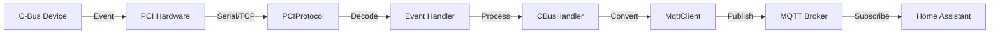
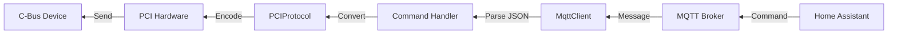
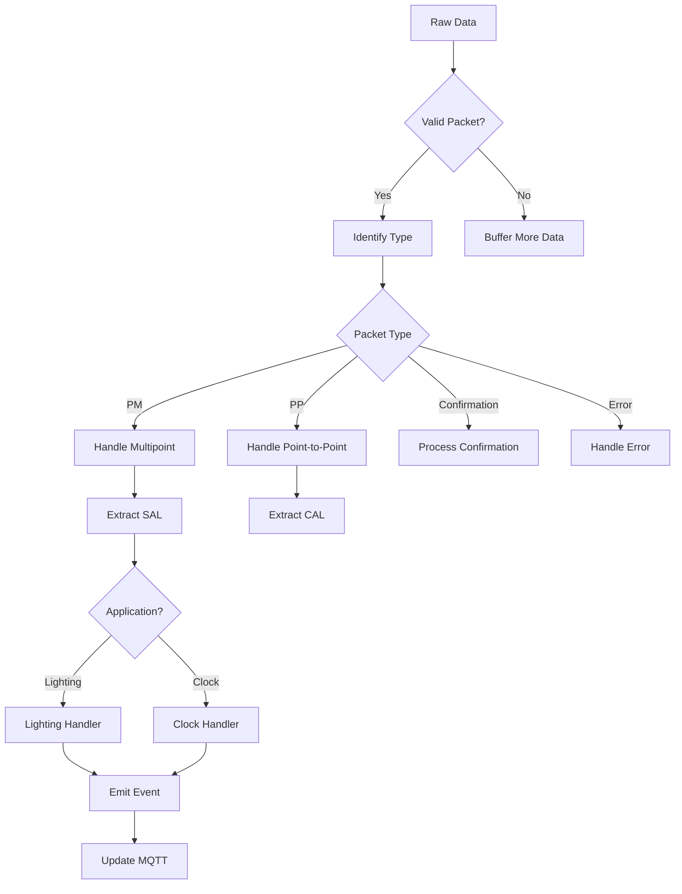
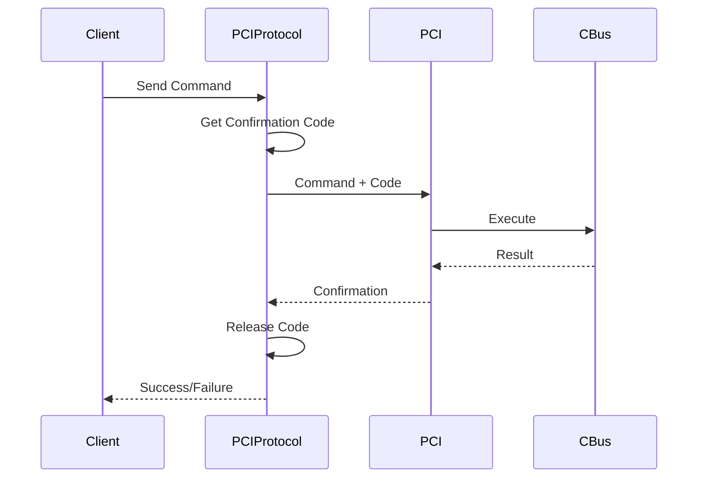
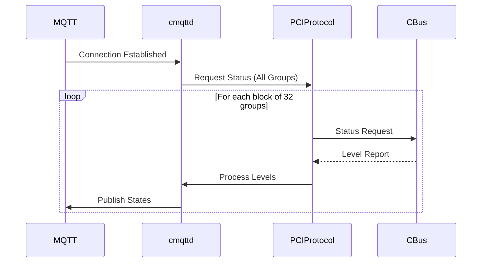
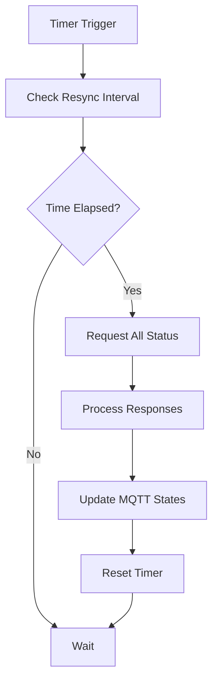
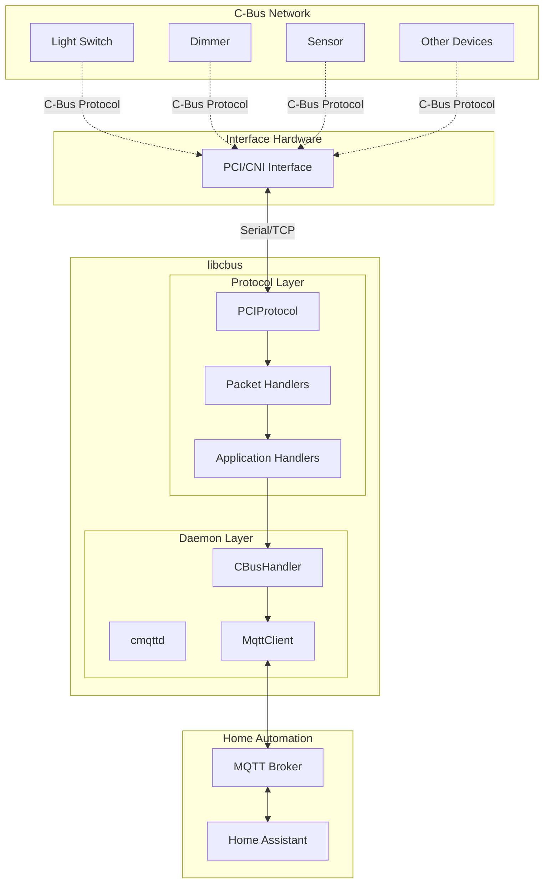
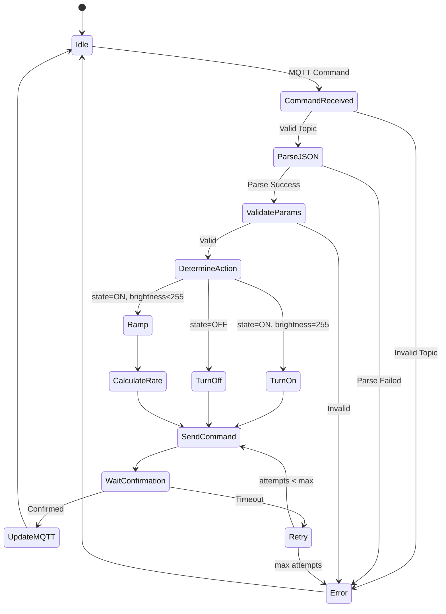
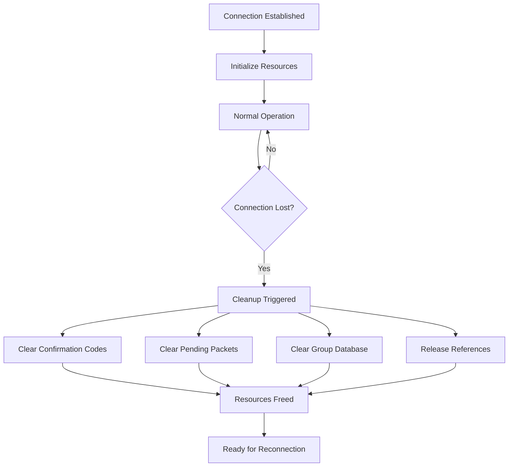

# C-Bus Library (libcbus) - Comprehensive Architecture Documentation

## Table of Contents
1. [Overview](#overview)
2. [Architecture Components](#architecture-components)
3. [Protocol Stack](#protocol-stack)
4. [Core Components](#core-components)
5. [Data Flow Analysis](#data-flow-analysis)
6. [Communication Patterns](#communication-patterns)
7. [Flow Diagrams](#flow-diagrams)
8. [Key Classes and Interfaces](#key-classes-and-interfaces)
9. [Security and Reliability](#security-and-reliability)

## Overview

The C-Bus library (libcbus) is a pure Python implementation of the Clipsal C-Bus protocol, designed to communicate with C-Bus home automation systems without relying on proprietary libraries. The library supports Python 3.7+ and uses asyncio for asynchronous operations.

### Key Features
- Pure Python implementation of C-Bus PCI serial protocol
- MQTT bridge daemon (cmqttd) for Home Assistant integration
- Support for multiple hardware interfaces (Serial, USB, Ethernet)
- Docker support for easy deployment
- Extensible architecture supporting multiple C-Bus applications

## Architecture Components

### 1. Protocol Layer (`cbus/protocol/`)
The protocol layer implements the C-Bus communication protocol, handling packet encoding/decoding and communication with PCI hardware.

**Key Components:**
- **PCIProtocol**: Main protocol handler for C-Bus PCI communication
- **Packet Types**: Various packet implementations (PM, PP, DM, etc.)
- **Application Protocols**: Specific implementations for lighting, clock, temperature, etc.
- **CAL (Common Application Language)**: Low-level protocol components

### 2. Daemon Layer (`cbus/daemon/`)
The daemon layer provides the MQTT bridge functionality, enabling integration with home automation systems.

**Key Component:**
- **cmqttd**: MQTT daemon that bridges C-Bus events to MQTT messages

### 3. Toolkit Layer (`cbus/toolkit/`)
Utilities for working with C-Bus Toolkit files and configuration.

**Key Components:**
- **cbz.py**: C-Bus Toolkit project file parser
- **dump_labels.py**: Extract group labels from project files
- **periodic.py**: Throttling and periodic task management

### 4. Common Layer (`cbus/common.py`)
Shared constants, enumerations, and utility functions used throughout the library.

## Protocol Stack

```
┌─────────────────────────────────────┐
│     Application Layer (MQTT)         │
├─────────────────────────────────────┤
│     C-Bus Applications              │
│  (Lighting, Clock, Temperature)     │
├─────────────────────────────────────┤
│    C-Bus Protocol (PCI/CNI)         │
├─────────────────────────────────────┤
│   Transport Layer (Serial/TCP)       │
└─────────────────────────────────────┘
```

## Core Components

### PCIProtocol Class
The heart of the library, managing C-Bus communication:

- **Connection Management**: Handles connection establishment and loss
- **Packet Processing**: Decodes incoming packets and dispatches to handlers
- **Confirmation System**: Manages command confirmations with retry logic
- **Time Synchronization**: Periodic clock sync with C-Bus network
- **Event Dispatching**: Routes C-Bus events to appropriate handlers

### Packet Types

1. **BasePacket**: Abstract base for all packet types
2. **PointToMultipointPacket (PM)**: Broadcast messages
3. **PointToPointPacket (PP)**: Direct device communication
4. **DeviceManagementPacket (DM)**: Device configuration
5. **ConfirmationPacket**: Command acknowledgments
6. **ErrorPacket**: Error notifications

### Application Protocols

1. **Lighting Application**: Controls lights (on/off/dim)
   - Supports multiple lighting application addresses (0x30-0x5F)
   - Ramp (fade) control with configurable durations
   - Group addressing

2. **Clock Application**: Time synchronization
   - Network-wide time updates
   - Clock request handling

3. **Temperature Application**: Temperature sensor data
4. **Status Request Application**: Query device states

## Data Flow Analysis

### 1. C-Bus to MQTT Flow



### 2. MQTT to C-Bus Flow



### 3. Packet Processing Flow



## Communication Patterns

### 1. Command Confirmation Pattern



### 2. Status Request Pattern



### 3. Periodic Resync Pattern



## Flow Diagrams

### Overall System Architecture



### Lighting Control Flow



### Memory Management and Leak Prevention



## Key Classes and Interfaces

### PCIProtocol
```python
class PCIProtocol(CBusProtocol):
    """Main protocol handler for C-Bus PCI communication"""
    
    Key Methods:
    - connection_made(): Initialize connection
    - connection_lost(): Clean up on disconnect
    - handle_cbus_packet(): Route packets to handlers
    - _get_confirmation_code(): Manage confirmation codes
    - lighting_group_on/off/ramp(): Control lights
    - clock_datetime(): Synchronize time
```

### MqttClient
```python
class MqttClient(mqtt.Client):
    """MQTT client with C-Bus integration"""
    
    Key Methods:
    - on_connect(): Initialize MQTT and request status
    - on_message(): Handle MQTT commands
    - publish_light(): Configure light in Home Assistant
    - lighting_group_on/off/ramp(): Relay C-Bus events
```

### Packet Structure
```python
BasePacket
├── SpecialClientPacket
│   └── ResetPacket
├── SpecialServerPacket
│   ├── ConfirmationPacket
│   └── PCIErrorPacket
├── PointToMultipointPacket
│   └── Contains SAL (Smart Application Language) data
└── PointToPointPacket
    └── Contains CAL (Common Application Language) data
```

## Security and Reliability

### Reliability Features

1. **Confirmation System**
   - Commands use confirmation codes
   - Automatic retry on failure (max 3 attempts)
   - Timeout handling (30 seconds)
   - Code pool management to prevent exhaustion

2. **Connection Management**
   - Automatic reconnection support
   - State cleanup on disconnect
   - Memory leak prevention

3. **Periodic Resynchronization**
   - Configurable resync interval (default 300s)
   - Ensures MQTT state matches C-Bus reality
   - Handles missed events

### Error Handling

1. **Protocol Errors**
   - Invalid checksum detection
   - Buffer overflow protection
   - Malformed packet handling

2. **Communication Errors**
   - Connection loss handling
   - Timeout management
   - Retry logic with backoff

3. **Application Errors**
   - Invalid group address validation
   - Parameter range checking
   - Graceful degradation

### Performance Considerations

1. **Throttling**
   - Command rate limiting
   - Bulk status request throttling
   - Prevents overwhelming PCI

2. **Memory Management**
   - Cleanup on disconnect
   - Bounded buffer sizes
   - Reference cycle prevention

3. **Asynchronous Operations**
   - Non-blocking I/O
   - Concurrent packet processing
   - Event-driven architecture

## Configuration

### Docker Environment Variables
- `TZ`: Timezone setting
- `MQTT_USE_TLS`: Enable MQTT TLS
- `MQTT_SERVER`: MQTT broker address
- `CMQTTD_PROJECT_FILE`: C-Bus project file
- `CNI_ADDR`: PCI/CNI address
- `CMQTTD_CBUS_NETWORK`: Network name

### Key Parameters
- `timesync_frequency`: Clock sync interval (seconds)
- `resync_frequency`: Status resync interval (seconds)
- `confirmation_timeout`: Command timeout (seconds)
- `max_retries`: Maximum retry attempts 