# C-Bus Library - Detailed Flow Diagrams

## Table of Contents
1. [System Initialization Flow](#system-initialization-flow)
2. [Packet Processing Flows](#packet-processing-flows)
3. [Command Execution Flows](#command-execution-flows)
4. [Event Handling Flows](#event-handling-flows)
5. [Error Handling and Recovery](#error-handling-and-recovery)
6. [Integration Flows](#integration-flows)

## System Initialization Flow

### Application Startup Sequence

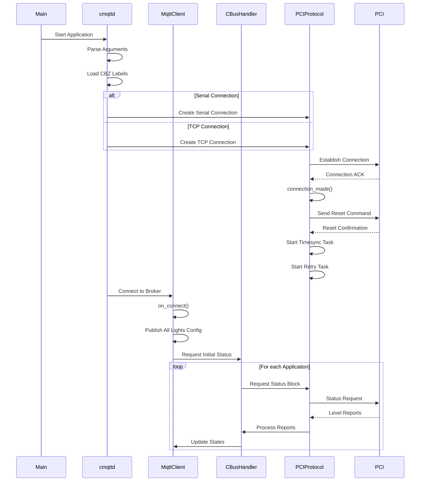

### Connection Recovery Flow

```mermaid
flowchart TD
    A[Connection Lost] --> B[connection_lost() Called]
    B --> C[Clean Up Resources]
    C --> D[Clear Confirmation Codes]
    C --> E[Clear Pending Packets]
    C --> F[Clear Group Database]
    
    D --> G[Set Reconnect Flag]
    E --> G
    F --> G
    
    G --> H{Auto Reconnect?}
    H -->|Yes| I[Wait Backoff Period]
    H -->|No| J[Exit]
    
    I --> K[Attempt Reconnection]
    K --> L{Success?}
    L -->|Yes| M[connection_made()]
    L -->|No| N[Increase Backoff]
    
    M --> O[Reset PCI]
    O --> P[Restore Subscriptions]
    P --> Q[Request Full Status]
    Q --> R[Resume Normal Operation]
    
    N --> S{Max Retries?}
    S -->|No| I
    S -->|Yes| J
```

## Packet Processing Flows

### Incoming Packet Processing

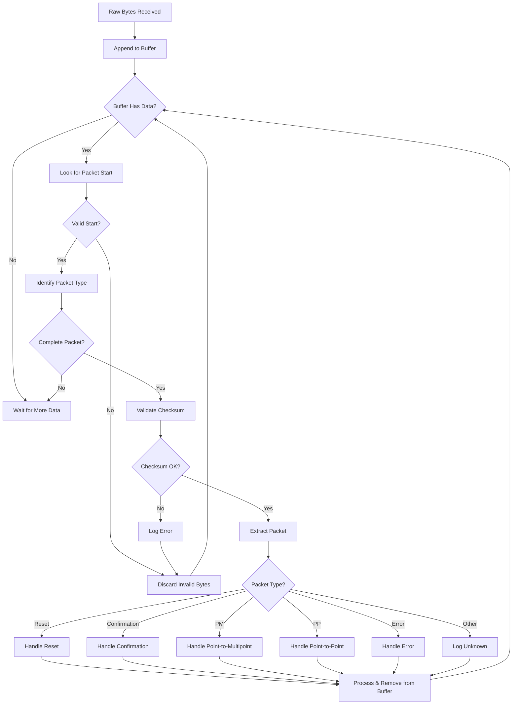

### SAL/CAL Packet Decoding

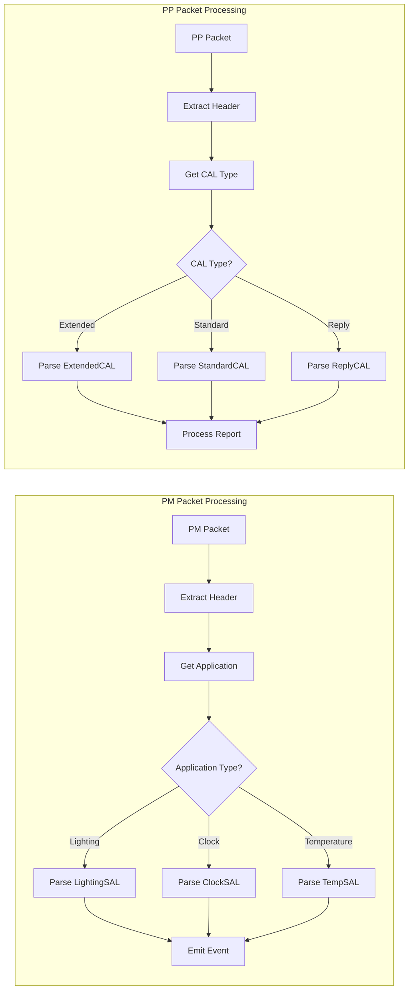

## Command Execution Flows

### Lighting Command Flow

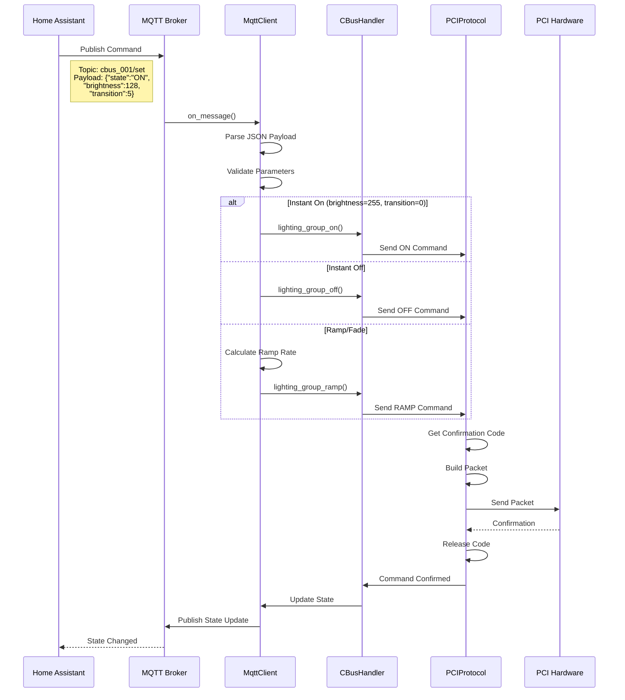

### Status Request Flow

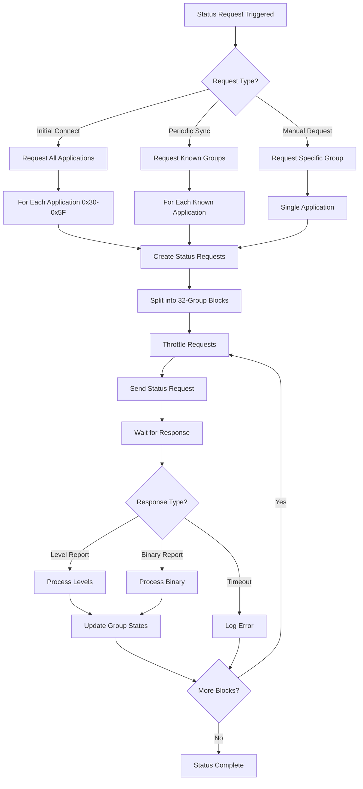

### Confirmation Code Management

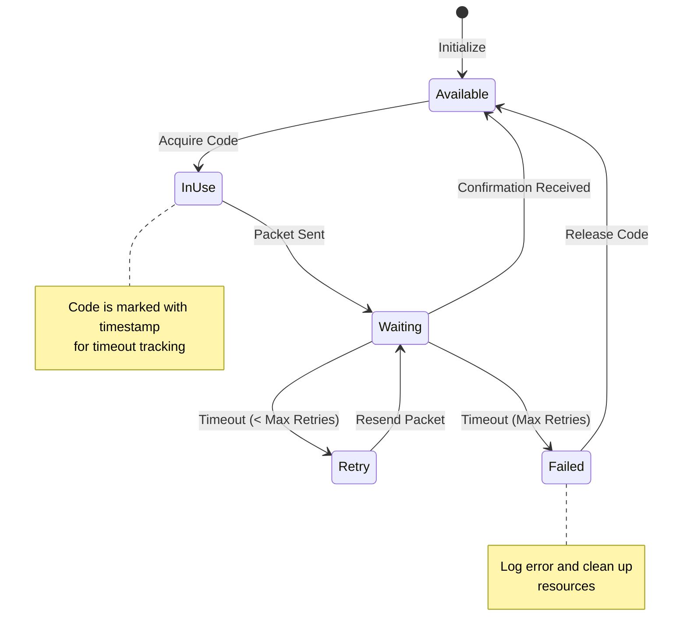

## Event Handling Flows

### C-Bus Event to MQTT Flow

```mermaid
flowchart TD
    A[C-Bus Event] --> B[PCI Receives]
    B --> C[PCIProtocol Decodes]
    
    C --> D{Event Type?}
    
    D -->|Light On| E[on_lighting_group_on()]
    D -->|Light Off| F[on_lighting_group_off()]
    D -->|Light Ramp| G[on_lighting_group_ramp()]
    D -->|Clock Update| H[on_clock_update()]
    D -->|Level Report| I[on_level_report()]
    
    E --> J[CBusHandler Process]
    F --> J
    G --> J
    H --> K[Update System Time]
    I --> L[Process Multiple Groups]
    
    J --> M{Group Published?}
    M -->|No| N[Publish Config]
    M -->|Yes| O[Skip Config]
    
    N --> P[Update MQTT State]
    O --> P
    
    L --> Q[For Each Level]
    Q --> M
    
    P --> R[Publish to MQTT]
    R --> S[Update Binary Sensor]
    S --> T[Event Complete]
```

### MQTT Discovery Flow

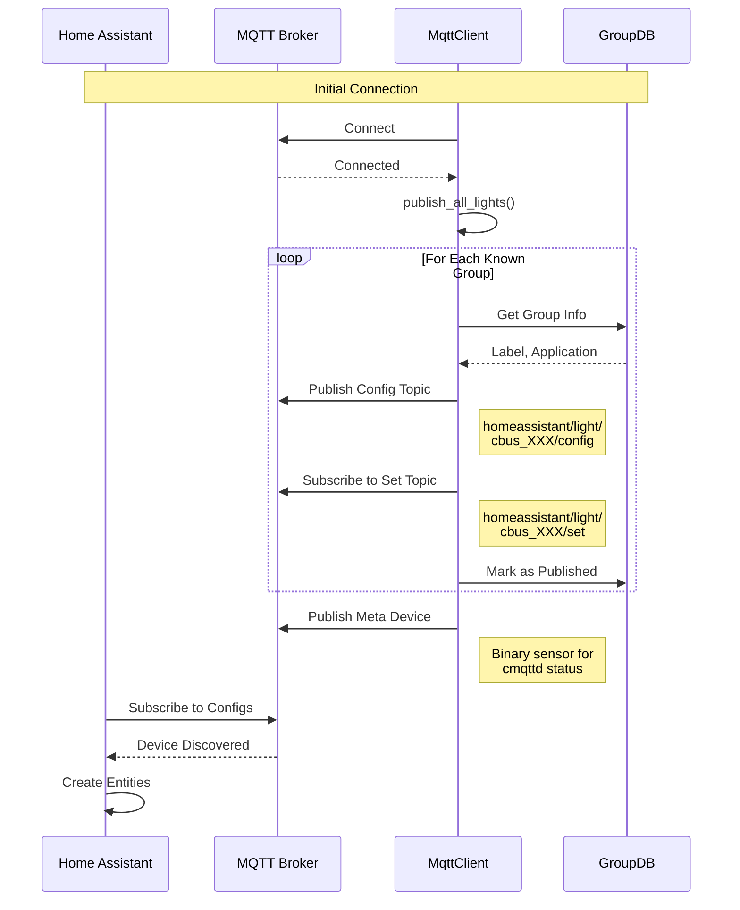

## Error Handling and Recovery

### Retry Mechanism Flow

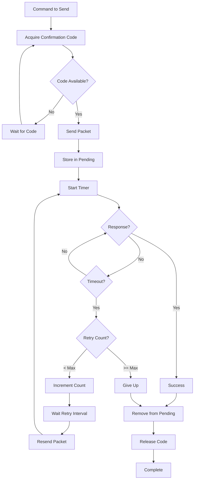

### Memory Leak Prevention

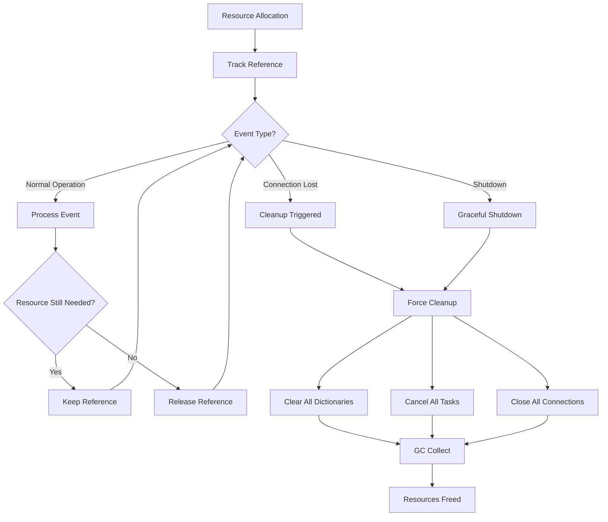

## Integration Flows

### Docker Container Lifecycle

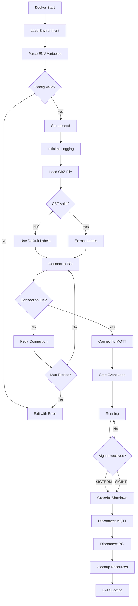

### Home Assistant Integration

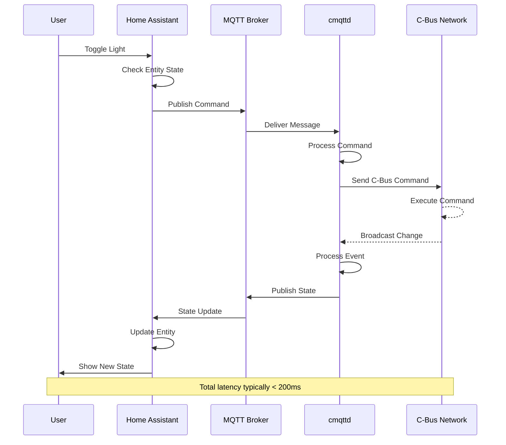

### Periodic Synchronization

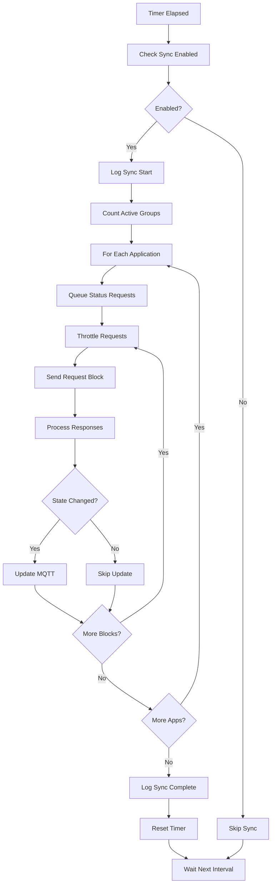