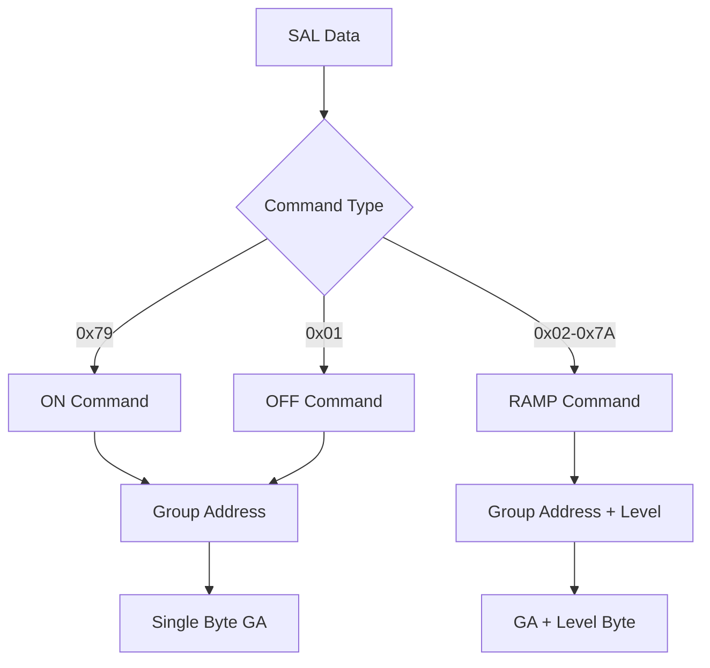
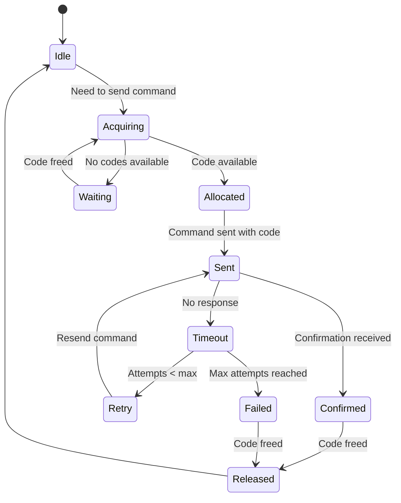
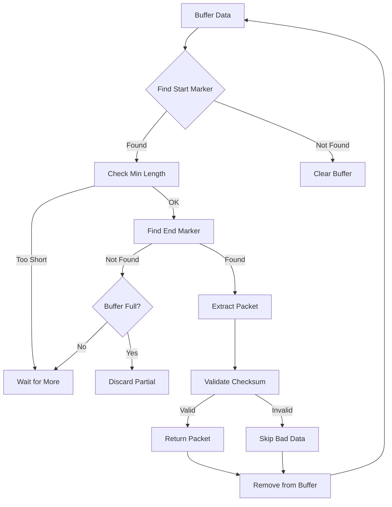
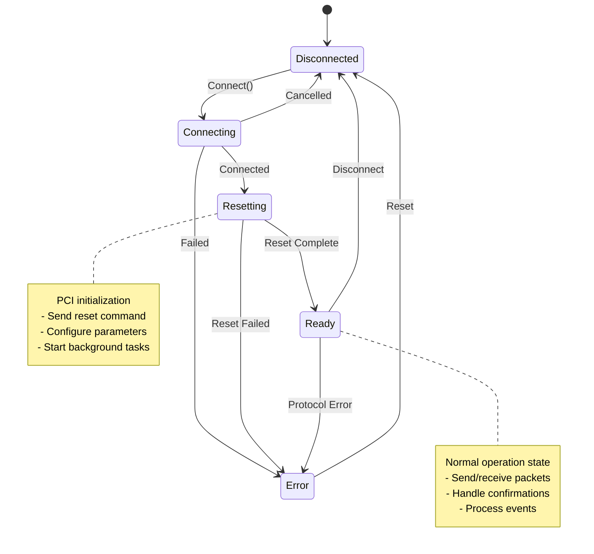

# C-Bus Protocol Implementation - Technical Deep Dive

## Table of Contents
1. [Protocol Overview](#protocol-overview)
2. [Packet Structure Analysis](#packet-structure-analysis)
3. [Command Encoding](#command-encoding)
4. [Application Layer Protocols](#application-layer-protocols)
5. [Confirmation System](#confirmation-system)
6. [Buffer Management](#buffer-management)
7. [State Machine Implementation](#state-machine-implementation)

## Protocol Overview

The C-Bus protocol is a multi-layer communication protocol designed for home automation. This implementation provides a pure Python interface to the protocol without relying on proprietary libraries.

### Protocol Layers

```
┌────────────────────────────────────────┐
│ Application Layer (SAL/CAL)            │
├────────────────────────────────────────┤
│ Presentation Layer (Packet Encoding)    │
├────────────────────────────────────────┤
│ Session Layer (Confirmation Codes)      │
├────────────────────────────────────────┤
│ Transport Layer (Serial/TCP)            │
└────────────────────────────────────────┘
```

## Packet Structure Analysis

### Base Packet Format

All C-Bus packets follow a basic structure:

```
┌─────────┬──────────┬─────────────┬──────────┬──────────┐
│ Start   │ Type     │ Payload     │ Checksum │ End      │
│ (1 byte)│ (1 byte) │ (variable)  │ (1 byte) │ (1 byte) │
└─────────┴──────────┴─────────────┴──────────┴──────────┘
```

### Packet Types

```python
# From the codebase analysis:
PACKET_TYPES = {
    '\\': 'Smart Mode Start',
    '~': 'Reset',
    '@': 'Address Setting', 
    'A': 'Recall Parameter',
    'B': 'Identify Unit',
    'P': 'Point-to-Point',
    'I': 'Point-to-Point-to-Multipoint',
    '\\05': 'Point-to-Multipoint',
    '!': 'Error',
    '#': 'Confirmation',
    '$': 'Power On',
    '=': 'Power On Notification'
}
```

### Detailed Packet Structures

#### Point-to-Multipoint (PM) Packet
```
┌────┬─────┬─────────┬──────┬───────────┬─────────┬──────┬────┐
│ \  │ 05  │ Source  │ App  │ Routing   │ SAL     │ Chk  │ \r │
│    │     │ Address │      │           │ Data    │ sum  │    │
└────┴─────┴─────────┴──────┴───────────┴─────────┴──────┴────┘
```

#### Point-to-Point (PP) Packet
```
┌────┬─────┬───────┬─────────┬──────┬─────────┬──────┬────┐
│ \  │ 06  │ Dest  │ Source  │ App  │ CAL     │ Chk  │ \r │
│    │     │ Addr  │ Address │      │ Data    │ sum  │    │
└────┴─────┴───────┴─────────┴──────┴─────────┴──────┴────┘
```

## Command Encoding

### Lighting Commands

The lighting application uses specific command codes:

```python
# Command structure for lighting
LIGHTING_COMMANDS = {
    0x79: 'ON',           # Turn group on
    0x01: 'OFF',          # Turn group off  
    0x09: 'TERMINATE_RAMP', # Stop ramping
    # Ramp rates (0x02 - 0x7A)
    0x02: 'RAMP_0s',      # Instant
    0x0A: 'RAMP_4s',      # 4 second ramp
    0x12: 'RAMP_8s',      # 8 second ramp
    # ... up to ...
    0x7A: 'RAMP_17m',     # 17 minute ramp
}
```

### Command Encoding Example

```python
# Turning on light at group address 100:
# PM packet: \05 + FF + 38 + 00 + 79 + 64 + checksum
# Where:
#   \05 = PM packet type
#   FF = Broadcast source
#   38 = Lighting application (0x38)
#   00 = No routing
#   79 = ON command
#   64 = Group 100 (0x64)
```

### SAL (Smart Application Language) Structure



## Application Layer Protocols

### Lighting Application (0x30-0x5F)

```python
class LightingApplication:
    """Handles lighting control commands"""
    
    COMMAND_STRUCTURE = {
        'on': {
            'code': 0x79,
            'params': ['group_address']
        },
        'off': {
            'code': 0x01,
            'params': ['group_address']
        },
        'ramp': {
            'code_range': (0x02, 0x7A),
            'params': ['group_address', 'level']
        }
    }
```

### Clock Application (0xDF)

```python
class ClockApplication:
    """Handles time synchronization"""
    
    COMMANDS = {
        0x08: 'UPDATE_TIME',
        0x11: 'REQUEST_TIME'
    }
    
    ATTRIBUTES = {
        0x01: 'TIME',  # HH:MM:SS
        0x02: 'DATE'   # DD/MM/YY
    }
```

### Status Request Application (0xFF)

```python
class StatusRequestApplication:
    """Queries device states"""
    
    REQUEST_TYPES = {
        'BINARY': 0x7A,  # Get on/off states
        'LEVEL': 0x73    # Get dimming levels
    }
```

## Confirmation System

### Confirmation Code Pool

```python
# Available confirmation codes (from common.py)
CONFIRMATION_CODES = b'hijklmnopqrstuvwxyzg'

# Code allocation state machine
class ConfirmationCodeManager:
    def __init__(self):
        self.available = set(CONFIRMATION_CODES)
        self.in_use = {}  # code -> (timestamp, packet_data)
        self.pending = {}  # code -> retry_info
```

### Confirmation Flow



### Retry Logic Implementation

```python
class RetryManager:
    """Manages packet retransmission"""
    
    DEFAULT_CONFIG = {
        'max_retries': 3,
        'retry_interval': 1.0,  # seconds
        'confirmation_timeout': 30.0  # seconds
    }
    
    async def retry_loop(self):
        while True:
            current_time = time.time()
            for code, info in self.pending.items():
                if self.should_retry(info, current_time):
                    await self.retry_packet(code, info)
                elif self.should_abandon(info, current_time):
                    await self.abandon_packet(code, info)
            await asyncio.sleep(self.retry_interval)
```

## Buffer Management

### Receive Buffer Implementation

```python
class ReceiveBuffer:
    """Manages incoming data buffering"""
    
    def __init__(self, max_size=256):
        self.buffer = bytearray()
        self.max_size = max_size
        self.lock = asyncio.Lock()
    
    async def process_data(self, data):
        async with self.lock:
            self.buffer.extend(data)
            
            # Prevent buffer overflow
            if len(self.buffer) > self.max_size:
                # Find last valid packet start
                self.buffer = self.find_last_valid_start()
            
            # Extract complete packets
            packets = []
            while packet := self.extract_packet():
                packets.append(packet)
            
            return packets
```

### Packet Extraction Algorithm



## State Machine Implementation

### Connection State Machine

```python
class ConnectionState(Enum):
    DISCONNECTED = 0
    CONNECTING = 1
    RESETTING = 2
    READY = 3
    ERROR = 4

class ConnectionStateMachine:
    """Manages PCI connection states"""
    
    TRANSITIONS = {
        ConnectionState.DISCONNECTED: [
            ConnectionState.CONNECTING
        ],
        ConnectionState.CONNECTING: [
            ConnectionState.RESETTING,
            ConnectionState.ERROR,
            ConnectionState.DISCONNECTED
        ],
        ConnectionState.RESETTING: [
            ConnectionState.READY,
            ConnectionState.ERROR
        ],
        ConnectionState.READY: [
            ConnectionState.ERROR,
            ConnectionState.DISCONNECTED
        ],
        ConnectionState.ERROR: [
            ConnectionState.DISCONNECTED
        ]
    }
```

### Protocol State Diagram



### Event Processing Pipeline

```python
class EventProcessor:
    """Processes C-Bus events through handlers"""
    
    def __init__(self):
        self.handlers = {
            LightingOnSAL: self.handle_lighting_on,
            LightingOffSAL: self.handle_lighting_off,
            LightingRampSAL: self.handle_lighting_ramp,
            ClockUpdateSAL: self.handle_clock_update,
            LevelStatusReport: self.handle_level_report,
        }
    
    async def process_packet(self, packet):
        # Extract events from packet
        events = self.extract_events(packet)
        
        # Process each event
        for event in events:
            handler = self.handlers.get(type(event))
            if handler:
                await handler(event)
```

### Memory Safety Patterns

```python
class ResourceManager:
    """Ensures proper resource cleanup"""
    
    def __init__(self):
        self._resources = []
        self._cleanup_tasks = []
    
    def register(self, resource, cleanup_func):
        self._resources.append(resource)
        self._cleanup_tasks.append(cleanup_func)
    
    async def cleanup(self):
        """Clean up all resources in reverse order"""
        for task in reversed(self._cleanup_tasks):
            try:
                await task()
            except Exception as e:
                logger.error(f"Cleanup error: {e}")
        
        self._resources.clear()
        self._cleanup_tasks.clear()
```

### Performance Optimization

```python
class PerformanceOptimizations:
    """Key performance optimizations"""
    
    # 1. Command Throttling
    throttler = Throttler(
        max_rate=10,  # commands per second
        burst_size=20  # allow bursts
    )
    
    # 2. Batch Processing
    async def batch_status_requests(self, groups):
        """Request status in efficient blocks"""
        BLOCK_SIZE = 32
        for i in range(0, len(groups), BLOCK_SIZE):
            block = groups[i:i + BLOCK_SIZE]
            await self.request_block_status(block)
    
    # 3. Connection Pooling
    connection_pool = ConnectionPool(
        max_connections=5,
        keepalive_interval=30
    )
``` 