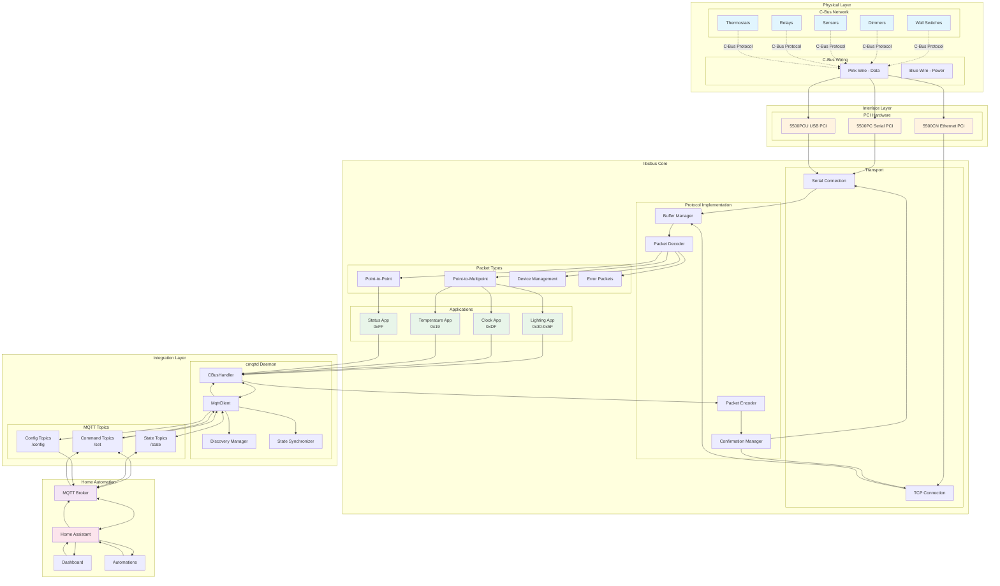
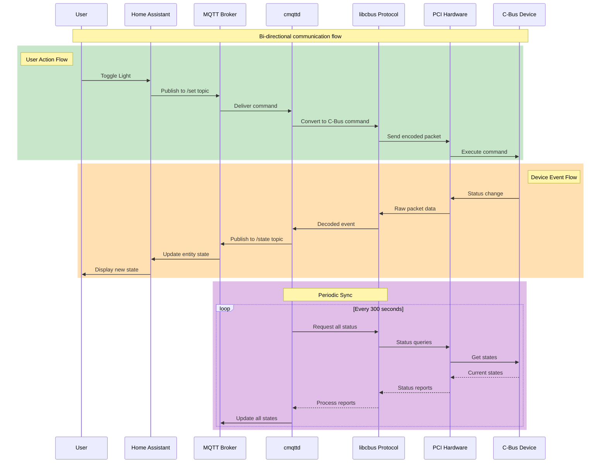
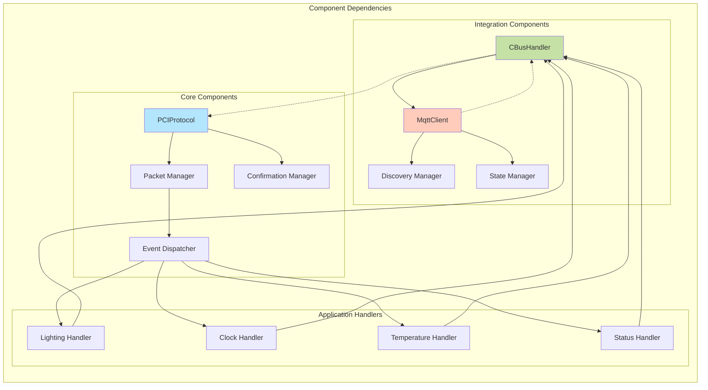
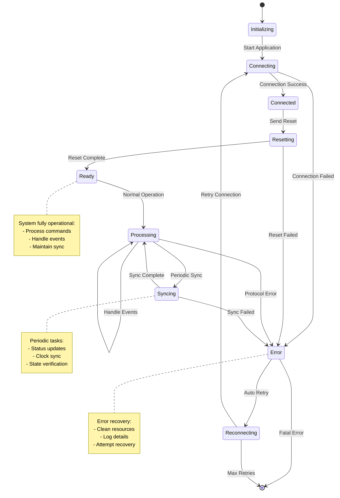
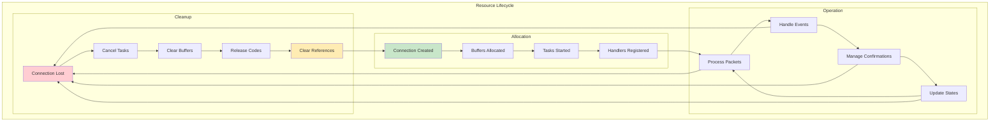
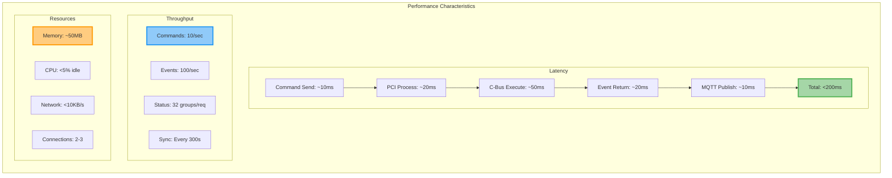

# C-Bus Library - System Overview Diagrams

## Complete System Architecture

## Data Flow Overview

## Component Interaction Matrix

## State Management

## Memory and Resource Management

## Performance Metrics

