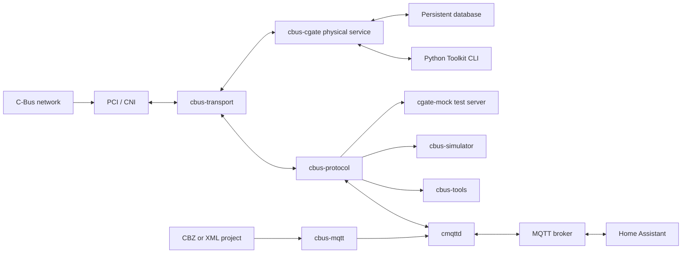

# Architecture

The repository has two application stacks. The Python `cbus-toolkit` CLI handles project editing and commissioning workflows. The Rust workspace supplies the MQTT bridge, reusable protocol libraries, inspection tools, and test servers.

## Toolkit CLI

`toolkit-cli/src/cbus_toolkit/cli.py` exposes the Python command-line interface. Offline commands use project-file editors and device-specific planning modules. Online `cgate` commands use the Python C-Gate client and typed workflow wrappers; direct `pci` commands use the Python PCI transport. These clients can address vendor software or explicitly selected test servers.

The CLI can connect to the Rust `cgate-mock` over TCP. The interop suite drives that server through the same Python client and typed wrappers used in production. The CLI does not require the Rust binaries for offline project work or connections to a native C-Gate server. Its detailed functions and compatibility limits are documented in the [Toolkit guide](../toolkit-cli/README.md).

## Rust workspace

The workspace separates pure protocol behavior from I/O and applications. This keeps packet rules testable without a network and lets the same codec serve the bridge, tools, simulator, and C-Gate test server.

## Runtime layers

`cbus-protocol` owns C-Bus values and byte-level encoding. It has no sockets or asynchronous runtime. Packet decoding produces typed packet, CAL, SAL, and report values; the JSON module provides a stable representation for tools and test vectors.

`cbus-transport` owns byte-stream framing and PCI/CNI lifecycle. It opens TCP or serial endpoints, performs PCI initialization, tracks confirmation codes, retries unconfirmed frames, reconnects when configured, and schedules command and status traffic through the flow controller.

`cbus-mqtt` owns pure MQTT behavior: topic naming, inbound command parsing, Home Assistant discovery payloads, and project-label extraction. `cmqttd` combines it with `rumqttc` and `cbus-transport`.

`cbus-cgate` contains a synchronous command model and the physical service embedded in cmqttd. That service adds persistent database storage, bounded TCP connections, per-client sessions, and source-correlated device reads using the bridge's existing PCI client. Only implemented physical operations reach the bus; unsupported operations return errors. The separate `cgate-mock` binary retains deterministic in-memory behavior for client tests. See [service status](cmqttd-cgate.md).

## Test layers

`cbus-golden-tests` generates one Rust test per compatibility vector and also generates exhaustive finite-domain cases. `cbus-test-support` supplies a small MQTT broker, fake PCI, child-process handling, and polling utilities. `cmqttd` system tests run the real binary against those components.

Committed fixtures and vectors live under `rust/testdata`; no external migration harness is required.
