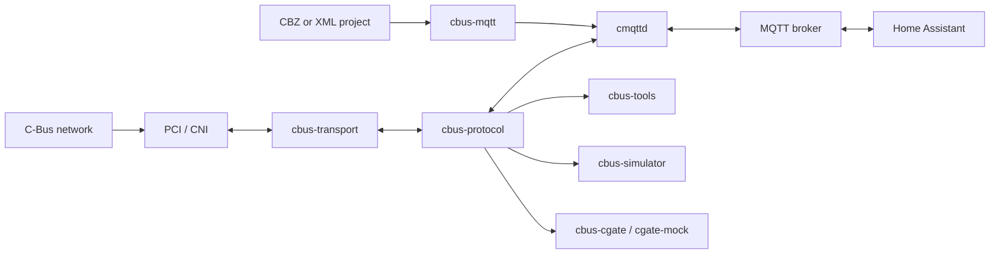

# Architecture

The workspace separates pure protocol behavior from I/O and applications. This keeps packet rules testable without a network and lets the same codec serve the bridge, tools, simulator, and C-Gate test server.

## Runtime layers

`cbus-protocol` owns C-Bus values and byte-level encoding. It has no sockets or asynchronous runtime. Packet decoding produces typed packet, CAL, SAL, and report values; the JSON module provides a stable representation for tools and test vectors.

`cbus-transport` owns byte-stream framing and PCI/CNI lifecycle. It opens TCP or serial endpoints, performs PCI initialization, tracks confirmation codes, retries unconfirmed frames, reconnects when configured, and schedules command and status traffic through the flow controller.

`cbus-mqtt` owns pure MQTT behavior: topic naming, inbound command parsing, Home Assistant discovery payloads, and project-label extraction. `cmqttd` combines it with `rumqttc` and `cbus-transport`.

`cbus-cgate` is a separate in-memory C-Gate protocol model. The library parses tagged commands and mutates shared state. The `cgate-mock` binary provides the TCP framing, per-connection project selection, event subscriptions, and cross-client event fanout.

## Test layers

`cbus-golden-tests` generates one Rust test per compatibility vector and also generates exhaustive finite-domain cases. `cbus-test-support` supplies a small MQTT broker, fake PCI, child-process handling, and polling utilities. `cmqttd` system tests run the real binary against those components.

Committed fixtures and vectors live under `rust/testdata`; no external migration harness is required.
