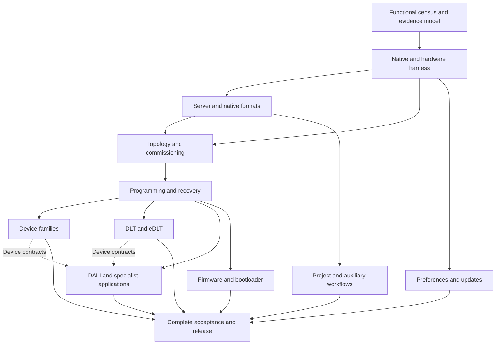

# Implementation review and execution plan to 100%

Reviewed 27 September 2026 against published commit
[`84cb7bba48f51236e2efb835fbe01f3eeffa74d8`](https://github.com/mitchell-johnson/cbus/commit/84cb7bba48f51236e2efb835fbe01f3eeffa74d8).
Target: **C-Bus Toolkit 1.18.0.2754 and C-Gate 3.4.0.2001**.
The review includes an independent GPT-6 Astra review of the published
implementation and the subsequent unmerged development work.
It combines source/evidence inspection, issue reconciliation and targeted
reproductions; it does not claim a new exhaustive execution of every function.

This revision makes **100% functional parity the delivery target**, with 59
tracked work items in 12 packages, six delivery stages and a concrete first
batch. These are execution tasks, not a new functionality denominator.
Unchecked items retain open exit conditions; checked items cover only their
declared scope. The working subsets remain in the implementation status.

The 3 October [SceneManager inventory batch](../toolkit-cli/docs/feature-batch-2026-10-03-scene-inventory-timeline.md)
adds bounded native create-enabled getter and accepted/cancelled Add histories,
initial per-scene label generations, retained old collections and ordered
parent/Reset ownership. This advances P6.01 without closing its full original
host/physical acceptance contract. The current ledger is 18 implemented,
22 in progress and 2 pending out of 42; its 42.86% category ratio is separate
from the still-unmeasured functional percentage. Earlier review tables below
retain their explicitly dated scope.

Start with the [first delivery batch](#first-delivery-batch), follow the
[dependency order](#dependency-order-and-delivery-stages), and use the
[completion contract](#completion-contract-and-progress-accounting) to decide
when the work is finished. Reaching 90% is an optional progress checkpoint,
not an exit condition or a reason to stop implementing the remaining scope.

Each work item below links to its GitHub issue in the [parity backlog](https://github.com/mitchell-johnson/cbus/issues?q=is%3Aissue%20is%3Aopen%20label%3Aparity).
The earlier umbrella issues [#10](https://github.com/mitchell-johnson/cbus/issues/10),
[#11](https://github.com/mitchell-johnson/cbus/issues/11) and
[#12](https://github.com/mitchell-johnson/cbus/issues/12) retain the historical
implementation and acceptance evidence; their replacement by individual tasks
does not close any outstanding functionality. GitHub carries each task's current
status; the boxes here record accepted scope at this revision.

## Assessment

The repository contains substantial working products: the Python Toolkit CLI
and the Rust `cmqttd` service, with a shared C-Bus transport and MQTT support.
It does **not** yet establish full Toolkit or C-Gate replacement. The largest
remaining gaps are complete device/workflow semantics, native file and server
interoperability, commissioning and programming recovery, firmware, and
independent native and physical acceptance.

The latest proposed route to a 90% category count would classify a broad row
as implemented when **at least one bounded public workflow** is complete.
That is too weak to measure the original full-functionality objective. This
review does not endorse those promotions as progress to 90% functionality.
Keep the existing bounded functions and their tests; close the remaining
functions rather than redefine the rows around the available subset.

### What the numbers actually establish

| Measure at the reviewed revision | Current result | Interpretation |
| --- | --- | --- |
| Toolkit feature ledger | 18 implemented / 19 in progress / 2 pending; 39 total | **46.15% of broad category labels**, not a functionality percentage |
| Complete Toolkit acceptance | `complete=false`, `census_complete=false` | Full parity is unproven |
| Differential matrix | 4 accepted slots / 234; 0 fully accepted areas / 39 | Four bounded nominal workflows have accepted evidence; 230 slots remain unassessed. This is an evidence measure, not code completeness |
| Documentation surface inventory | 3,767 indexed topics, 209 public command blocks, 118 dialog candidates | A starting inventory, not a deduplicated functional denominator; its topic/command acceptance counts are zero |
| Vendor catalogue inventory | 577 unit records, 3,750 firmware revision records, 271 unit types | Inventory only; records and revisions cannot be counted as independently supported hardware |
| cmqttd primary C-Gate routing | 429/429 non-obsolete paths, or 100% | Every maintained primary path reaches a handler; selectors, effects and interoperability can still be incomplete |
| Full C-Gate replacement | `full_cgate_compatibility=false` | Native formats, access/configuration semantics, DALI selectors, device behavior and acceptance remain open |

With 39 categories, 36 implemented labels would be 92.31%; 35 would be
89.74%. Those arithmetic facts cannot establish 90% of Toolkit functionality.
A meaningful functional percentage needs the finite requirement map in work
package P0 below. No calendar or effort percentage can be defended from the
current category counts.

Sources: [feature ledger](../toolkit-cli/src/cbus_toolkit/capabilities.json),
[surface census](../toolkit-cli/docs/toolkit-surface.json),
[differential matrix](../toolkit-cli/src/cbus_toolkit/differential.py),
[cmqttd replacement limits](cmqttd-cgate.md#outstanding-replacement-work).

## Review findings

Priority P1 means a blocker to the relevant merge or full-replacement claim;
P2 means a required coverage or release-control improvement. A finding about
a draft is not a deployed defect.

### R1 — P1: category promotion can conceal unfinished functionality

The unmerged integration branch added `implementation-row-policy.md` and
`coverage --require-implemented-percent`. Its threshold arithmetic is sound,
but the proposed policy admits an entire category after a single bounded
workflow. For example, complete thermostat scheduling is not complete
thermostat configuration; SENPILL occupancy support does not implement all
sensor dialogs; a preference editor does not implement the updater.

The same rule could promote firmware today because bounded DFU workflows
already exist. Leaving firmware unfinished while promoting comparable subsets
elsewhere would therefore be inconsistent. The network promotion draft also
reclassifies seven broad rows using existing tests and a new manifest; a
manifest asserting a status is not new behavioral acceptance.

**Required action:** keep this threshold, if retained at all, as a separately
named category metric. Do not merge the proposed policy or bulk status changes
as evidence for the user's 90% target. Record implementation, original
comparison and physical acceptance separately for each functional obligation.
Preserve wider gaps in both the backlog and the public status output.

### R2 — historical draft update-diagnostic provenance defect

At the original review, the unmerged `toolkit_update_bundle.py` composer
(lines 82–193 at review)
accepts four parsed objects separately from four byte strings. It hashes the
strings without proving they decode to the supplied objects. It matches the
selected node ID and two self-reported metadata hashes, but never matches
`metadata.source.file_sha256` to `catalogue.http.body_sha256`. Revocation and
condition reports also lack a verified relationship to that selected node.

Both reviewers reproduced `diagnostics_complete=true` with different catalogue
and metadata source hashes and unrelated `input_bytes`. The existing tests
even supply literal `b"catalogue"`, `b"metadata"`, and similar strings in place
of serialized reports. The draft still reports trust/install claims false,
so this is an incorrect diagnostic-linkage claim, not an observed installation
or publisher-trust bypass.

The integrated v4 composer now parses exact bounded raw documents, rejects
duplicate keys and ambiguous identities, binds selected metadata to the
catalogue response, and requires matching condition and revocation receipts.
The 2026-09-28 P9.01 review and focused adversarial tests also pin condition
source representation and the unverified revocation request-subject boundary.
Unlinked reports keep `diagnostics_complete=false`. The 62 required diagnostic
and package-bundle cases passed in both the source and installed-wheel audits
of the [integrated CI run](https://github.com/mitchell-johnson/cbus/actions/runs/36369952618),
with no P9.01 skips; the [P9.01 closure receipt](../toolkit-cli/research/experiments/2026-09-28/update-diagnostic-bundle-review.json)
binds the exact source revision, wheel hash and applicability decision for
[#60](https://github.com/mitchell-johnson/cbus/issues/60).
This diagnostic work does not establish publisher trust or installation parity.

### R3 — P1: primary command routing does not cover valid selectors

Published cmqttd routes all primary command paths, but DALI conditional
extraction stops before `ADDRESS_UNKNOWN`, and typed `DALI_ONLY`/`FULL`
deployment stops before writes. The full unit allocation, write ordering,
model-field ownership, readback and combined typed/extended transaction
contract are unfinished. Explicit patch manifests work, but native
`patchset.zip` ingestion is unsupported. Native repository/archive formats
and full CGL metadata/controller behavior are also missing.

**Required action:** expand the C-Gate inventory from primary paths to
command/selector/state combinations, retain original request/reply and state
evidence for each, then implement these missing branches. Keep the current
refusals until their contracts are known. See
[DALI](cgate-dali.md) and [service limits](cmqttd-cgate.md#outstanding-replacement-work).

### R4 — P1: native authorization and runtime configuration semantics are incomplete

Published `service.rs` explicitly advertises
`access_global_command_level_matrix=false` and does not map TLS certificate
identities into ACCESS rows. The access-level matrix is a confirmed gap;
native certificate identity behavior remains an unresolved comparison, not
proof that native C-Gate requires such a mapping. CONFIG stores a compatibility catalogue
and snapshots but does not apply those values to the running listener, MQTT
client, transport or loggers. These are material differences for a replacement
server, even where command syntax and persistence work.

**Required action:** capture and enforce native per-handler access rules,
session elevation/revocation and certificate admission behavior. Implement
certificate identity mapping only if the target native behavior requires it. Identify which
configuration values are live, restart-bound, read-only or external to cmqttd,
and test their real effect. Preserve intentional credential redaction and
other security improvements as explicit compatibility deviations; do not
silently call them byte-exact equivalence.

Evidence: [service capabilities and behavior](../rust/cbus-cgate/src/service.rs),
[ACCESS/TLS/configuration boundaries](cmqttd-cgate.md).

### R5 — P1: programming success and durable physical success remain different

The typed PP client admits ten methods and performs one save followed by a
fresh load. Only `direct` currently has the full Python CLI → real cmqttd →
synthetic PCI programming integration in
[`test_cmqtt_interop.py`](../toolkit-cli/tests/test_cmqtt_interop.py).
Other methods have Python scripted-client and Rust transport/service evidence.
All-method cross-language composition, real bridge/device effects,
multi-range recovery, and power-cycle persistence remain open.

The template draft's new `--save-project` confirms one PROJECT SAVE after a
database reload; that is not independent close/load or process-restart proof
of file durability. The thermostat draft checks collection order across its
own snapshot/save/reload; it does not establish original Toolkit manager order.

**Required action:** retain those distinctions in all status summaries. Add
real-daemon integration per programming method/protection/route class, then
native comparisons and physical/restart tests. Record which ranges were
confirmed, which may have changed, and the only safe recovery action after
each interruption. Never infer a rollback or replay uncertain mutations.

### R6 — P2: green CI is an offline gate, not the release acceptance gate

The exact published revision has successful CI, but the Python job builds
`cgate-mock` only. cmqttd-dependent Python tests use `skipif` when its binary
does not exist; the separate Rust job does not provision that binary into the
Python job. CI also tests an editable install rather than a fresh isolated
wheel. Native, Windows, vendor and hardware requirements are not provisioned
there. `make coverage` intentionally exits zero after printing the parity
gate's failure, so it must not be used as a release enforcement command.

**Required action:** build both servers in the Python interoperability job,
require intended interop tests to execute, add an isolated wheel job, retain
machine-readable skip reasons, and create a separately provisioned native and
hardware release gate. Run `cbus-toolkit coverage --require-complete` directly
for final enforcement.

Evidence: [CI workflow](../.github/workflows/ci.yml),
[Makefile](../toolkit-cli/Makefile), [test strategy](testing.md).

### R7 — P2: evidence aggregation needs stronger provenance

The current differential harness is useful and deliberately incomplete. Its
facts are curated constants checked against retained artifacts; the completion
CLI ultimately trusts ledger statuses and `census_complete`. This is not yet
an automatically derived certificate of current-revision acceptance.

The unmerged network acceptance manifest contains a placeholder test command
`<25 listed network/control modules>` rather than a reproducible exact list.
The Unicode template additions have expected fixtures and an optional original
test; a skipped original test cannot become fresh original evidence. The
repair-shape draft was added without dedicated positive/negative tests.

**Required action:** bind evidence to source/artifact hashes, exact test IDs,
runtime, profile, backend and observed outcomes. A current-code change must
invalidate affected older acceptance until its scope is revalidated. Test
manifest integrity in addition to behavior, never instead of behavior.

## Current strengths to retain

- Rust crate boundaries separate protocol, transport, MQTT transformations,
  C-Gate state/behavior and daemon orchestration. Exact vectors and real-daemon
  tests provide a strong base for further compatibility work.
- MQTT and C-Gate share one physical transport. Generation guards, correlated
  replies, one-attempt mutations, partial outcomes and reconnect invalidation
  are essential and already deeply tested.
- The Python CLI has substantial project, schema, native database, scene,
  classic-key and KEYGL5 functionality, including preservation, backup,
  reload and uncertain-save handling.
- KEYGL5 5.5.00 editor support is extensive: widget models, parent settings,
  five CRCs, ordered multi-edit composition, Reset/Blank and SceneManager,
  automatic metadata, static label reads and drift auditing.
- Encoding evidence is unusually broad: 6,487 of 6,497 declared catalogue
  boundary configurations and all 163 distinct layouts have retained native
  comparisons. The ten absent vendor specifications are explicit gaps in the
  vendor corpus, not implementations that should be invented.
- Documentation and capabilities generally distinguish PCI confirmation,
  device acknowledgement, readback, physical effect and persistence. Preserve
  that clarity when summarizing or promoting work.

## Disposition of unmerged work

All development work is preserved. None is included in the reviewed deployed
baseline merely because its focused tests passed.

| Development branch | Useful work | Next action |
| --- | --- | --- |
| Original user checkout, local `main` at `7db9238` | Existing uncommitted Python/Rust/docs changes on an older base | Preserve and reconcile separately against current GitHub; do not reset it or treat its uncommitted state as covered by published-revision CI |
| `codex/parity-next-20260927` | Explicit row-ratio threshold, evidence-path checks | Retain arithmetic as an optional category statistic; replace the proposed completion policy. Add 35/39 versus 36/39, combined flags, NaN/infinity, empty/duplicate/unknown-status ledger tests if merging the gate |
| `codex/promote-network-rows` | Committed `ffe7c21`: explicit routed PCI WRITE and ACK correlation | Review native command/ACK semantics, integrate focused behavior with existing reads, run full gates. Remove bulk promotions as a route to functional completion; make the acceptance command reproducible |
| `codex/promote-offline-20260927` | Encoding audit; Unicode Description metadata; optional template project save; whole-project CSV selection; thermostat order postcondition; repair-shape draft | Split into reviewable changes, add missing repair tests and native persistence/order evidence; retain admitted profile limits |
| `codex/ui-row-closures-20260927` | Sequential network diagnostics and SENPILL inspection | Integrate after review and applicable gates as bounded functions. The R2 source fix is integrated separately; neither inspector closes the broader family |

Reported focused results from the implementation agents: offline combined
slice **129 passed, 25 skipped, 3,374 subtests**; network diagnostics
**58 passed, 3 skipped**; sensor inspector **14 passed, no skips**. These are
worktree checkpoints, not an integrated release. The independent reviewer also
ran focused subsets; overlapping counts must not be added together.

## Definition of 100%

Full completion requires the selected Toolkit and C-Gate versions' functions
to be available through the CLI/service and verified within their actual
device, firmware, file, state and topology domains. It does not require a CLI
to visually reproduce a Windows dialog. It does require reproducing the
dialog's meaningful initialization, validation, dependencies, save behavior,
side effects and failure handling. Focus/modal behavior matters where it
changes those observable results.

Every functional obligation needs:

1. A stable ID, original source reference, owning component, CLI/API entry
   point, supported profiles and preconditions.
2. An implementation that reaches the complete declared outcome, including
   its recoverable failure behavior and preservation requirements.
3. Independent original evidence for nominal, error, invalid-input and relevant
   profile variation, with precisely named intentional deviations.
4. Native persistence, physical effects, rendering, power-cycle and recovery
   evidence wherever the function actually depends on them.
5. Reproducible current-artifact tests and retained results, including skipped
   and failed attempts.

A native feature proved absent or obsolete can be marked not applicable with
version-specific evidence. A feature delegated to PICED requires Toolkit's
launch/handoff/data-exchange contract, not a reimplementation of PICED itself.
Unsupported functions must not be relabeled as external or excluded simply
because they are difficult. An operator's house lacking a device is not proof
that its Toolkit functionality is out of scope.

The existing six-slot matrix remains the historical baseline. Pure file or
inventory workflows may not have meaningful physical-device or multi-firmware
effects. Resolve those applicability cases explicitly with evidence and a
versioned matrix design; never silently turn `unassessed` into `accepted`.
Likewise, repair deliberate native defects only with documented behavior and
an explicit compatibility decision. A useful safer alternative is not by
itself exact parity.

## Completion contract and progress accounting

The target covers **both products together**: Toolkit-owned functions must be
usable through the Python CLI, and C-Gate-owned functions must run through
Rust `cmqttd`, alongside working MQTT support. A CLI workflow that still needs
Schneider C-Gate in production does not close the replacement goal. Original
Toolkit/C-Gate remain comparison oracles during development. A raw command
forwarder, mock handler or read-only inspector cannot substitute for an
unfinished user workflow.

P0 must turn the inventory into a versioned set of functional obligations.
Do not call the initial map exhaustive until the executable controls, valid
selectors and native-supported device/firmware domains are reconciled.
Each newly discovered requirement joins the map before the next progress
calculation; preserve previous denominators so additions remain visible.
The target cannot be reduced to the equipment installed in one house.

| Record field | Required content |
| --- | --- |
| Identity and origin | Stable obligation ID; Toolkit/C-Gate version; source/control/selector reference; ledger row and work item IDs |
| User outcome | CLI command or service operation, preconditions, expected successful result, failures and values that must be preserved |
| Supported domain | Device, firmware, format, locale, state, protection and topology cases; a reasoned partition where native equivalence is established |
| Implementation | Owning Python module/Rust crate, integrated revision and executable test IDs; incomplete branches stay explicit |
| Acceptance | Required original, interop, physical, rendering, persistence and recovery cases, each with a status and exact evidence reference |
| Applicability | Version-specific proof for every not-applicable dimension or native-absent function; hardware unavailable is `blocked`, not not-applicable |
| Provenance | Source and release artifact hashes, original artifact hashes, exact command, result, skips/failures, and invalidation rules |

These fields are the **schema requirement for P0**. The packaged provisional
register and validator now enforce the record structure, while the complete
deduplicated obligation set and its acceptance evidence remain unfinished.
Preserve the current ledger and six-slot matrix as historical evidence while
finishing this finer map.

Publish three separate ratios after the census is accepted:

- **Implemented:** obligations with complete executable behavior and passing
  implementation tests / all applicable functional obligations.
- **Accepted:** obligations whose implementation and every required acceptance
  dimension pass / all applicable functional obligations. This is the
  full-functionality completion measure; equal counts are not an effort estimate.
- **Physical acceptance:** passed required physical cases / all required physical
  cases. Show the case count, unavailable fixtures and other blockers alongside
  the ratio. It does not stand in for native or workflow acceptance.

An obligation closes only when its **entire declared case set** passes. A
pass from one device or one nominal path cannot close the other cases.
Not-applicable dimensions need reviewed original evidence; an unsupported
implementation, absent test fixture, skipped test or unknown scope cannot
satisfy a required dimension. If a code change invalidates an acceptance
record, reopen that record and the obligations depending on it.

The final completion decision is conjunctive, not an average:

```text
100% = exhaustive versioned census accepted
       AND every applicable obligation implemented and accepted
       AND every required native and physical case passed
       AND no unresolved replacement-blocking deviation or unknown scope
       AND final wheel/image acceptance and deployment gates passed
       AND coverage --require-complete succeeds from the installed artifact
```

P0/P11 must make the command derive that decision from validated records;
editing `complete`, `census_complete` or a capability flag is not the mechanism
for completion. MQTT regression, migration/recovery and package-installation
gates also remain mandatory even though they are not Toolkit help topics.

## Execution plan

Each checkbox has a stable work item ID. Close it only when its complete
stated scope and the applicable package exit criteria have matching evidence;
partial implementation remains in its linked obligation records. Each package must
publish code, native vectors where applicable, positive and negative tests,
current-artifact evidence, remaining limits and updated AI operating references.
The 59 boxes organize delivery; checking 53 boxes is not evidence of 90%
functionality, and the existing 18 implemented ledger rows still need their
outstanding acceptance work.

### P0 — Establish the functional denominator and trustworthy progress

**Owns:** Python coverage/census tooling and shared compatibility records.
**Depends on:** the existing inventories; can start immediately.

- [ ] **P0.01** ([#13](https://github.com/mitchell-johnson/cbus/issues/13)) — Walk all 3,767 topics and six unindexed HTML files, all 118 dialog candidates,
  menus, toolbars and executable controls. Resolve the 179 macro-reference
  leaves and implicit/undocumented branches. Deduplicate documentation while
  keeping genuinely different workflow/profile behavior distinct.
- [ ] **P0.02** ([#14](https://github.com/mitchell-johnson/cbus/issues/14)) — Expand 431 C-Gate primary paths into valid selectors, states, target forms,
  authorization levels, response/event envelopes and effects. Reconcile the
  209 documentation blocks with manual/bytecode inventories without adding
  their counts together.
- [ ] **P0.03** ([#15](https://github.com/mitchell-johnson/cbus/issues/15)) — Produce an obligation record with independent fields for implementation,
  original differential acceptance, physical acceptance and applicability.
  Map every obligation to its broad ledger row; preserve the 39-row history.
- [ ] **P0.04** ([#16](https://github.com/mitchell-johnson/cbus/issues/16)) — Define workflow-level completion criteria before changing statuses. Publish
  separate percentages using a fixed, reviewed denominator; report unknown
  scope explicitly and version the denominator when discoveries add work.
- [ ] **P0.05** ([#17](https://github.com/mitchell-johnson/cbus/issues/17)) — Derive completion from evidence records and executable tests. Reject missing
  IDs, duplicate IDs, unknown states, missing evidence, altered hashes and
  unexplained skips. A file's existence is insufficient acceptance.

**Exit:** every inventoried surface is mapped or has an evidenced disposition;
all newly discovered executable behavior is recorded; no unassessed surface
is hidden by a category status. Functional progress toward 100% becomes
measurable only after this mapping. Do not set `census_complete=true` merely because all help pages
have been counted.

### P1 — Make original/native and hardware acceptance repeatable

**Owns:** research runners, acceptance fixtures and CI/release infrastructure.
**Depends on:** P0 IDs; infrastructure work runs in parallel with the census.

- [ ] **P1.01** ([#18](https://github.com/mitchell-johnson/cbus/issues/18)) — Pin Toolkit EXE/DLLs, target C-Gate, JVM, decoded specifications and updater
  artifacts by hash. Use owned disposable native services and isolated Windows
  profiles/projects. Preserve vendor binaries privately.
- [ ] **P1.02** ([#19](https://github.com/mitchell-johnson/cbus/issues/19)) — Provision authorized Windows access for new GUI and worker captures. Existing
  retained fixtures and host-native acceptance can continue while that
  environment is unavailable.
- [ ] **P1.03** ([#20](https://github.com/mitchell-johnson/cbus/issues/20)) — Capture original inputs, raw output, event order, PP bytes and save/close/load
  outcomes for one complete workflow at a time. Do not join unrelated fragment
  tests into an end-to-end original result.
- [ ] **P1.04** ([#21](https://github.com/mitchell-johnson/cbus/issues/21)) — Define hardware fixtures by type, catalogue, firmware, serial hash, topology,
  protection and instrumented observable effect. Obtain representative relay,
  dimmer, classic/Neo/DLT/eDLT, sensor, thermostat, DALI, wireless and specialist
  application devices, plus USB/bootloader and bridge test setups as required.
- [ ] **P1.05** ([#22](https://github.com/mitchell-johnson/cbus/issues/22)) — Build cmqttd in the Python CI job; run both interop suites, isolated-wheel
  tests, and separate provisioned native/hardware jobs. Record the actual
  executed tests and skips instead of inferring them from a green job.

**Exit:** a fresh checkout reproduces each declared gate; required native
provisioning fails visibly when absent; raw private evidence has sanitized,
hash-bound public receipts. The prior zero-skip September 15 artifact is
historical evidence, not acceptance of newer code.

### P2 — Complete native C-Gate server and file interoperability

**Owns:** `cbus-cgate`, project/file adapters, Python native clients.
**Depends on:** P0 command cases and P1 native oracle.

- [ ] **P2.01** ([#23](https://github.com/mitchell-johnson/cbus/issues/23)) — Implement Schneider repository/archive/import/export formats and version
  transitions; prove bidirectional interchange with native C-Gate and Toolkit.
  Preserve unknown metadata, OIDs and references across copy/rename/restore.
- [ ] **P2.02** ([#24](https://github.com/mitchell-johnson/cbus/issues/24)) — Capture combined Network/Unit/Application DBSETXML replacement, including
  namespaces, comments, conflicts, omitted fields and lifecycle persistence.
  A 67-request owned original capture now covers independent Group/NetVar
  children under repeated-OID Applications, same-address direct replacement,
  exact XML readback and save/reload; Rust repository restart is covered.
  A further 62-request owned capture adds unique-OID Levels under both child
  kinds, load-time empty TagsDLT, and the direct NetVar/Level 500 response;
  Rust replays these exact outcomes and persists the bounded tree after restart.
  A 108-request follow-up proves that original C-Gate accepts the post-load
  empty Level TagsDLT in Network, Group, NetVar and Level replacements and
  retains it through another lifecycle; Rust replays those exact outcomes.
  A 24-request owned capture adds one nonempty Level TagDLT, native generated
  OID, explicit-OID edit and whole-Network roundtrip through another lifecycle;
  Rust replays the identity and XML after generated-OID substitution.
  Descendant OID collisions and broader combined forms remain open.
- [ ] **P2.03** ([#25](https://github.com/mitchell-johnson/cbus/issues/25)) — Complete CGL metadata/controller semantics and multi-network route behavior;
  distinguish importing a label graph from programming a controller.
- [ ] **P2.04** ([#26](https://github.com/mitchell-johnson/cbus/issues/26)) — Implement per-handler access levels and login/logout transitions. Capture
  native certificate admission and its relationship to ACCESS/LOGIN; implement
  identity mapping only if the target native behavior requires it. Cover denied operations before mutation,
  concurrent sessions, reconnect and persisted admission rules.
  The 2026-09-28 programming slice adds 40 independently probed handler entry
  floors (360 native role/invocation observations), bringing the maintained
  total to 129. A fourth owned native probe adds 44 Audio, Security and Media
  Transport entry floors (396 more role/invocation observations), bringing the
  maintained total to 173. All 44 enter at Operate. All PP leaves require
  Clipsal; PROGRAMMER and DEPLOY_QUEUE require Program. Rust denial,
  owner-session preservation on LOGIN downgrade,
  and LOGOUT restoration are covered. Object-specific authorization and the
  remaining command matrix still prevent closing this issue. A final safe
  owned-native sweep raises exact handler-entry observations to 431 of 442;
  eleven parser, comment, session and cmqttd-only paths retain no native floor.
  See the [programming validation record](../rust/cbus-cgate/research/programming-authorization-review-20260928.md)
  and [final role review](../rust/cbus-cgate/research/final-authorization-review-20260928.md).
- [ ] **P2.05** ([#27](https://github.com/mitchell-johnson/cbus/issues/27)) — Implement meaningful CONFIG runtime/restart effects and exact native FILE,
  REPOSITORY and server lifecycle behavior within the supported deployment
  model. Document intentional secure deviations explicitly.

**Exit:** original-native and Rust services accept the same admitted client
workflows and exchanges, produce equivalent durable state and denials, and
pass cross-server project roundtrips. All selector-level differences have a
resolved disposition; `full_cgate_compatibility` stays false until later
physical packages and the final audit also pass.

### P3 — Finish transport, topology, commissioning and reconciliation

**Owns:** `cbus-protocol`, `cbus-transport`, `cbus-cgate`, typed Python PCI/network
and addressing workflows. **Depends on:** P1; native state contracts from P2.

- [ ] **P3.01** ([#28](https://github.com/mitchell-johnson/cbus/issues/28)) — Integrate and independently validate routed WRITE alongside RECALL/IDENTIFY.
  Resolve logical topology in typed workflows rather than require operators
  to infer raw Reply Network paths for ordinary commissioning.
- [ ] **P3.02** ([#29](https://github.com/mitchell-johnson/cbus/issues/29)) — Cover discovery/setup across interfaces/adapters/subnets and the supported
  serial, CNI, Wiser, bridge and wireless gateways. Distinguish absence from
  timeout, incomplete scan and unreachable ownership.
- [ ] **P3.03** ([#30](https://github.com/mitchell-johnson/cbus/issues/30)) — Complete arbitrary supported duplicate sets, occupied-address displacement
  cycles, selected-serial and database matching, second-interface commissioning,
  and unknown-serial behavior as actually implemented by the native system.
- [ ] **P3.04** ([#31](https://github.com/mitchell-johnson/cbus/issues/31)) — Add durable plan/attempt/recovery identities, independent pre/post inventory,
  interrupted-process recovery and explicit handling of competing controllers.
  Existing process-local fingerprints must not be presented as global
  cross-process deduplication.
- [ ] **P3.05** ([#32](https://github.com/mitchell-johnson/cbus/issues/32)) — Reconcile physical identity/address changes with the database through explicit
  transactions, preserving serial/OID/reference identity and partial outcomes.

**Exit:** direct and supported one-to-six-bridge workflows pass nominal,
collision, loss, duplication, reordering, reconnect and recovery tests; physical
devices retain intended addresses after power cycle; unrelated networks remain
unchanged. No uncertain move is automatically replayed.

### P4 — Complete programming and durable failure recovery

**Owns:** Rust programming transport/service and Python `physical-pp`.
**Depends on:** P1 and P3; can build direct-method cases before routed completion.

- [ ] **P4.01** ([#33](https://github.com/mitchell-johnson/cbus/issues/33)) — Add real CLI → cmqttd → independent PCI integration for all ten methods:
  `direct`, `paged`, `ncc`, `edlt`, `giu`, `sgiu`, `dali`, `goc`, `gocbyt`, `goc2`.
- [ ] **P4.02** ([#34](https://github.com/mitchell-johnson/cbus/issues/34)) — Exercise every applicable `none`/`checksum`/`lock` combination, page and block
  boundary, changed/unchanged range, tags, factory/special field and NVM commit.
  Define supported combinations from original specifications rather than assume
  a full Cartesian product exists.
- [ ] **P4.03** ([#35](https://github.com/mitchell-johnson/cbus/issues/35)) — Interrupt each multi-range save before/after send, ACK, readback and NVM
  commit. Persist sufficient evidence to inspect and recover after a process or
  power failure; verify no stale confirmation completes a new generation.
- [ ] **P4.04** ([#36](https://github.com/mitchell-johnson/cbus/issues/36)) — Verify field preservation and real-unit readback, then power-cycle reload.
  Compare fresh originals for the same method/profile transaction.
- [ ] **P4.05** ([#37](https://github.com/mitchell-johnson/cbus/issues/37)) — Keep MQTT receipt/state fanout and C-Gate events operating throughout long
  programming; verify pacing, queues, reconnect and no fabricated state.

**Exit:** each admitted method/profile/protection/route combination has an
evidenced complete transaction and safe recovery contract. Confirmed receipt,
readback and power-cycle persistence are separate recorded observations.

### P5 — Close all device editors and conversion/template semantics

**Owns:** Python device modules, schemas and native adapters; Rust transfer from
P4. **Depends on:** P0 controls, P1 oracle, P4 for physical closure.

- [ ] **P5.01** ([#38](https://github.com/mitchell-johnson/cbus/issues/38)) — Build a control-to-parameter/action table for all 118 dialog candidates and
  their real firmware variants. Reuse logic only after equivalence is proved.
- [ ] **P5.02** ([#39](https://github.com/mitchell-johnson/cbus/issues/39)) — Finish classic/Neo and other key/auxiliary/IR input families: custom macros,
  timers, indicators, secondary applications, scene bindings and power-up
  behavior beyond the current 18 presets.
- [ ] **P5.03** ([#40](https://github.com/mitchell-johnson/cbus/issues/40)) — Finish relay/dimmer/occupancy-controller logic, interlocks and other
  controller-owned settings. External logic-code editors remain a separate
  handoff contract where original evidence proves that boundary.
- [ ] **P5.04** ([#41](https://github.com/mitchell-johnson/cbus/issues/41)) — Expand the SENPILL subset to the other sensor dialogs: PIR/lux/temperature/
  current, calibration/sensitivity, IR, corridor/join, broadcast/maintenance,
  macro and output interactions.
- [ ] **P5.05** ([#42](https://github.com/mitchell-johnson/cbus/issues/42)) — Complete thermostat settings, zones, schedules, inherited loading and service
  factories, metadata/order behavior and physical timing effects.
- [ ] **P5.06** ([#43](https://github.com/mitchell-johnson/cbus/issues/43)) — Complete unit copy/convert/reset and vendor template exchange across every
  native-supported pair/profile; preserve destination-specific identity and
  unsupported fields. Unicode Description support is file metadata only.
- [ ] **P5.07** ([#44](https://github.com/mitchell-johnson/cbus/issues/44)) — Finish wireless learn/join, addressing and gateway mapping.

**Exit:** every admitted dialog control and workflow has positive, invalid,
boundary, roundtrip and unrelated-value-preservation evidence against the
original, plus physical effects where relevant. Generic PP get/set alone does
not close a device editor.

### P6 — Finish DLT/eDLT editor, metadata and physical behavior

**Owns:** Python eDLT/DLT models and cmqttd eDLT backends. **Depends on:** P1,
P3/P4; runs alongside P5 with separate device ownership.

- [ ] **P6.01** ([#45](https://github.com/mitchell-johnson/cbus/issues/45)) — Complete original parent initialization, asynchronous loading, control
  bindings, event/validation/save order, interactive Add dialogs, and supported
  Reset/Blank/SceneManager histories. Verify component composition against an
  actual combined original workflow.
- [ ] **P6.02** ([#46](https://github.com/mitchell-johnson/cbus/issues/46)) — Resolve registry display/sort preferences and project/DLTP image-dependent
  dynamic-label data. Preserve capacities, reference identities, labels and
  existing per-unit differences during bulk/global programming.
- [ ] **P6.03** ([#47](https://github.com/mitchell-johnson/cbus/issues/47)) — Implement the legacy Saturn/Neo/Decorator DLT variants and remaining eDLT
  firmware revisions; do not extrapolate KEYGL5 5.5.00 evidence to them.
- [ ] **P6.04** ([#48](https://github.com/mitchell-johnson/cbus/issues/48)) — Complete scene learning/capture/broadcast/trigger, timers, MRA/audio, wake,
  navigation, buttons, rendering, brightness, reset and recovery on devices.
- [ ] **P6.05** ([#49](https://github.com/mitchell-johnson/cbus/issues/49)) — Investigate a native operation for pre-existing dynamic-label cache contents.
  If one exists, implement and physically verify it. If the selected native
  release exposes none, retain version/profile-specific proof of absence and
  document the limitation; observed traffic must never become device-cache
  readback. This determination resolves scope, not a guessed protocol.
  The pinned 1.18.0.2754 / 3.4.0.2001 command-surface determination is
  [recorded with bytecode and native loopback evidence](../toolkit-cli/docs/edlt-dynamic-cache-boundary.md):
  no exposed native getter was found. This does not establish firmware-wide
  impossibility or close the package's rendering/persistence requirements.
  A separate offline original-GUI observation now binds the Dynamic Label
  Editor controls and a project-level `TagDLT` record to private screenshots
  and XML hashes. The project's dynamic label is separate from unit static
  strings; the selected group value was not displayed in the GUI, and no
  device-cache readback occurred. A further bounded original-C-Gate
  [generic `GET` probe](../toolkit-cli/docs/edlt-dynamic-cache-boundary.md#generic-get-and-audio-label-command-check)
  could not resolve an unopened synthetic KEYGL5 database unit, so it does
  not establish whether a live unit has a cache property. P0 census and P6
  acceptance remain open.
- [ ] **P6.06** ([#50](https://github.com/mitchell-johnson/cbus/issues/50)) — Validate static/dynamic labels after programming, disconnect, restart and
  power cycle, with serial-bound before/after identity and external display
  observations where needed.

**Exit:** full control-level and profile-level coverage, combined original
workflow comparisons, actual rendered/action outcomes and persistence/recovery
records. The existing successful live static-read slice remains useful but
cannot alone close this package.

### P7 — Complete DALI, scenes and specialist application behavior

**Owns:** Rust application/DALI transport, C-Gate service, Python typed workflows.
**Depends on:** P1–P4 and device-specific data from P5/P6.

- [ ] **P7.01** ([#51](https://github.com/mitchell-johnson/cbus/issues/51)) — Retain the native DALI conditional remediation/allocation contract and typed
  deployment write order. Implement `COND_QUICK`, `COND_EXTENDED`,
  `RESCAN_FAULT`, and typed `DALI_ONLY`/`FULL` deployment, including combined
  extended/typed state, per-field readback and interrupted reconciliation.
- [ ] **P7.02** ([#52](https://github.com/mitchell-johnson/cbus/issues/52)) — Complete remaining resident scene/macro/label functions and their native
  selector behavior; distinguish native named-scene rejections from supported
  alternative scene-file workflows.
- [ ] **P7.03** ([#53](https://github.com/mitchell-johnson/cbus/issues/53)) — Verify controller action and supported readback for AIRCON/HVAC, Audio/MRA,
  Security, Measurement, Media Transport, Telephony, Identify, Short Message,
  Error Reporting and Access Control. Retain wire-only semantics where the
  protocol truly offers no acknowledgement, with independent effect evidence
  for acceptance rather than fabricated online readback.
- [ ] **P7.04** ([#54](https://github.com/mitchell-johnson/cbus/issues/54)) — Validate command/event ordering, physical source identity and MQTT coexistence
  on direct and bridged routes. Document repaired native encoders explicitly.

**Exit:** every required selector reaches its correct native-equivalent result;
DALI downstream device state/persistence and specialist controller effects
are demonstrated, not inferred from PCI confirmation.

### P8 — Finish project, reporting, navigation and auxiliary workflows

**Owns:** Python project/native/CSV/report interfaces and matching Rust database
behavior. **Depends on:** P0/P1 and P2 where native formats are involved.

- [ ] **P8.01** ([#55](https://github.com/mitchell-johnson/cbus/issues/55)) — Complete repair behavior across native-supported versions/encodings and
  failure classes; preserve evidence for native-rejected domains rather than
  invent general corrupt-database recovery.
  Owned original captures now cover bounded internal DTD/entity expansion and
  XML 1.1 restricted references/prefix undeclarations. The merged parser also
  matches nine original cases where XML 1.1 and internal DTDs intersect.
  Native loading of newly admitted outputs and broader failure classes remain open.
- [ ] **P8.02** ([#56](https://github.com/mitchell-johnson/cbus/issues/56)) — Finish original report-manager enumeration, remaining unit associations,
  secondary applications, whole-project export and encoding/column behavior.
  The admitted snapshot adapter now exports every network/unit in one project
  with one live DBGETXML request, document-order provenance, and atomic rejection
  of unsupported or ambiguous units before output creation. This does not close
  original manager enumeration or broaden supported unit/firmware profiles.
  [Bounded project-export receipt](../toolkit-cli/research/experiments/2026-09-28/csv-project-export-review.json).
  Native XML document order alone does not prove Toolkit manager order.
- [ ] **P8.03** ([#57](https://github.com/mitchell-johnson/cbus/issues/57)) — Implement project/database documentation, print/image export and topology
  navigation with comparable native outputs and reference integrity.
- [ ] **P8.04** ([#58](https://github.com/mitchell-johnson/cbus/issues/58)) — Resolve scanner input formats, duplicate/invalid scans and selection/creation
  effects. Implement PICED/controller handoff and roundtrip boundaries that
  belong to Toolkit.
- [ ] **P8.05** ([#59](https://github.com/mitchell-johnson/cbus/issues/59)) — Finish diagnostics/recovery decisions beyond the calculator and sequential
  PINGU/CHECKUNIT/CLOCKS draft. Establish actual electrical measurements and
  clock/burden effects where the native workflow depends on them.

**Exit:** every P0 navigation, reporting and auxiliary obligation has an
executable CLI equivalent and independent expected outcomes; native project
exchange remains intact after each workflow.

### P9 — Complete preferences and software-update workflows

**Owns:** Python preferences, Windows workers, metadata/trust/update modules.
**Depends on:** P1; independent of most physical C-Bus work.

- [x] **P9.01** ([#60](https://github.com/mitchell-johnson/cbus/issues/60)) — Accepted the bounded R2 diagnostic-bundle provenance fix with exact-source and installed-wheel evidence in the [closure receipt](../toolkit-cli/research/experiments/2026-09-28/update-diagnostic-bundle-review.json). The broader P9 trust and installation work remains open.
- [ ] **P9.02** ([#61](https://github.com/mitchell-johnson/cbus/issues/61)) — Validate all preference runtime effects and interactive-user registry
  behavior, including the original lazy wrapper, culture and repeated reads.
- [ ] **P9.03** ([#62](https://github.com/mitchell-johnson/cbus/issues/62)) — Bind catalogue, signed metadata, revocation, conditions and package bytes to
  one source/version. Implement the actual publisher chain/current trust,
  applicability, version comparison and rollout policy from original evidence.
  The original SESU Registry32 key/entry are now source-pinned, and a guarded
  read-only CLI has an interactive-user absent-entry and one original-seeded
  numeric-cohort comparison. These do not compose the updater's full policy.
- [ ] **P9.04** ([#63](https://github.com/mitchell-johnson/cbus/issues/63)) — Implement verified download, selection, install/open and restart/result
  reporting where those are Toolkit-owned functions. Retain failures and
  recovery; do not infer availability from a valid signature alone.

**Exit:** original Windows workflow comparison covers current user context,
trusted/untrusted, revoked/expired, inapplicable, offline, partial download and
installation outcomes. Every trust and availability claim is backed by the
exact source and policy it depends on.

### P10 — Complete vendor firmware, bootloader and deployment recovery

**Owns:** Python firmware/USB and Rust WRITE_PATCH/PROGRAMMER/DEPLOY_QUEUE.
**Depends on:** P1 hardware/artifacts and P4 recovery infrastructure.

- [ ] **P10.01** ([#64](https://github.com/mitchell-johnson/cbus/issues/64)) — Implement actual vendor container/payload/patch catalogue and authenticity
  rules, version compatibility, external-address semantics and NCC paths where
  exposed by the target products. An explicit custom manifest is not native
  `patchset.zip` interoperability.
- [ ] **P10.02** ([#65](https://github.com/mitchell-johnson/cbus/issues/65)) — Validate device selection, USB claim/configuration/alternate interfaces,
  erase/program/verify, reset/re-enumeration and resulting firmware identity.
- [ ] **P10.03** ([#66](https://github.com/mitchell-johnson/cbus/issues/66)) — Exercise wrong image, interrupted erase/write/verify, lost USB, process crash,
  power loss, bootloader recovery and explicit resume/retry. Retain failures;
  prove recovery on disposable supported devices before wider use.
- [ ] **P10.04** ([#67](https://github.com/mitchell-johnson/cbus/issues/67)) — Verify native programmer/deploy queue lifetime across restart, cancellation,
  partial outcomes and explicit retry. Preserve native volatility where
  established; retain separate durable recovery evidence for uncertain
  physical operations.

**Exit:** original vendor packages run through the complete supported update
workflow, recover from the admitted failures and produce independently read
firmware/version/persistence results on hardware. Fake USB and memory-simulator
passes remain development evidence.

### P11 — Final acceptance, deployment and completion audit

**Owns:** all components; independent reviewer/release verifier.
**Depends on:** P0–P10; acceptance collection occurs throughout, not only here.

- [ ] **P11.01** ([#68](https://github.com/mitchell-johnson/cbus/issues/68)) — Close every functional obligation, original differential slot and applicable
  hardware case with current-artifact evidence. Resolve every documented
  deviation and every required skip. Re-run affected native evidence after code
  changes instead of carrying old pass flags forward.
- [ ] **P11.02** ([#69](https://github.com/mitchell-johnson/cbus/issues/69)) — Run all Rust gates, Python source checks, both interop servers, fresh wheel,
  provisioned native/Windows and hardware matrices. Preserve exact revisions,
  hashes, commands and failure history.
- [ ] **P11.03** ([#70](https://github.com/mitchell-johnson/cbus/issues/70)) — Build a clean Docker image; validate project/state migration and rollback,
  MQTT discovery/commands/state, C-Gate interoperability, long PP activity,
  broker/CNI reconnect and event fanout together. Restore test loads to their
  exact original state.
- [ ] **P11.04** ([#71](https://github.com/mitchell-johnson/cbus/issues/71)) — Update README, status, per-feature docs, AI skill/reference material and
  the replacement work item issues from validated evidence. Derive `census_complete=true`,
  completed feature/acceptance rows and the full-parity predicate from those
  records; expose a full C-Gate capability claim only when its entire scope
  passes the same release audit.

**Exit:** a reviewer can start from the requirement map and reproduce every
completion claim from the released wheel/image and retained evidence. No
required behavior is missing, merely forwarded, simulator-only where hardware
is required, or hidden behind an exclusion.

## Dependency order and delivery stages



Arrows describe closure dependencies, not a requirement to wait before starting
independent code or evidence collection. P0/P1 are iterative: infrastructure
and hardware availability inform the case map, while stable obligation IDs
bind the captured evidence. No stage has an assigned percentage or calendar
duration; those require the actual requirement map and available test fixtures.

| Stage | Delivery | Gate to close the stage |
| --- | --- | --- |
| S0 — Reliable scope and tests | P0/P1 foundations and the first batch below | Complete versioned requirement map; evidence validator; both Rust interop binaries exercised; installed-wheel gate; each original/hardware fixture available or explicitly blocked |
| S1 — Replacement foundations | P2–P4: native server/formats, access/runtime configuration, commissioning and programming | Cross-server interchange, exact authorization/state effects, every supported programming method and route, and interrupted-operation recovery accepted |
| S2 — Complete user workflows | P5/P6/P8: every device editor, DLT/eDLT, projects/reports/navigation and handoffs | All mapped controls, variants and workflows executable through the CLI; independent original and applicable physical acceptance collected as each workflow lands |
| S3 — Specialist and update closure | P7/P9/P10: DALI/application behavior, preferences/software updates and firmware/USB recovery | All valid selectors, trust/install behavior and vendor firmware paths implemented and accepted, including failure/recovery cases |
| S4 — Exhaustive release candidate | P11.01/P11.02 on one integrated revision | No open applicable obligation, missing case, required skip, unresolved deviation or stale evidence; every release test passes against the final installed wheel and image |
| S5 — Deploy and certify 100% | P11.03/P11.04 | Exact image deployed; migration, MQTT/C-Gate coexistence and recovery pass; completion predicate succeeds; documentation, AI references and issue evidence match the release |

Useful independent lanes after P0/P1 are server/formats/auth; transport and
physical programming; device editors with eDLT ownership; project/update
workflows; and acceptance infrastructure. Only one lane owns a given physical
interface or device at a time. Within a lane, complete a vertical workflow
from CLI through service to its outcome and evidence before broadening to the
next profile. This reduces the accumulation of partially implemented features.

A functional 90% reading, once measurable, is a checkpoint inside these stages.
It does not waive S3–S5 or permit unfinished firmware, device families or native
interoperability to disappear from the target.

### First delivery batch

This batch produces working code, regression protection and an auditable
backlog. It should be delivered as independently reviewable changes, with the
required Python/Rust checks for each affected component. It is planned work;
this report update does not claim these changes have been implemented.

| Order / tracking | Concrete change and location | Acceptance before merging |
| --- | --- | --- |
| B1 — P0.01–P0.04 | Add the obligation register/schema and inventory reconciliation in the Python coverage/census tooling. Map all 39 rows, 431 paths, 118 dialog candidates and the undocumented/crosscutting inventory; identify unresolved source domains explicitly. | No orphaned inventory entry or duplicate obligation; no inferred hardware exclusion; all remaining functions mapped to owners, CLI/service outcomes and required cases. A partial first register must still report the census incomplete. |
| B2 — P0.05, P11.01 | Make progress validation consume the obligation/evidence records. Extend `tests/test_coverage_require_complete.py` and `tests/test_differential_matrix.py`; keep category counts separately named. | Missing/stale/tampered evidence, required skips, unknown scope and an incomplete child case all prevent completion. Boundary and malformed-input tests cover any retained percentage option; 35/39 must fail a 90% category threshold and 36/39 pass it without implying functional parity. |
| B3 — P1.05 | Change `.github/workflows/ci.yml` to build `cbus-cgate` **and** `cmqttd` for Python interop, add clean installed-wheel execution, and separate provisioned release gates from offline CI. | `test_rust_cgate_interop.py` and `test_cmqtt_interop.py` demonstrably execute; a missing required binary/provision fails the relevant gate. Wheel tests cannot import `src/`. Release gating preserves the direct completion command's nonzero exit. |
| B4 — P9.01 | Verify the integrated `toolkit_update_bundle.py` provenance composer against an installed artifact. It parses exact raw inputs and verifies catalogue/metadata/revocation/condition links or retains an explicitly incomplete result. | R2 no longer reproduces; substituted raw bytes, duplicate keys, same-ID/different-version sources, missing links and unrelated reports fail linked completion. Valid linked fixtures still pass; no trust/install claim is added without its own evidence. |
| B5 — P3.01, P4.01 | Review and integrate routed WRITE from the network draft; expand the real Python → cmqttd → independent PCI interop seam from `direct` to the other nine admitted programming methods. | Exact route/unit/parameter/tag/count correlation, stale/foreign replies, disconnect and ambiguous send tested. All ten methods cross the real service boundary; scripted PCI results remain distinct from physical acceptance. |
| B6 — P5.04–P5.06, P8.01/P8.02/P8.05 | Split the offline/UI drafts into bounded changes: encoding audit; template Unicode/save; whole-project CSV; thermostat ordering; repair shape validation; SENPILL inspection; network diagnostics. | Each change has its own native scope and negative tests. Add dedicated repair tests, independent project reload after template save and original report/thermostat ordering evidence. Do not include unsupported broad row promotions. |
| B7 — P1.01–P1.04 | Create a private provision inventory and sanitized receipts for pinned native services, Windows workers, specifications and required devices/routes. Schedule native captures and missing hardware access early. | For every required case, identify the original artifact/fixture, operator prerequisites and runnable harness or explicit blocker. An unavailable fixture stays open; the house's devices do not define the supported product domain. |
| B8 — P2.01/P2.04/P2.05, P7.01, P10.01 | Start native contract captures for repository exchange, access levels/CONFIG effects, DALI allocation/deployment and vendor firmware formats while B1–B7 land. | Retain valid and invalid original transactions and state transitions sufficient to write independent implementation tests. Unknown packet fields and private formats remain unresolved until observed or source-proven. |

B1 supplies IDs for B2; B7 supplies environments for B8 and native closures.
B3–B7 can make independent progress while the complete census is reconciled.
Do not hold useful bounded code until every feature is complete, and do not
merge incomplete acceptance claims with that code. Finish the batch with an
integrated test result, the actual closed obligations, remaining case counts
and blockers; do not predict a completion percentage in advance.

#### P0 implementation checkpoint — 27 September 2026

The first evidence-accounting implementation packages a versioned register
and strict validator. It accounts for 22,103 committed source records: 3,767
topics, 3,680 headings, 1,349 anchors, 118 dialog candidates, 179 macro leaves,
six unindexed HTML files, 209 public command blocks, 431 primary C-Gate paths,
11 service supplement paths, 412 parsed executable forms, 10,102 executable
controls and 1,839 event bindings. The installed-wheel acceptance runner and
wheel auditor use the same register and evidence bundle as `coverage`.

This is source accounting, not completion of B1/B2 or P0. All records remain
provisional, the 39 umbrella obligations remain undefined at functional level,
and the counted executable controls still need functional deduplication with
undocumented branches, selector/state/effect cases and catalogue firmware
profiles. The output therefore keeps
`denominator_ready=false`, all functional percentages `null`, zero obligations
accepted, and the completion gate red. P0.01–P0.05 stay open until those
records are deduplicated, fully specified and backed by current evidence.

P0.02 now also has a deterministic, packaged contract inventory for all 431
primary and 11 supplement C-Gate paths. Every record contains structured
selector, session, target, authorization, response/event, effect/routing and
implementation/acceptance axes, with a source reference and reason on every
unresolved subaxis. The generator binds the routing matrix, manual declarations,
production endpoint and exact authorization-policy function by SHA-256; the
parity register and installed-wheel auditor bind the generated inventory and
each scoped row by digest. This resolves path identity, connection/recovery
state, routing/I/O class and implementation-route status for all 442 paths,
plus 398 path-level programming-gate decisions. The separate handler-role
subaxis records a bounded native Operate entry observation for all five
TELEPHONY leaves, while their successful-delivery role remains unresolved.
Ten sanitized original C-Gate probes add 431 exact handler-entry floor
observations across all nine ACCESS levels (31 initial, 58 expansion, 40
programming/session/queue, 44 media/security, 22 administrative, 24
application, 126 DALI, 31 remaining, 22 further and 33 final safe paths).
Eleven of the 44 paths in the final sweep did not expose a native role
gradient. Each fixture,
capture script, local harness and Rust registry is checked during generation.
Those 431 rows retain unresolved
handler-role subaxes and partial authorization axes: lower-role `420` denial
and reaching a later stage at the floor do not prove other selectors,
object-level authorization or physical success. The pinned original C-Gate
command-session trace and production parser and pinned native selector matrix
resolve five path arities, five session-state axes, five target-form axes,
three value domains and five state effects for `SESSION_ID` variants, `EVENT`
and `QUIT`. `EVENT` mode value domains and incomplete response/event cases
remain open. Digest-pinned native fixture adapters for AIRCON, AUDIO,
MEASUREMENT, MEDIATRANSPORT, SECURITY and TELEPHONY, plus DEPLOY_QUEUE, FILE,
NET, PORT and PP/PROGRAMMER, mark a subaxis resolved only when the fixture
keeps both an accepted and a same-class rejected native observation for the
path; the adapters cover 100 leaves, 92 of which keep at least one `partial`
subaxis. Argument arity is now resolved
for 21 paths (84 partial), value domains for 33 (70 partial) and command
envelopes for 45 (57 partial). The 64 declarative model arities with native
observations are reconciled: 63 have no native counterexample and
`AUDIO OUTPUT_ERROR_CODE` is contradicted by the native Z-form rejection, which
`cgate-mock` now also rejects; six model arities have no native fixture.
Target forms for the other 437 paths, 337 arities, 339 value domains, 44
argument-dependent programming-gate decisions, complete handler roles on all
442 paths (including the 431 with scoped entry observations), 340 command
envelopes and 433 command-specific effect contracts remain open, and no path
has functional acceptance evidence.
P0.02 and issue #14 therefore remain open.

### Blockers to remove early

| Dependency | Work it blocks | Resolution needed for 100% |
| --- | --- | --- |
| Incomplete executable requirement map | Any defensible full-functionality percentage | Complete P0, including undocumented selectors, controls and supported profile partitions |
| Missing original combined-workflow observations | Device editors, eDLT parent forms, ordering, state transitions | Pin artifacts and capture complete native workflows under P1; retained component tests alone do not close them |
| Proprietary formats and firmware containers | Native replacement and real vendor updates | Implement independently verified adapters/payload handling in P2/P10, with original import/export or device outcomes |
| Unresolved allocation/deployment contracts | Remaining DALI selectors | Establish native step order, field ownership and receipts before implementing P7 remediation |
| Unavailable device/firmware/bridge/USB cases | Full physical behavior, rendering, persistence and recovery | Obtain access to the needed fixtures or prove native equivalence that legitimately reduces cases; simulator evidence cannot waive them |
| Weak evidence linkage or stale results | Every final completion claim | Bind exact inputs, current artifacts and outcomes; rerun affected acceptance after behavior changes |

Software work may proceed while a dependency is unavailable. Record the blocked
case and continue independent packages; never treat elapsed time, inability to
obtain a device or a passing offline suite as closure. Date estimates become
useful after the accepted census and provision inventory establish this path.

### Closure receipt for every work item

Before checking any P0–P11 item, retain one reviewable receipt linking:

1. The exact work item and functional obligation IDs, their native scope, and
   all required case IDs, including rejected/not-applicable cases with reasons.
2. Integrated commits, source/module changes, installed artifact hashes and
   exact test commands/results. Preserve failed attempts and required skips.
3. Independent expected behavior and the appropriate transport, service,
   physical effect, persistence and recovery evidence; do not substitute one
   layer's success for another layer's outcome.
4. Updated capability/status output, feature documentation, AI references and
   issue links. No broader claims than the accepted cases permit.
5. Remaining limitations and evidence invalidation conditions. A work item
   cannot close with a limitation inside its required native scope; split
   accepted sub-obligations from the still-open parent instead.

The final P11 receipt must additionally bind the deployed image and installed
wheel to the accepted revision and show the complete predicate succeeding.
Keep the house report, credentials, project data and vendor materials private;
public receipts must still identify the evidence by sanitized IDs and hashes.

## Complete ledger-to-work-package map

`I` = currently labeled implemented, `W` = in progress, `P` = pending on
published `84cb7bb`. An `I` row can still have the wider parity work listed here.
The detailed retained test/profile boundaries remain in
[implementation status](../toolkit-cli/docs/implementation-status.md).

| Ledger ID | State | Remaining work for full parity | Packages |
| --- | --- | --- | --- |
| `legacy-project-editing` | I | Original edit comparison, implicit device references, full roundtrip/preservation corpus | P2, P8, P11 |
| `native-cgate3-projects` | I | Retain all CRUD/save/copy native outcomes; native formats/repository switching and full Toolkit workflows | P2, P8 |
| `native-project-repair` | W | Native-supported versions/encodings/corruptions, loadability, full workflow and failure behavior | P2, P8 |
| `cgate-command-transport` | I | Per-command effects, access, events, error and lifecycle interoperability beyond transport | P2, P3, P7 |
| `pci-command-transport` | W | Routed WRITE, topology/correlation, asynchronous receiver behavior and physical routing | P3, P4 |
| `vendor-catalog-inventory` | I | Map inventory to actual supported encodings/profiles; evidence-based absent-spec disposition | P0, P5 |
| `toolkit-surface-census` | I | Executable controls, undocumented branches, deduplicated obligations and complete acceptance map | P0 |
| `interface-discovery-and-setup` | W | Full setup, adapters/subnets/interfaces, original workflow and physical endpoint identity | P3, P5 |
| `network-scan-unravel-routing` | W | Broad duplicate/displacement/reconciliation states, typed routes, concurrent controllers and physical recovery | P3 |
| `all-unit-parameter-encoding` | W | Original Toolkit workflow coverage, absent-schema disposition, transfer/protection beyond logical encoding | P0, P4, P5 |
| `native-unit-defaults-and-database-editing` | I | Complete profile coverage, resource-loss states, original workflow and physical linkage | P2, P4, P5 |
| `unit-read-write-verify` | W | All-method end-to-end interop, native/hardware profiles, multi-range and power-loss recovery | P4 |
| `unit-copy-convert-reset` | W | Other conversions/resets, native file durability and physical factory/reset outcomes | P4, P5 |
| `classic-key-presets` | I | Other families/custom macros and physical key/indicator behavior | P5 |
| `groups-applications-control` | W | Remaining typed application workflows, exact reconstruction and listener effects | P7 |
| `scenes-triggers-labels` | W | Other resident scene profiles, learning, physical execution, cache/label persistence | P5, P6, P7 |
| `dlt-edlt-widgets-and-labels` | W | Complete parent/control lifecycle, DLT/revisions, image metadata, rendering/actions/persistence | P6 |
| `edlt-parent-automatic-application-cache` | I | Registry ordering/preferences, image facts, original combined form and hardware outcome | P6 |
| `edlt-reset-controls` | I | Other contexts/histories, original interactive composition, physical reset/reboot/recovery | P6 |
| `edlt-global-category-programming` | I | Arbitrary edit histories, target selection, full form, label transfer and physical bulk programming | P6 |
| `edlt-retained-scene-editing` | I | Full binding/Add dialogs, images, other contexts and device behavior | P6 |
| `edlt-scene-live` | I | Original timing/form binding, trigger receipt where available and actual scene execution | P6, P7 |
| `sensors-wizard-semantics` | W | Remaining sensor/control families, full controls, calibration and optical/physical effects | P5 |
| `firmware-update` | W | Real vendor payloads, NCC/external memory, physical USB, recovery and authenticity | P10 |
| `cgl-import-export` | I | Native results, unknown metadata, bridge routes and controller semantics | P2, P8 |
| `network-calculator-diagnostics` | W | Remaining diagnostics/recovery and physical electrical observations/arbitration | P3, P8 |
| `preferences-and-update-workflow` | W | Runtime preferences, interactive-user context, trust/applicability/rollout/download/install | P9 |
| `toolkit-differential-acceptance` | P | Every obligation's original nominal/error/rejection/profile comparison | P0, P1, P11 |
| `unit-hardware-acceptance` | P | All applicable effects/protection/topology/rendering/persistence/firmware/recovery | P1, P3–P7, P10, P11 |
| `neo-core-key-presets` | I | Other firmware/profiles, custom macros, physical key/indicator effects | P5 |
| `database-unit-addressing` | I | Coupled bridge topology, identity/reference integrity through full native workflows | P2, P3 |
| `native-serial-retrieval` | I | Full observation completeness and identity compatibility across supported profiles | P3 |
| `database-serial-population` | I | Other compatibility branches, native/physical reconciliation and preservation | P3, P5 |
| `physical-unit-addressing` | W | Occupied displacement, other units, competing controllers, bridge/power-cycle acceptance | P3 |
| `toolkit-unit-templates` | W | Other vendor-supported profiles/conversions, exact Unicode domain, durable and physical transfer | P5, P8 |
| `serial-directed-commissioning` | W | Broader duplicates/fallback/displacement, typed route workflow and physical persistence | P3 |
| `edlt-usb-read-only-diagnostics` | I | Vendor package compatibility and actual supported USB-device acceptance | P1, P10 |
| `toolkit-database-report-export` | W | Original enumeration, remaining associations/profiles and report/document workflows | P8 |
| `thermostat-configuration` | W | Full settings/zones/loader/factories/order and physical scheduling | P5 |
| `topology-navigation` | W | Original map/order/layout, print, clipboard image, unit-form opening and live topology comparison | P8 |
| `project-documentation` | P | Project/database documentation and print outputs with native comparison and reference integrity | P8 |
| `dali-commissioning` | W | Conditional extraction, typed deployment, Python typed workflows and gateway/device state and persistence | P7 |

Crosscutting census obligations must also include wireless, scanner input,
print/image/report export, relay/dimmer logic and external-editor integration.
Do not lose these because the 39 category names do not mention them directly.

## Verification performed for this review

- Fetched GitHub and verified published main remains `84cb7bb`; read issues
  [#10](https://github.com/mitchell-johnson/cbus/issues/10),
  [#11](https://github.com/mitchell-johnson/cbus/issues/11) and
  [#12](https://github.com/mitchell-johnson/cbus/issues/12), including their latest
  status bodies.
- Recomputed ledger/census/differential counts from the published source.
- Ran the published `cbus-toolkit coverage --require-complete` directly; it
  returned exit 1 with both completion flags false, as required.
- Ran `PYTHONPATH=src:tests python -m pytest
  tests/test_coverage_require_complete.py tests/test_differential_matrix.py
  tests/test_device_dialogs.py -q -p no:cacheprovider` on Python 3.13:
  **31 passed, 749 subtests**, no skips.
- Independently reproduced R2 using distinct catalogue/metadata source hashes
  and unrelated input bytes. No network, registry or installer was accessed.
- Verified exact-revision [CI run 36294863490](https://github.com/mitchell-johnson/cbus/actions/runs/36294863490)
  succeeded. The retained broad source and isolated-wheel checkpoints each
  report **2,477 passed, 265 provisioning skips, 19,488 subtests**; interop
  reports **17 passed, one vendor-spec skip**. These broad runs were not
  repeated for this documentation review.
- Read-only Docker inspection confirmed the published image revision, running
  container and zero restarts. Prior authorized relay/dimmer roundtrips and
  static eDLT reads are retained operational evidence; no new physical mutation
  was performed for this review.

The private house operations document, project data, raw labels, credentials
and vendor specifications remain outside this public report. The dirty
original checkout and all unmerged development work were preserved.

### Verification of the execution-plan update

This documentation-only update rechecked GitHub main and issues #10/#11/#12,
validated all 59 unique work item IDs across 12 packages, reconciled the
39-row map with the unchanged source ledger, and checked local Markdown
links/anchors and whitespace. It did not implement or close any work item,
rerun the product acceptance suites, change the running container or operate
physical devices. The earlier review/test results above retain their stated
revision and scope.

## Required release commands and evidence

Run Rust checks from `rust/` on the final integrated revision:

```sh
cargo fmt --check
cargo clippy --workspace --all-targets -- -D warnings
cargo test --workspace
cargo build --release --workspace
```

Install the Python `test,research,serial,usb` extras in `toolkit-cli/.venv`, then
run from `toolkit-cli/`:

```sh
make check
make check-interop
make check-wheel
make check-native
.venv/bin/cbus-toolkit coverage --require-complete
```

`make check-native` is a selected owned-service/original-instruction subset;
it is not the entire native, Windows or hardware matrix. Provision all remaining
required gates identified by the obligation map, then rerun the installed
artifact against them. `make check-wheel` currently creates an isolated
environment for the offline suite; P1/P11 must add the provisioned release
variant and retain its artifacts instead of treating that offline target as
full release acceptance.

Each release record should identify the source revision, wheel/image digest,
vendor artifact hashes, runtime and platform, exact test command and IDs,
requirements covered, device/profile/topology, before/after state hashes,
original comparison, delivery/acknowledgement/readback/effect/persistence
observations, failure and recovery disposition, test/skipped/failed counts and
cleanup result. Private raw data stays private; sanitized records must still
bind to the exact raw evidence. An acceptance record is invalidated when a
change affects the behavior it claims to verify.
