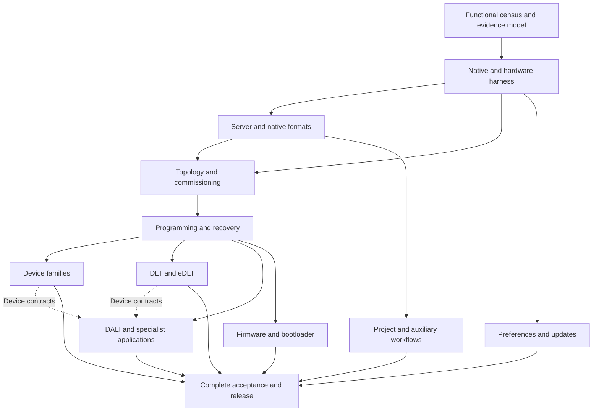

# Implementation review and path to full parity

Reviewed 27 September 2026 against published commit
[`84cb7bba48f51236e2efb835fbe01f3eeffa74d8`](https://github.com/mitchell-johnson/cbus/commit/84cb7bba48f51236e2efb835fbe01f3eeffa74d8).
Target: **C-Bus Toolkit 1.18.0.2754 and C-Gate 3.4.0.2001**.
The review includes an independent GPT-6 Astra review of the published
implementation and the subsequent unmerged development work.
It combines source/evidence inspection, issue reconciliation and targeted
reproductions; it does not claim a new exhaustive execution of every function.

## Assessment

The repository contains substantial working products: the Python Toolkit CLI
and the Rust `cmqttd` service, with a shared C-Bus transport and MQTT support.
It does **not** yet establish full Toolkit or C-Gate replacement. The largest
remaining gaps are complete device/workflow semantics, native file and server
interoperability, commissioning and programming recovery, firmware, and
independent native and physical acceptance.

The latest proposed route to a 90% category count would classify a broad row
as implemented when **at least one bounded public workflow** is complete.
That is too weak to measure the original full-functionality objective. This
review does not endorse those promotions as progress to 90% functionality.
Keep the existing bounded functions and their tests; close the remaining
functions rather than redefine the rows around the available subset.

### What the numbers actually establish

| Measure at the reviewed revision | Current result | Interpretation |
| --- | --- | --- |
| Toolkit feature ledger | 18 implemented / 19 in progress / 2 pending; 39 total | **46.15% of broad category labels**, not a functionality percentage |
| Complete Toolkit acceptance | `complete=false`, `census_complete=false` | Full parity is unproven |
| Differential matrix | 4 accepted slots / 234; 0 fully accepted areas / 39 | Four bounded nominal workflows have accepted evidence; 230 slots remain unassessed. This is an evidence measure, not code completeness |
| Documentation surface inventory | 3,767 indexed topics, 209 public command blocks, 118 dialog candidates | A starting inventory, not a deduplicated functional denominator; its topic/command acceptance counts are zero |
| Vendor catalogue inventory | 577 unit records, 3,750 firmware revision records, 271 unit types | Inventory only; records and revisions cannot be counted as independently supported hardware |
| cmqttd primary C-Gate routing | 429/429 non-obsolete paths, or 100% | Every maintained primary path reaches a handler; selectors, effects and interoperability can still be incomplete |
| Full C-Gate replacement | `full_cgate_compatibility=false` | Native formats, access/configuration semantics, DALI selectors, device behavior and acceptance remain open |

With 39 categories, 36 implemented labels would be 92.31%; 35 would be
89.74%. Those arithmetic facts cannot establish 90% of Toolkit functionality.
A meaningful functional percentage needs the finite requirement map in work
package P0 below. No calendar or effort percentage can be defended from the
current category counts.

Sources: [feature ledger](../toolkit-cli/src/cbus_toolkit/capabilities.json),
[surface census](../toolkit-cli/docs/toolkit-surface.json),
[differential matrix](../toolkit-cli/src/cbus_toolkit/differential.py),
[cmqttd replacement limits](cmqttd-cgate.md#outstanding-replacement-work).

## Review findings

Priority P1 means a blocker to the relevant merge or full-replacement claim;
P2 means a required coverage or release-control improvement. A finding about
a draft is not a deployed defect.

### R1 — P1: category promotion can conceal unfinished functionality

The unmerged integration branch added `implementation-row-policy.md` and
`coverage --require-implemented-percent`. Its threshold arithmetic is sound,
but the proposed policy admits an entire category after a single bounded
workflow. For example, complete thermostat scheduling is not complete
thermostat configuration; SENPILL occupancy support does not implement all
sensor dialogs; a preference editor does not implement the updater.

The same rule could promote firmware today because bounded DFU workflows
already exist. Leaving firmware unfinished while promoting comparable subsets
elsewhere would therefore be inconsistent. The network promotion draft also
reclassifies seven broad rows using existing tests and a new manifest; a
manifest asserting a status is not new behavioral acceptance.

**Required action:** keep this threshold, if retained at all, as a separately
named category metric. Do not merge the proposed policy or bulk status changes
as evidence for the user's 90% target. Record implementation, original
comparison and physical acceptance separately for each functional obligation.
Preserve wider gaps in both the backlog and the public status output.

### R2 — P1, draft only: update-diagnostic provenance is not bound

The unmerged `toolkit_update_bundle.py` composer (lines 82–193 at review)
accepts four parsed objects separately from four byte strings. It hashes the
strings without proving they decode to the supplied objects. It matches the
selected node ID and two self-reported metadata hashes, but never matches
`metadata.source.file_sha256` to `catalogue.http.body_sha256`. Revocation and
condition reports also lack a verified relationship to that selected node.

Both reviewers reproduced `diagnostics_complete=true` with different catalogue
and metadata source hashes and unrelated `input_bytes`. The existing tests
even supply literal `b"catalogue"`, `b"metadata"`, and similar strings in place
of serialized reports. The draft still reports trust/install claims false,
so this is an incorrect diagnostic-linkage claim, not an observed installation
or publisher-trust bypass.

**Required action:** parse exact bounded raw documents inside the composer;
reject duplicate keys and ambiguous identities; bind selected metadata to the
catalogue response; explicitly verify the revocation and condition references.
If the source reports cannot provide those links, report independent,
unverified component provenance and keep linked completion false. Add
cross-version same-ID, substituted bytes, mismatched source, missing receipt,
and unrelated revocation/condition tests before merging.

### R3 — P1: primary command routing does not cover valid selectors

Published cmqttd routes all primary command paths, but DALI conditional
extraction stops before `ADDRESS_UNKNOWN`, and typed `DALI_ONLY`/`FULL`
deployment stops before writes. The full unit allocation, write ordering,
model-field ownership, readback and combined typed/extended transaction
contract are unfinished. Explicit patch manifests work, but native
`patchset.zip` ingestion is unsupported. Native repository/archive formats
and full CGL metadata/controller behavior are also missing.

**Required action:** expand the C-Gate inventory from primary paths to
command/selector/state combinations, retain original request/reply and state
evidence for each, then implement these missing branches. Keep the current
refusals until their contracts are known. See
[DALI](cgate-dali.md) and [service limits](cmqttd-cgate.md#outstanding-replacement-work).

### R4 — P1: native authorization and runtime configuration semantics are incomplete

Published `service.rs` explicitly advertises
`access_global_command_level_matrix=false` and does not map TLS certificate
identities into ACCESS rows. The access-level matrix is a confirmed gap;
native certificate identity behavior remains an unresolved comparison, not
proof that native C-Gate requires such a mapping. CONFIG stores a compatibility catalogue
and snapshots but does not apply those values to the running listener, MQTT
client, transport or loggers. These are material differences for a replacement
server, even where command syntax and persistence work.

**Required action:** capture and enforce native per-handler access rules,
session elevation/revocation and certificate admission behavior. Implement
certificate identity mapping only if the target native behavior requires it. Identify which
configuration values are live, restart-bound, read-only or external to cmqttd,
and test their real effect. Preserve intentional credential redaction and
other security improvements as explicit compatibility deviations; do not
silently call them byte-exact equivalence.

Evidence: [service capabilities and behavior](../rust/cbus-cgate/src/service.rs),
[ACCESS/TLS/configuration boundaries](cmqttd-cgate.md).

### R5 — P1: programming success and durable physical success remain different

The typed PP client admits ten methods and performs one save followed by a
fresh load. Only `direct` currently has the full Python CLI → real cmqttd →
synthetic PCI programming integration in
[`test_cmqtt_interop.py`](../toolkit-cli/tests/test_cmqtt_interop.py).
Other methods have Python scripted-client and Rust transport/service evidence.
All-method cross-language composition, real bridge/device effects,
multi-range recovery, and power-cycle persistence remain open.

The template draft's new `--save-project` confirms one PROJECT SAVE after a
database reload; that is not independent close/load or process-restart proof
of file durability. The thermostat draft checks collection order across its
own snapshot/save/reload; it does not establish original Toolkit manager order.

**Required action:** retain those distinctions in all status summaries. Add
real-daemon integration per programming method/protection/route class, then
native comparisons and physical/restart tests. Record which ranges were
confirmed, which may have changed, and the only safe recovery action after
each interruption. Never infer a rollback or replay uncertain mutations.

### R6 — P2: green CI is an offline gate, not the release acceptance gate

The exact published revision has successful CI, but the Python job builds
`cgate-mock` only. cmqttd-dependent Python tests use `skipif` when its binary
does not exist; the separate Rust job does not provision that binary into the
Python job. CI also tests an editable install rather than a fresh isolated
wheel. Native, Windows, vendor and hardware requirements are not provisioned
there. `make coverage` intentionally exits zero after printing the parity
gate's failure, so it must not be used as a release enforcement command.

**Required action:** build both servers in the Python interoperability job,
require intended interop tests to execute, add an isolated wheel job, retain
machine-readable skip reasons, and create a separately provisioned native and
hardware release gate. Run `cbus-toolkit coverage --require-complete` directly
for final enforcement.

Evidence: [CI workflow](../.github/workflows/ci.yml),
[Makefile](../toolkit-cli/Makefile), [test strategy](testing.md).

### R7 — P2: evidence aggregation needs stronger provenance

The current differential harness is useful and deliberately incomplete. Its
facts are curated constants checked against retained artifacts; the completion
CLI ultimately trusts ledger statuses and `census_complete`. This is not yet
an automatically derived certificate of current-revision acceptance.

The unmerged network acceptance manifest contains a placeholder test command
`<25 listed network/control modules>` rather than a reproducible exact list.
The Unicode template additions have expected fixtures and an optional original
test; a skipped original test cannot become fresh original evidence. The
repair-shape draft was added without dedicated positive/negative tests.

**Required action:** bind evidence to source/artifact hashes, exact test IDs,
runtime, profile, backend and observed outcomes. A current-code change must
invalidate affected older acceptance until its scope is revalidated. Test
manifest integrity in addition to behavior, never instead of behavior.

## Current strengths to retain

- Rust crate boundaries separate protocol, transport, MQTT transformations,
  C-Gate state/behavior and daemon orchestration. Exact vectors and real-daemon
  tests provide a strong base for further compatibility work.
- MQTT and C-Gate share one physical transport. Generation guards, correlated
  replies, one-attempt mutations, partial outcomes and reconnect invalidation
  are essential and already deeply tested.
- The Python CLI has substantial project, schema, native database, scene,
  classic-key and KEYGL5 functionality, including preservation, backup,
  reload and uncertain-save handling.
- KEYGL5 5.5.00 editor support is extensive: widget models, parent settings,
  five CRCs, ordered multi-edit composition, Reset/Blank and SceneManager,
  automatic metadata, static label reads and drift auditing.
- Encoding evidence is unusually broad: 6,487 of 6,497 declared catalogue
  boundary configurations and all 163 distinct layouts have retained native
  comparisons. The ten absent vendor specifications are explicit gaps in the
  vendor corpus, not implementations that should be invented.
- Documentation and capabilities generally distinguish PCI confirmation,
  device acknowledgement, readback, physical effect and persistence. Preserve
  that clarity when summarizing or promoting work.

## Disposition of unmerged work

All development work is preserved. None is included in the reviewed deployed
baseline merely because its focused tests passed.

| Development branch | Useful work | Next action |
| --- | --- | --- |
| Original user checkout, local `main` at `7db9238` | Existing uncommitted Python/Rust/docs changes on an older base | Preserve and reconcile separately against current GitHub; do not reset it or treat its uncommitted state as covered by published-revision CI |
| `codex/parity-next-20260927` | Explicit row-ratio threshold, evidence-path checks | Retain arithmetic as an optional category statistic; replace the proposed completion policy. Add 35/39 versus 36/39, combined flags, NaN/infinity, empty/duplicate/unknown-status ledger tests if merging the gate |
| `codex/promote-network-rows` | Committed `ffe7c21`: explicit routed PCI WRITE and ACK correlation | Review native command/ACK semantics, integrate focused behavior with existing reads, run full gates. Remove bulk promotions as a route to functional completion; make the acceptance command reproducible |
| `codex/promote-offline-20260927` | Encoding audit; Unicode Description metadata; optional template project save; whole-project CSV selection; thermostat order postcondition; repair-shape draft | Split into reviewable changes, add missing repair tests and native persistence/order evidence; retain admitted profile limits |
| `codex/ui-row-closures-20260927` | Sequential network diagnostics and SENPILL inspection | Integrate after review and full gates as bounded functions. Keep update bundle blocked on R2; neither inspector closes the broader family |

Reported focused results from the implementation agents: offline combined
slice **129 passed, 25 skipped, 3,374 subtests**; network diagnostics
**58 passed, 3 skipped**; sensor inspector **14 passed, no skips**. These are
worktree checkpoints, not an integrated release. The independent reviewer also
ran focused subsets; overlapping counts must not be added together.

## Definition of 100%

Full completion requires the selected Toolkit and C-Gate versions' functions
to be available through the CLI/service and verified within their actual
device, firmware, file, state and topology domains. It does not require a CLI
to visually reproduce a Windows dialog. It does require reproducing the
dialog's meaningful initialization, validation, dependencies, save behavior,
side effects and failure handling. Focus/modal behavior matters where it
changes those observable results.

Every functional obligation needs:

1. A stable ID, original source reference, owning component, CLI/API entry
   point, supported profiles and preconditions.
2. An implementation that reaches the complete declared outcome, including
   its recoverable failure behavior and preservation requirements.
3. Independent original evidence for nominal, error, invalid-input and relevant
   profile variation, with precisely named intentional deviations.
4. Native persistence, physical effects, rendering, power-cycle and recovery
   evidence wherever the function actually depends on them.
5. Reproducible current-artifact tests and retained results, including skipped
   and failed attempts.

A native feature proved absent or obsolete can be marked not applicable with
version-specific evidence. A feature delegated to PICED requires Toolkit's
launch/handoff/data-exchange contract, not a reimplementation of PICED itself.
Unsupported functions must not be relabeled as external or excluded simply
because they are difficult. An operator's house lacking a device is not proof
that its Toolkit functionality is out of scope.

The existing six-slot matrix remains the historical baseline. Pure file or
inventory workflows may not have meaningful physical-device or multi-firmware
effects. Resolve those applicability cases explicitly with evidence and a
versioned matrix design; never silently turn `unassessed` into `accepted`.
Likewise, repair deliberate native defects only with documented behavior and
an explicit compatibility decision. A useful safer alternative is not by
itself exact parity.

## Execution plan

These are large deliverable packages, not promises that a small patch closes a
whole product area. Each package must publish code, native vectors where
applicable, positive and negative tests, current-artifact evidence, remaining
limits and updated AI operating references.

### P0 — Establish the functional denominator and trustworthy progress

**Owns:** Python coverage/census tooling and shared compatibility records.
**Depends on:** the existing inventories; can start immediately.

- Walk all 3,767 topics and six unindexed HTML files, all 118 dialog candidates,
  menus, toolbars and executable controls. Resolve the 179 macro-reference
  leaves and implicit/undocumented branches. Deduplicate documentation while
  keeping genuinely different workflow/profile behavior distinct.
- Expand 431 C-Gate primary paths into valid selectors, states, target forms,
  authorization levels, response/event envelopes and effects. Reconcile the
  209 documentation blocks with manual/bytecode inventories without adding
  their counts together.
- Produce an obligation record with independent fields for implementation,
  original differential acceptance, physical acceptance and applicability.
  Map every obligation to its broad ledger row; preserve the 39-row history.
- Define workflow-level completion criteria before changing statuses. Publish
  separate percentages using a fixed, reviewed denominator; report unknown
  scope explicitly and version the denominator when discoveries add work.
- Derive completion from evidence records and executable tests. Reject missing
  IDs, duplicate IDs, unknown states, missing evidence, altered hashes and
  unexplained skips. A file's existence is insufficient acceptance.

**Exit:** every inventoried surface is mapped or has an evidenced disposition;
all newly discovered executable behavior is recorded; no unassessed surface
is hidden by a category status. The 90% target becomes measurable only after
this mapping. Do not set `census_complete=true` merely because all help pages
have been counted.

### P1 — Make original/native and hardware acceptance repeatable

**Owns:** research runners, acceptance fixtures and CI/release infrastructure.
**Depends on:** P0 IDs; infrastructure work runs in parallel with the census.

- Pin Toolkit EXE/DLLs, target C-Gate, JVM, decoded specifications and updater
  artifacts by hash. Use owned disposable native services and isolated Windows
  profiles/projects. Preserve vendor binaries privately.
- Provision authorized Windows access for new GUI and worker captures. Existing
  retained fixtures and host-native acceptance can continue while that
  environment is unavailable.
- Capture original inputs, raw output, event order, PP bytes and save/close/load
  outcomes for one complete workflow at a time. Do not join unrelated fragment
  tests into an end-to-end original result.
- Define hardware fixtures by type, catalogue, firmware, serial hash, topology,
  protection and instrumented observable effect. Obtain representative relay,
  dimmer, classic/Neo/DLT/eDLT, sensor, thermostat, DALI, wireless and specialist
  application devices, plus USB/bootloader and bridge test setups as required.
- Build cmqttd in the Python CI job; run both interop suites, isolated-wheel
  tests, and separate provisioned native/hardware jobs. Record the actual
  executed tests and skips instead of inferring them from a green job.

**Exit:** a fresh checkout reproduces each declared gate; required native
provisioning fails visibly when absent; raw private evidence has sanitized,
hash-bound public receipts. The prior zero-skip September 15 artifact is
historical evidence, not acceptance of newer code.

### P2 — Complete native C-Gate server and file interoperability

**Owns:** `cbus-cgate`, project/file adapters, Python native clients.
**Depends on:** P0 command cases and P1 native oracle.

- Implement Schneider repository/archive/import/export formats and version
  transitions; prove bidirectional interchange with native C-Gate and Toolkit.
  Preserve unknown metadata, OIDs and references across copy/rename/restore.
- Capture combined Network/Unit/Application DBSETXML replacement, including
  namespaces, comments, conflicts, omitted fields and lifecycle persistence.
- Complete CGL metadata/controller semantics and multi-network route behavior;
  distinguish importing a label graph from programming a controller.
- Implement per-handler access levels and login/logout transitions. Capture
  native certificate admission and its relationship to ACCESS/LOGIN; implement
  identity mapping only if the target native behavior requires it. Cover denied operations before mutation,
  concurrent sessions, reconnect and persisted admission rules.
- Implement meaningful CONFIG runtime/restart effects and exact native FILE,
  REPOSITORY and server lifecycle behavior within the supported deployment
  model. Document intentional secure deviations explicitly.

**Exit:** original-native and Rust services accept the same admitted client
workflows and exchanges, produce equivalent durable state and denials, and
pass cross-server project roundtrips. All selector-level differences have a
resolved disposition; `full_cgate_compatibility` stays false until later
physical packages and the final audit also pass.

### P3 — Finish transport, topology, commissioning and reconciliation

**Owns:** `cbus-protocol`, `cbus-transport`, `cbus-cgate`, typed Python PCI/network
and addressing workflows. **Depends on:** P1; native state contracts from P2.

- Integrate and independently validate routed WRITE alongside RECALL/IDENTIFY.
  Resolve logical topology in typed workflows rather than require operators
  to infer raw Reply Network paths for ordinary commissioning.
- Cover discovery/setup across interfaces/adapters/subnets and the supported
  serial, CNI, Wiser, bridge and wireless gateways. Distinguish absence from
  timeout, incomplete scan and unreachable ownership.
- Complete arbitrary supported duplicate sets, occupied-address displacement
  cycles, selected-serial and database matching, second-interface commissioning,
  and unknown-serial behavior as actually implemented by the native system.
- Add durable plan/attempt/recovery identities, independent pre/post inventory,
  interrupted-process recovery and explicit handling of competing controllers.
  Existing process-local fingerprints must not be presented as global
  cross-process deduplication.
- Reconcile physical identity/address changes with the database through explicit
  transactions, preserving serial/OID/reference identity and partial outcomes.

**Exit:** direct and supported one-to-six-bridge workflows pass nominal,
collision, loss, duplication, reordering, reconnect and recovery tests; physical
devices retain intended addresses after power cycle; unrelated networks remain
unchanged. No uncertain move is automatically replayed.

### P4 — Complete programming and durable failure recovery

**Owns:** Rust programming transport/service and Python `physical-pp`.
**Depends on:** P1 and P3; can build direct-method cases before routed completion.

- Add real CLI → cmqttd → independent PCI integration for all ten methods:
  `direct`, `paged`, `ncc`, `edlt`, `giu`, `sgiu`, `dali`, `goc`, `gocbyt`, `goc2`.
- Exercise every applicable `none`/`checksum`/`lock` combination, page and block
  boundary, changed/unchanged range, tags, factory/special field and NVM commit.
  Define supported combinations from original specifications rather than assume
  a full Cartesian product exists.
- Interrupt each multi-range save before/after send, ACK, readback and NVM
  commit. Persist sufficient evidence to inspect and recover after a process or
  power failure; verify no stale confirmation completes a new generation.
- Verify field preservation and real-unit readback, then power-cycle reload.
  Compare fresh originals for the same method/profile transaction.
- Keep MQTT receipt/state fanout and C-Gate events operating throughout long
  programming; verify pacing, queues, reconnect and no fabricated state.

**Exit:** each admitted method/profile/protection/route combination has an
evidenced complete transaction and safe recovery contract. Confirmed receipt,
readback and power-cycle persistence are separate recorded observations.

### P5 — Close all device editors and conversion/template semantics

**Owns:** Python device modules, schemas and native adapters; Rust transfer from
P4. **Depends on:** P0 controls, P1 oracle, P4 for physical closure.

- Build a control-to-parameter/action table for all 118 dialog candidates and
  their real firmware variants. Reuse logic only after equivalence is proved.
- Finish classic/Neo and other key/auxiliary/IR input families: custom macros,
  timers, indicators, secondary applications, scene bindings and power-up
  behavior beyond the current 18 presets.
- Finish relay/dimmer/occupancy-controller logic, interlocks and other
  controller-owned settings. External logic-code editors remain a separate
  handoff contract where original evidence proves that boundary.
- Expand the SENPILL subset to the other sensor dialogs: PIR/lux/temperature/
  current, calibration/sensitivity, IR, corridor/join, broadcast/maintenance,
  macro and output interactions.
- Complete thermostat settings, zones, schedules, inherited loading and service
  factories, metadata/order behavior and physical timing effects.
- Complete unit copy/convert/reset and vendor template exchange across every
  native-supported pair/profile; preserve destination-specific identity and
  unsupported fields. Unicode Description support is file metadata only.
- Finish wireless learn/join, addressing and gateway mapping.

**Exit:** every admitted dialog control and workflow has positive, invalid,
boundary, roundtrip and unrelated-value-preservation evidence against the
original, plus physical effects where relevant. Generic PP get/set alone does
not close a device editor.

### P6 — Finish DLT/eDLT editor, metadata and physical behavior

**Owns:** Python eDLT/DLT models and cmqttd eDLT backends. **Depends on:** P1,
P3/P4; runs alongside P5 with separate device ownership.

- Complete original parent initialization, asynchronous loading, control
  bindings, event/validation/save order, interactive Add dialogs, and supported
  Reset/Blank/SceneManager histories. Verify component composition against an
  actual combined original workflow.
- Resolve registry display/sort preferences and project/DLTP image-dependent
  dynamic-label data. Preserve capacities, reference identities, labels and
  existing per-unit differences during bulk/global programming.
- Implement the legacy Saturn/Neo/Decorator DLT variants and remaining eDLT
  firmware revisions; do not extrapolate KEYGL5 5.5.00 evidence to them.
- Complete scene learning/capture/broadcast/trigger, timers, MRA/audio, wake,
  navigation, buttons, rendering, brightness, reset and recovery on devices.
- Investigate a native operation for pre-existing dynamic-label cache contents.
  If one exists, implement and physically verify it. If the selected native
  release exposes none, retain version/profile-specific proof of absence and
  document the limitation; observed traffic must never become device-cache
  readback. This determination resolves scope, not a guessed protocol.
- Validate static/dynamic labels after programming, disconnect, restart and
  power cycle, with serial-bound before/after identity and external display
  observations where needed.

**Exit:** full control-level and profile-level coverage, combined original
workflow comparisons, actual rendered/action outcomes and persistence/recovery
records. The existing successful live static-read slice remains useful but
cannot alone close this package.

### P7 — Complete DALI, scenes and specialist application behavior

**Owns:** Rust application/DALI transport, C-Gate service, Python typed workflows.
**Depends on:** P1–P4 and device-specific data from P5/P6.

- Retain the native DALI conditional remediation/allocation contract and typed
  deployment write order. Implement `COND_QUICK`, `COND_EXTENDED`,
  `RESCAN_FAULT`, and typed `DALI_ONLY`/`FULL` deployment, including combined
  extended/typed state, per-field readback and interrupted reconciliation.
- Complete remaining resident scene/macro/label functions and their native
  selector behavior; distinguish native named-scene rejections from supported
  alternative scene-file workflows.
- Verify controller action and supported readback for AIRCON/HVAC, Audio/MRA,
  Security, Measurement, Media Transport, Telephony, Identify, Short Message,
  Error Reporting and Access Control. Retain wire-only semantics where the
  protocol truly offers no acknowledgement, with independent effect evidence
  for acceptance rather than fabricated online readback.
- Validate command/event ordering, physical source identity and MQTT coexistence
  on direct and bridged routes. Document repaired native encoders explicitly.

**Exit:** every required selector reaches its correct native-equivalent result;
DALI downstream device state/persistence and specialist controller effects
are demonstrated, not inferred from PCI confirmation.

### P8 — Finish project, reporting, navigation and auxiliary workflows

**Owns:** Python project/native/CSV/report interfaces and matching Rust database
behavior. **Depends on:** P0/P1 and P2 where native formats are involved.

- Complete repair behavior across native-supported versions/encodings and
  failure classes; preserve evidence for native-rejected domains rather than
  invent general corrupt-database recovery.
- Finish original report-manager enumeration, remaining unit associations,
  secondary applications, whole-project export and encoding/column behavior.
  Native XML document order alone does not prove Toolkit manager order.
- Implement project/database documentation, print/image export and topology
  navigation with comparable native outputs and reference integrity.
- Resolve scanner input formats, duplicate/invalid scans and selection/creation
  effects. Implement PICED/controller handoff and roundtrip boundaries that
  belong to Toolkit.
- Finish diagnostics/recovery decisions beyond the calculator and sequential
  PINGU/CHECKUNIT/CLOCKS draft. Establish actual electrical measurements and
  clock/burden effects where the native workflow depends on them.

**Exit:** every P0 navigation, reporting and auxiliary obligation has an
executable CLI equivalent and independent expected outcomes; native project
exchange remains intact after each workflow.

### P9 — Complete preferences and software-update workflows

**Owns:** Python preferences, Windows workers, metadata/trust/update modules.
**Depends on:** P1; independent of most physical C-Bus work.

- Fix R2 before integrating the diagnostic bundle.
- Validate all preference runtime effects and interactive-user registry
  behavior, including the original lazy wrapper, culture and repeated reads.
- Bind catalogue, signed metadata, revocation, conditions and package bytes to
  one source/version. Implement the actual publisher chain/current trust,
  applicability, version comparison and rollout policy from original evidence.
- Implement verified download, selection, install/open and restart/result
  reporting where those are Toolkit-owned functions. Retain failures and
  recovery; do not infer availability from a valid signature alone.

**Exit:** original Windows workflow comparison covers current user context,
trusted/untrusted, revoked/expired, inapplicable, offline, partial download and
installation outcomes. Every trust and availability claim is backed by the
exact source and policy it depends on.

### P10 — Complete vendor firmware, bootloader and deployment recovery

**Owns:** Python firmware/USB and Rust WRITE_PATCH/PROGRAMMER/DEPLOY_QUEUE.
**Depends on:** P1 hardware/artifacts and P4 recovery infrastructure.

- Implement actual vendor container/payload/patch catalogue and authenticity
  rules, version compatibility, external-address semantics and NCC paths where
  exposed by the target products. An explicit custom manifest is not native
  `patchset.zip` interoperability.
- Validate device selection, USB claim/configuration/alternate interfaces,
  erase/program/verify, reset/re-enumeration and resulting firmware identity.
- Exercise wrong image, interrupted erase/write/verify, lost USB, process crash,
  power loss, bootloader recovery and explicit resume/retry. Retain failures;
  prove recovery on disposable supported devices before wider use.
- Verify native programmer/deploy queue lifetime across restart, cancellation,
  partial outcomes and explicit retry. Preserve native volatility where
  established; retain separate durable recovery evidence for uncertain
  physical operations.

**Exit:** original vendor packages run through the complete supported update
workflow, recover from the admitted failures and produce independently read
firmware/version/persistence results on hardware. Fake USB and memory-simulator
passes remain development evidence.

### P11 — Final acceptance, deployment and completion audit

**Owns:** all components; independent reviewer/release verifier.
**Depends on:** P0–P10; acceptance collection occurs throughout, not only here.

- Close every functional obligation, original differential slot and applicable
  hardware case with current-artifact evidence. Resolve every documented
  deviation and every required skip. Re-run affected native evidence after code
  changes instead of carrying old pass flags forward.
- Run all Rust gates, Python source checks, both interop servers, fresh wheel,
  provisioned native/Windows and hardware matrices. Preserve exact revisions,
  hashes, commands and failure history.
- Build a clean Docker image; validate project/state migration and rollback,
  MQTT discovery/commands/state, C-Gate interoperability, long PP activity,
  broker/CNI reconnect and event fanout together. Restore test loads to their
  exact original state.
- Update README, status, per-feature docs, AI skill/reference material and
  issues #10/#11/#12 from the evidence. Only then set `census_complete=true`,
  mark all required feature/acceptance rows complete and allow the full-parity
  predicate and C-Gate capability claim to succeed.

**Exit:** a reviewer can start from the requirement map and reproduce every
completion claim from the released wheel/image and retained evidence. No
required behavior is missing, merely forwarded, simulator-only where hardware
is required, or hidden behind an exclusion.

## Dependency order and practical milestones



| Milestone | Reviewable outcome | Percentage claim allowed |
| --- | --- | --- |
| M0: reviewed baseline | Published main and all drafts accounted for; defects recorded; no status inflation | Existing 18/39 category ratio only |
| M1: known scope | P0 complete and P1 operational; finite versioned functional map with per-obligation acceptance | Honest implementation/differential/hardware percentages can begin |
| M2: dependable foundation | P2–P4 complete for every mapped contract; uncertainty and recovery verified | Progress calculated from closed obligations, never command routing alone |
| M3: functional 90% | At least 90% of the fixed functional obligations fully accepted; residual list names every remaining behavior | 90% only for that declared denominator; critical unfinished release blockers remain explicit |
| M4: full parity | P5–P10 closed, P11 passes, all acceptance and scope requirements satisfied | 100% for the selected version/profile domain, with evidenced native-absent/external boundaries |

Suggested parallel lanes after P0/P1: server/formats/auth; transport and physical
programming; device editors with eDLT ownership; project/update workflows;
independent acceptance and hardware operation. Only one lane owns a given
physical interface or device at a time. Acceptance should follow each completed
workflow rather than accumulate until the end.

The immediately actionable batch is to harden CI/evidence, fix the update draft,
split and validate the useful unmerged features, and build the requirement map
while commissioning the native/hardware harness. Then prioritize access rules,
all-method programming integration/recovery and native file interoperability:
these are shared blockers for many later functions. Firmware and hardware
procurement should start early because their dependencies can outlast coding.
No credible date for 100% can be set before M1 defines the actual remaining
work and available hardware.

## Complete ledger-to-work-package map

`I` = currently labeled implemented, `W` = in progress, `P` = pending on
published `84cb7bb`. An `I` row can still have the wider parity work listed here.
The detailed retained test/profile boundaries remain in
[implementation status](../toolkit-cli/docs/implementation-status.md).

| Ledger ID | State | Remaining work for full parity | Packages |
| --- | --- | --- | --- |
| `legacy-project-editing` | I | Original edit comparison, implicit device references, full roundtrip/preservation corpus | P2, P8, P11 |
| `native-cgate3-projects` | I | Retain all CRUD/save/copy native outcomes; native formats/repository switching and full Toolkit workflows | P2, P8 |
| `native-project-repair` | W | Native-supported versions/encodings/corruptions, loadability, full workflow and failure behavior | P2, P8 |
| `cgate-command-transport` | I | Per-command effects, access, events, error and lifecycle interoperability beyond transport | P2, P3, P7 |
| `pci-command-transport` | W | Routed WRITE, topology/correlation, asynchronous receiver behavior and physical routing | P3, P4 |
| `vendor-catalog-inventory` | I | Map inventory to actual supported encodings/profiles; evidence-based absent-spec disposition | P0, P5 |
| `toolkit-surface-census` | I | Executable controls, undocumented branches, deduplicated obligations and complete acceptance map | P0 |
| `interface-discovery-and-setup` | W | Full setup, adapters/subnets/interfaces, original workflow and physical endpoint identity | P3, P5 |
| `network-scan-unravel-routing` | W | Broad duplicate/displacement/reconciliation states, typed routes, concurrent controllers and physical recovery | P3 |
| `all-unit-parameter-encoding` | W | Original Toolkit workflow coverage, absent-schema disposition, transfer/protection beyond logical encoding | P0, P4, P5 |
| `native-unit-defaults-and-database-editing` | I | Complete profile coverage, resource-loss states, original workflow and physical linkage | P2, P4, P5 |
| `unit-read-write-verify` | W | All-method end-to-end interop, native/hardware profiles, multi-range and power-loss recovery | P4 |
| `unit-copy-convert-reset` | W | Other conversions/resets, native file durability and physical factory/reset outcomes | P4, P5 |
| `classic-key-presets` | I | Other families/custom macros and physical key/indicator behavior | P5 |
| `groups-applications-control` | W | Remaining typed application workflows, exact reconstruction and listener effects | P7 |
| `scenes-triggers-labels` | W | Other resident scene profiles, learning, physical execution, cache/label persistence | P5, P6, P7 |
| `dlt-edlt-widgets-and-labels` | W | Complete parent/control lifecycle, DLT/revisions, image metadata, rendering/actions/persistence | P6 |
| `edlt-parent-automatic-application-cache` | I | Registry ordering/preferences, image facts, original combined form and hardware outcome | P6 |
| `edlt-reset-controls` | I | Other contexts/histories, original interactive composition, physical reset/reboot/recovery | P6 |
| `edlt-global-category-programming` | I | Arbitrary edit histories, target selection, full form, label transfer and physical bulk programming | P6 |
| `edlt-retained-scene-editing` | I | Full binding/Add dialogs, images, other contexts and device behavior | P6 |
| `edlt-scene-live` | I | Original timing/form binding, trigger receipt where available and actual scene execution | P6, P7 |
| `sensors-wizard-semantics` | W | Remaining sensor/control families, full controls, calibration and optical/physical effects | P5 |
| `firmware-update` | W | Real vendor payloads, NCC/external memory, physical USB, recovery and authenticity | P10 |
| `cgl-import-export` | I | Native results, unknown metadata, bridge routes and controller semantics | P2, P8 |
| `network-calculator-diagnostics` | W | Remaining diagnostics/recovery and physical electrical observations/arbitration | P3, P8 |
| `preferences-and-update-workflow` | W | Runtime preferences, interactive-user context, trust/applicability/rollout/download/install | P9 |
| `toolkit-differential-acceptance` | P | Every obligation's original nominal/error/rejection/profile comparison | P0, P1, P11 |
| `unit-hardware-acceptance` | P | All applicable effects/protection/topology/rendering/persistence/firmware/recovery | P1, P3–P7, P10, P11 |
| `neo-core-key-presets` | I | Other firmware/profiles, custom macros, physical key/indicator effects | P5 |
| `database-unit-addressing` | I | Coupled bridge topology, identity/reference integrity through full native workflows | P2, P3 |
| `native-serial-retrieval` | I | Full observation completeness and identity compatibility across supported profiles | P3 |
| `database-serial-population` | I | Other compatibility branches, native/physical reconciliation and preservation | P3, P5 |
| `physical-unit-addressing` | W | Occupied displacement, other units, competing controllers, bridge/power-cycle acceptance | P3 |
| `toolkit-unit-templates` | W | Other vendor-supported profiles/conversions, exact Unicode domain, durable and physical transfer | P5, P8 |
| `serial-directed-commissioning` | W | Broader duplicates/fallback/displacement, typed route workflow and physical persistence | P3 |
| `edlt-usb-read-only-diagnostics` | I | Vendor package compatibility and actual supported USB-device acceptance | P1, P10 |
| `toolkit-database-report-export` | W | Original enumeration, remaining associations/profiles and report/document workflows | P8 |
| `thermostat-configuration` | W | Full settings/zones/loader/factories/order and physical scheduling | P5 |

Crosscutting census obligations must also include wireless, scanner input,
print/image/report export, relay/dimmer logic and external-editor integration.
Do not lose these because the 39 category names do not mention them directly.

## Verification performed for this review

- Fetched GitHub and verified published main remains `84cb7bb`; read issues
  [#10](https://github.com/mitchell-johnson/cbus/issues/10),
  [#11](https://github.com/mitchell-johnson/cbus/issues/11) and
  [#12](https://github.com/mitchell-johnson/cbus/issues/12), including their latest
  status bodies.
- Recomputed ledger/census/differential counts from the published source.
- Ran the published `cbus-toolkit coverage --require-complete` directly; it
  returned exit 1 with both completion flags false, as required.
- Ran `PYTHONPATH=src:tests python -m pytest
  tests/test_coverage_require_complete.py tests/test_differential_matrix.py
  tests/test_device_dialogs.py -q -p no:cacheprovider` on Python 3.13:
  **31 passed, 749 subtests**, no skips.
- Independently reproduced R2 using distinct catalogue/metadata source hashes
  and unrelated input bytes. No network, registry or installer was accessed.
- Verified exact-revision [CI run 36294863490](https://github.com/mitchell-johnson/cbus/actions/runs/36294863490)
  succeeded. The retained broad source and isolated-wheel checkpoints each
  report **2,477 passed, 265 provisioning skips, 19,488 subtests**; interop
  reports **17 passed, one vendor-spec skip**. These broad runs were not
  repeated for this documentation review.
- Read-only Docker inspection confirmed the published image revision, running
  container and zero restarts. Prior authorized relay/dimmer roundtrips and
  static eDLT reads are retained operational evidence; no new physical mutation
  was performed for this review.

The private house operations document, project data, raw labels, credentials
and vendor specifications remain outside this public report. The dirty
original checkout and all unmerged development work were preserved.

## Required release commands and evidence

Run Rust checks from `rust/` on the final integrated revision:

```sh
cargo fmt --check
cargo clippy --workspace --all-targets -- -D warnings
cargo test --workspace
cargo build --release --workspace
```

Install the Python `test,research,serial,usb` extras in `toolkit-cli/.venv`, then
run from `toolkit-cli/`:

```sh
make check
make check-interop
make check-wheel
make check-native
.venv/bin/cbus-toolkit coverage --require-complete
```

`make check-native` is a selected owned-service/original-instruction subset;
it is not the entire native, Windows or hardware matrix. Provision all remaining
required gates identified by the obligation map, then rerun the installed
artifact against them. `make check-wheel` currently creates an isolated
environment for the offline suite; P1/P11 must add the provisioned release
variant and retain its artifacts instead of treating that offline target as
full release acceptance.

Each release record should identify the source revision, wheel/image digest,
vendor artifact hashes, runtime and platform, exact test command and IDs,
requirements covered, device/profile/topology, before/after state hashes,
original comparison, delivery/acknowledgement/readback/effect/persistence
observations, failure and recovery disposition, test/skipped/failed counts and
cleanup result. Private raw data stays private; sanitized records must still
bind to the exact raw evidence. An acceptance record is invalidated when a
change affects the behavior it claims to verify.
