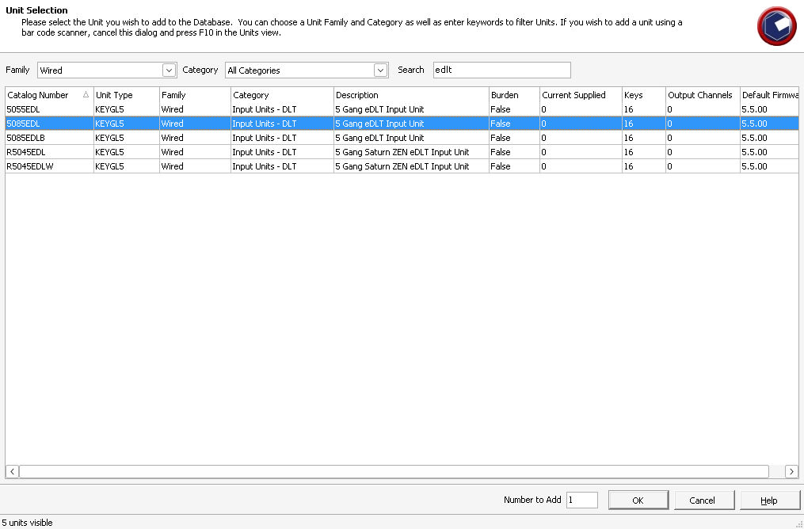
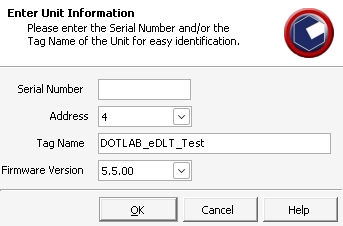
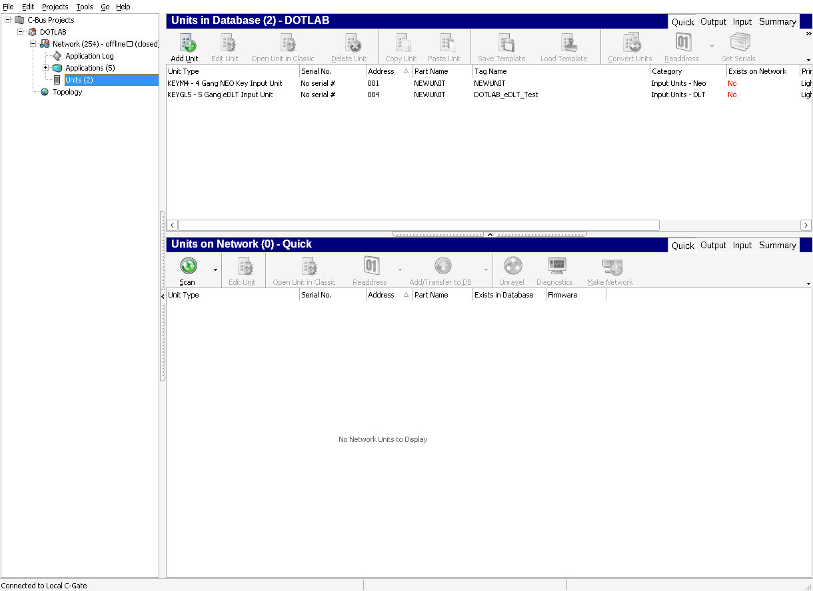
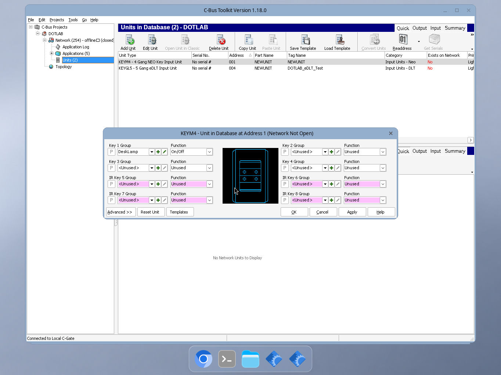
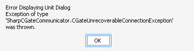
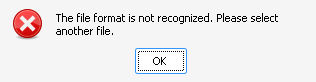

# Running C Bus Toolkit with Wine

A practical setup and troubleshooting guide

Original Schneider Electric C-Bus Toolkit 1.18.0.2754 with C-Gate 3.4.0 build 2001

Status dated 2 October 2026

Evidence updated 2 October 2026 UTC including the eDLT offline test

This guide explains how to build a suitable Wine environment for the original Toolkit, why its dependencies matter, and how to prove that it can edit and retain a project. It separates the ordinary Intel Linux route from an exceptional cloud Linux host whose kernel cannot execute 32-bit Linux programs directly.

The original Toolkit passes a full synthetic offline Neo edit, database save, shutdown and cold reopen on the exceptional host. After both Toolkit and C-Gate restarted, the real Neo editor retained key 1 DeskLamp with the On/Off function. Native Microsoft MSXML3 SP7 fixed the earlier cold project-load failure; native .NET Framework 4.0 followed by 4.8 had already passed real compile and execution tests. Backup Project remains unresolved: Wine comdlg32.dll fails before creating a CBZ archive. The later eDLT test passed catalogue selection, database creation and cold persistence of a synthetic identity, but its editor failed before the configuration pages opened. No eDLT configuration save or compatibility repair has been proved. This is a verified Neo offline editing workflow with specific backup and eDLT limitations, not complete Toolkit compatibility.

The intended first use is an isolated, synthetic, offline editing lab. Connecting to a real C-Bus installation, scanning units, downloading unit settings, USB-driver use and production commissioning require separate testing and authorization.

### What is proved so far

| Test | Result on the exceptional cloud host |
|---|---|
| Signed Wine 10.0 pure 32-bit environment | Boot returned 0; real Notepad visibly opened and closed |
| Native Microsoft .NET Framework 4.0 | Installer completed; actual compile and execution returned 0 |
| Native Microsoft .NET Framework 4.8 upgrade | Installer completed; actual compile and execution returned 0 |
| CLR identity after the upgrade | Native mscoree, mscoreei, clr and clrjit loaded; runtime reports 4.0.30319.42000 |
| Matching C-Gate backend | Version 3.4.0 build 2001; intended default config loaded; local Toolkit connection observed |
| Toolkit main window | Opened; project tree and Add Project toolbar visible; Connected to Local C-Gate |
| Real Neo unit editor and database save | KEYM4 editor rendered; key 1 DeskLamp On/Off applied; backend PROJECT SAVE returned 200 OK |
| Complete client and backend restart | Completed; persisted SQLite project, closed network and unit remain |
| Cold reopen through Toolkit GUI | Passed after native MSXML3: network 254 closed; saved KEYM4 key 1 DeskLamp On/Off reopened |
| Normal Backup Project export | Failed before file creation: EAccessViolation in Wine comdlg32.dll |
| eDLT catalogue and database fixture | Passed: five KEYGL5 models; synthetic 5085EDL at 004 with firmware 5.5.00 and blank serial |
| eDLT cold identity readback | Passed: DOTLAB_eDLT_Test and preserved Neo survive full restart; network 254 stays closed |
| eDLT editor and configuration | Blocked: TLS client-certificate handshake fails before pages render; no configuration acceptance |
| eDLT repair and certificate import | Not completed: no patch installed; wizard rejected client.p12 before password or import |

### How to use this guide

Residual Wine signal-stack errors have appeared in helper or background processes even when the managed probe exits successfully. A successful dependency probe is not a full application compatibility result.

1. Read the architecture and choose the correct host route
2. Keep the original installer, record its identity and review the applicable licences
3. Build a fresh, dedicated 32-bit Wine prefix
4. Prove Wine, Windows Installer and the native CLR before trying Toolkit
5. Start matching C-Gate and Toolkit together in a genuinely offline lab
6. Finish the editor and persistence checklist before relying on the setup
7. Read the eDLT limitations in Section 14 before choosing this setup for an eDLT project

Command blocks are shell commands unless labelled C# or configuration. Replace placeholders such as `<INSTALLER_DIR>`, `<JAVA_BIN>` and `<CGATE_DIR>` with your own absolute paths. Do not type the angle brackets literally. Most blocks are portable examples adapted from the successful dependency tests. The ordinary Linux route has not been independently completed end to end for this Toolkit version.


## Contents

- [1 Understanding the architecture](#1-understanding-the-architecture)
- [2 Inputs licences and a clean workspace](#2-inputs-licences-and-a-clean-workspace)
- [3 Choose the host route before installing dependencies](#3-choose-the-host-route-before-installing-dependencies)
- [4 The QEMU signal fix and why it matters](#4-the-qemu-signal-fix-and-why-it-matters)
- [5 Install the native Microsoft CLR in the right order](#5-install-the-native-microsoft-clr-in-the-right-order)
- [6 Prove native managed execution before launching Toolkit](#6-prove-native-managed-execution-before-launching-toolkit)
- [7 Stage Toolkit without pulling in unrelated components](#7-stage-toolkit-without-pulling-in-unrelated-components)
- [8 Run matching C Gate with native Java](#8-run-matching-c-gate-with-native-java)
- [9 Make the first editing test genuinely offline](#9-make-the-first-editing-test-genuinely-offline)
- [10 Finish the main editor and persistence test](#10-finish-the-main-editor-and-persistence-test)
- [11 Start stop backup and recovery](#11-start-stop-backup-and-recovery)
- [12 Troubleshoot in layer order](#12-troubleshoot-in-layer-order)
- [13 A compact repeatable runbook](#13-a-compact-repeatable-runbook)
- [14 eDLT offline test and the remaining connection blocker](#14-edlt-offline-test-and-the-remaining-connection-blocker)

## 1 Understanding the architecture

### Toolkit is more than one executable

The Toolkit client is a 32-bit Windows application with native and managed components. It depends on the Windows API environment supplied by Wine and on the Microsoft CLR for its .NET components. The observed installation contains WPF-related assemblies and a managed C-Gate communicator. Cold project loading also uses an MSXML3 SAX XML reader; the .NET runtime does not supply that native COM parser. That is why merely opening a native Windows test application is insufficient.

C-Gate is the backend. It maintains the C-Bus project model and exposes local network interfaces to client software. It is Java-based and can run with a native Linux Java runtime, while the Toolkit client runs inside Wine. The vendor publishes a C-Gate 3 Linux package alongside Toolkit releases. Use the backend that matches the tested client rather than substituting an unrelated C-Gate release. [S1]

There are two separate meanings of “network.” Toolkit talks over TCP to its C-Gate backend, even for an offline project. C-Gate can also talk to a physical C-Bus network through an interface. The first link is needed for the lab; the second must remain unavailable during the initial offline test.

### The ordinary Intel Linux stack

On a conventional x86-64 Linux machine with working 32-bit process support, the chain is:

Toolkit Windows EXE → Wine32 Windows API and native Microsoft CLR → 32-bit Linux libraries → Linux kernel

Matching C-Gate JAR → native Java runtime → the same Linux kernel

Wine translates Windows interfaces. It does not, by itself, solve a kernel refusal to execute the 32-bit Linux Wine loader. A working 32-bit Wine package, its complete library dependencies, a graphical session and a new win32 prefix are the foundation. [S2], [S3]

### The exceptional cloud stack

The tested cloud machine is x86-64 Debian 13.6 with a kernel that lacks usable IA32 execution. It can execute native 64-bit Linux programs, but the 32-bit Linux Wine loader cannot run directly. The route used here adds QEMU user-mode translation:

Toolkit Windows EXE → Wine32 and native CLR → QEMU i386 user-mode translator → native Linux kernel

Wine server → matching native Wine64 server → native Linux kernel

C-Gate JAR → native Java 11 runtime → native Linux kernel

QEMU is executing the Linux Wine loader and translating its Linux system calls. It is not running a Windows virtual machine and it does not replace Wine. QEMU’s user-mode documentation describes this syscall and signal translation model. [S4]

### Why pure 32 bit was chosen

A dedicated pure 32-bit prefix reduces ambiguity around the original 32-bit client and native CLR files. It also matches the successful dependency probes. Prefix architecture is selected when the prefix is created; setting WINEARCH later does not convert an existing prefix. [S3]

Newer Wine distributions may use a different WoW64 architecture and may reject WINEARCH=win32. That is a different configuration. Do not assume the commands below apply to it unchanged, and do not mix its files into the tested prefix.

### Where macOS and ARM fit

The Linux result does not establish that Toolkit works on an Intel Mac, an Apple silicon Mac, Linux ARM or a particular commercial Wine wrapper. Those platforms have different execution, graphics and 32-bit support constraints. A Mac deployment requires its own supported runtime and the same main-editor and cold-reopen tests. Do not copy this Linux sysroot onto macOS.

## 2 Inputs licences and a clean workspace

### Preserve the exact software identity

The guide targets Toolkit 1.18.0.2754 and C-Gate 3.4.0 build 2001. The official vendor page also lists newer Toolkit releases. A newer download may be useful, but it is not a byte-identical reproduction of this test. [S1]

Keep the original installer unchanged. Check a SHA-256 hash after download or transfer. A hash proves that two copies have the same bytes; it is not a substitute for obtaining software from the vendor and validating its signature.

Original Toolkit installer

```text
34811c4837ab484061760ebe8b02d059c59b57d8a40a8324391aa1bdd12f9c41
```

Microsoft .NET Framework 4 offline installer

```text
65e064258f2e418816b304f646ff9e87af101e4c9552ab064bb74d281c38659f
```

Microsoft .NET Framework 4.8 offline installer

```text
0a3a390c47e639d0f7fc65b21195fee6b7f65b066f80f70c60fab191d14b7e40
```

Original CBusToolkit.exe client

```text
9d01721abab3beb4724511e7d65e39328c0518e0721caa53f4601cded20655ab
```

Example integrity check:

```sh
sha256sum "<INSTALLER_DIR>/Toolkit-original.exe"
sha256sum "<INSTALLER_DIR>/dotNetFx40_Full_x86_x64.exe"
sha256sum "<INSTALLER_DIR>/NDP48-x86-x64-AllOS-ENU.exe"
```

The original Toolkit EXE was 176,675,576 bytes. Its Authenticode digest, signing chain and timestamp were checked during setup, but online revocation retrieval was not established. The Microsoft package digests matched the official inputs, while the Linux certificate bundle did not fully validate the Microsoft signing roots. These are limits of the verification, not reasons to bypass a security warning.

### Review terms before proceeding

Obtain Toolkit from Schneider Electric or Clipsal and Microsoft redistributables from Microsoft. Review the Toolkit agreement and the terms of each runtime installer before accepting. This guide does not accept them for you or establish that your licence covers every Wine, redistribution or deployment scenario. Follow the rights granted by the specific software agreements. [S1], [S5], [S6]

Keep the initial Microsoft .NET installers interactive so you can see their agreement and result. The later MSXML3 test used a quiet MSI command only after its exact embedded agreement and mirror-package source were separately reviewed and approved. Do not copy a command containing a silent licence-acceptance option without first reviewing what it does. If an installer raises a compatibility or security warning, read it; do not interpret an instruction in this guide as blanket permission to continue.

Use trusted package repositories for Wine, QEMU, Java and extraction tools. Do not fetch DLLs from “missing DLL” download sites. Do not change proprietary executables, fabricate installed registry flags, skip installer custom actions or turn off system protections to force a pass.

### Use a separate disposable test area

This example creates a user-owned workspace. It does not touch the default Wine prefix.

```sh
export LABROOT="$HOME/cbus-toolkit-lab"
mkdir -p "$LABROOT"/{inputs,logs,backups,probe,cgate}
export WINEPREFIX="$LABROOT/prefix-toolkit32"
export WINEARCH=win32
```

Run Wine as your regular user, never as root. Use only synthetic project names and unit details at first. Do not import a household or customer project, saved credentials or another person’s settings into the lab.

A prefix is a collection of Windows files and registry state. It is not a security sandbox. Wine applications can normally access files available to your Linux user, often through a Z drive mapping. An offline network namespace also does not isolate the filesystem. Use a disposable machine, an appropriately constrained container or a dedicated low-privilege user when file isolation matters.

## 3 Choose the host route before installing dependencies

### First identify what actually works

```sh
uname -m
wine --version
file "$(command -v wine)"
printf 'DISPLAY=%s\n' "$DISPLAY"
```

The command found as “wine” may be a shell launcher, so inspect the package’s real loader if the result is not an ELF executable. On the tested Debian packages that loader was under usr/lib/wine. Do not infer 32-bit kernel support solely from uname reporting x86_64.

The practical test is to boot a fresh 32-bit prefix with the intended loader and visibly run Notepad. If it succeeds natively, use the ordinary route and leave QEMU out. If a valid 32-bit ELF program fails with an execution-format error on this host, confirm whether the kernel supports it and whether its ELF interpreter and libraries exist. “No such file” can mean a missing ELF interpreter, even when the executable itself is present.

### Route A ordinary Intel Linux

On a conventional Debian-family desktop, a starting point is the following. These package-management commands change your system and need administrator approval. They are a proposed reader setup, not the private extraction route used on the cloud host.

```sh
sudo dpkg --add-architecture i386
sudo apt update
sudo apt install wine wine32:i386 wine64
```

Use one coherent repository and matching Wine versions. Check your distribution’s current documentation before running these commands. Debian’s tested package family was Wine 10.0~repack-6; a newer or differently packaged Wine is a new test baseline. The wine32 package supplies the 32-bit loader and depends on the matching libwine. [S2]

Initialize the dedicated prefix and verify it visually:

```sh
export WINEPREFIX="$HOME/cbus-toolkit-lab/prefix-toolkit32"
export WINEARCH=win32
wine wineboot.exe --init
wine notepad.exe
```

Close Notepad normally. If prefix initialization offers Wine Mono, do not install it as the substitute for the native Microsoft CLR used by this recipe. If you already created a contaminated or wrong-architecture prefix, preserve it for diagnosis and create another fresh named prefix. Do not delete your default .wine directory.

Run Windows Installer help:

```sh
WINEDLLOVERRIDES='fusion=b;mscoree=b;mshtml=' \
  wine msiexec.exe /? > "$LABROOT/logs/msi-help.log" 2>&1
```

Expect a visible usage dialog. In the successful cloud test the Windows Installer help dialog’s title was “Error,” although the dialog itself displayed usage text. Judge the body and log, not that title alone.

### Route B the exceptional cloud host

This route is justified only when direct IA32 execution is unavailable. It is considerably more complex than ordinary Wine. The verified baseline consists of a privately extracted, authenticated Debian Wine 10.0 dependency closure, a native matching 64-bit Wine server, and QEMU 10.0.11 with one merged upstream x86 trap-number fix.

Keep all package files in an owned workspace. The tested setup downloaded and extracted packages privately; it did not globally install Wine, register binfmt handlers or change host security settings. The native Wine loader ELF and Toolkit files stayed byte-identical. Small shell launchers route execution through the emulator and matching server.

The private sysroot must include the full i386 library closure, not just wine32. It must have a usable ELF interpreter, matching libwine, required Windows DLL payloads, fonts and Wine data files. The tested setup provided Debian’s zlib1.dll before first boot and retained merged usr library and NLS symlinks. Missing one of these produces a misleading application failure long before Toolkit is involved.

The current route excludes the optional wine32-preloader and wine64-preloader packages from the private extraction. Wine then uses its ordinary loader fallback. This behavior exists in Wine’s source; it is not a proprietary patch or a new memory-mapping implementation. It passed boot, Notepad, Windows Installer help and both native CLR probes here. Do not remove a system preloader from a normal installation merely because this exceptional host used that route. [S7]

## 4 The QEMU signal fix and why it matters

### A page fault can be part of normal execution

Wine uses Unix signals to implement Windows exception behavior. An x86 page fault should arrive with trap number 14. Before the QEMU fix, the guest signal frame could report -1 because QEMU had reset the transient exception index before constructing that frame. Wine could not correctly dispatch the fault, and 32-bit module loading failed. [S8]

The fix preserves the last hardware exception vector in a separate CPU-state field and writes that value into the guest signal frame. It is upstream commit:

```text
586284af4c2cfa90fd61cff414b0deb77acd70f7
```

The tested baseline backports this merged fix onto authenticated Debian QEMU source 1:10.0.11+ds-0+deb13u1. The backport adapts one unchanged context line to the older source; the added and removed fix lines are the same. Only four open-source QEMU files are changed. No Toolkit or Microsoft binary is modified. [S8]

### Validate the emulator independently

The independent 32-bit signal probe deliberately faults on a null-page write and checks the delivered trap number. The patched build reports trapno=14 and exits 0. This is a controlled diagnostic, not a failure of the application. Do this before interpreting Wine errors under QEMU.

QEMU source archive SHA 256

```text
c6fbe5322b2b76bbbef583d1d86d0fca433b3a33776cf38ddcb619cb044b61e6
```

Patched QEMU i386 binary SHA 256

```text
612d102cfe2e701e0dc3b206bfde4f5dd96be9d3bfdcec1a0c08c1830062cc6b
```

Original upstream patch SHA 256

```text
f58d8e42b1f86b07cd809c0709f37e28d1953971a0cd69e7bc6255644c3380d0
```

Applied QEMU 10 backport SHA 256

```text
b0c3ed7d0c0951244682ef8847ccce3782286434d8b0f94f323e593e6c4d45d2
```

The emulator was rebuilt after a cloud-host replacement and produced the same binary hash. That is strong recovery evidence for this recorded toolchain. A rebuild using another compiler, distro or path may produce different bytes even with equivalent source. Compare its manifest and behavior rather than assuming every independent build must match this hash.

### A transparent launcher example

This is an adapted explanation of the tested launcher. Replace each path and preserve the original Wine ELF under a separate name before placing a shell launcher at the package’s expected Wine path. It requires the private dependency tree and matching wrappers; it is not a stand-alone installation script.

```sh
#!/bin/sh
ROOT="<PRIVATE_RUNTIME_ROOT>"
exec "$ROOT/qemu/out/qemu-i386" \
  -cpu max \
  -0 "$ROOT/wine/usr/lib/wine/wine" \
  -L "$ROOT/wine" \
  -E "LD_LIBRARY_PATH=$ROOT/wine/usr/lib/i386-linux-gnu" \
  "$ROOT/wine/usr/lib/wine/wine32-original" "$@"
```

The -L argument supplies the guest ELF interpreter prefix. The -E argument supplies the guest library search path. The -0 value gives the original launcher identity to Wine; this matters when Wine starts another Windows process and re-executes its loader. The native matching wineserver64 is launched directly, rather than placing it under qemu-i386. [S4]

All child Windows processes must continue to use the intended wrapper, sysroot and server. One successful initial invocation is not enough if a later installer helper accidentally resolves the host’s unrelated Wine.

### Rebuilding the recorded baseline

The recovery bundle’s acquire, prepare and build scripts retain source identities, authenticated package records, the upstream patch, the exact build options and the signal probe. Keep their configuration together. The core build choices were i386-linux-user only, TCG enabled, system emulation disabled, optional tools and documentation disabled, no Meson downloads, and at most four build jobs.

For an independent rebuild, obtain the recorded source through authenticated Debian metadata, verify archive hashes, apply the upstream backport with no fuzz, record before and after file hashes, and build only the user-mode target. Preserve the emulator’s private GLib dependencies and RUNPATH layout if you use the supplied binary. A relocated recovery tree needs reviewed wrapper paths and RUNPATH handling; simply moving the binary alone is insufficient.

Do not add speculative address-space fixes to this baseline. If an unresolved fault requires changes beyond the established upstream signal fix, stop treating the environment as reproduced and diagnose that separate problem.

## 5 Install the native Microsoft CLR in the right order

### Why the older framework comes first

The first failed configuration had enough files to advertise .NET 4.8, but lacked a working native System32 mscoree.dll shell shim. A compiler /help invocation was not proof of normal compilation or managed startup. Actual compilation failed with exception 0xc06d007e, and Toolkit reported an IGCHost interface problem.

The successful correction was to install genuine .NET Framework 4.0 normally in a fresh prefix, prove native managed execution, then upgrade to 4.8. The older bootstrap populated the complete native activation path. This is the observed Wine recipe, not a claim that every Windows installation requires 4.0 before 4.8.

Microsoft documents that later 4.x versions are in-place updates. Installing 4.8 upgrades the 4.x runtime rather than adding an independent second CLR beside 4.0. Do not reinstall 4.0 over a completed 4.8 prefix. Start from a clean checkpoint if the sequence was wrong. [S9]

### Understand the loader chain

The native activation chain includes the System32 mscoree shell entry point, the framework mscoreei implementation, the CLR and the JIT. Toolkit’s managed hosting path needs that chain to work, not just a .NET registry value. A missing shell DLL can cause a hosting failure while other files in the framework directory look present.

The commands below use WINEBIN to mean the chosen native Wine executable or the tested QEMU wrapper. Set it once and use the same value throughout.

```sh
export WINEBIN="$(command -v wine)"   # ordinary Linux route
# Exceptional route: set WINEBIN to your verified Wine wrapper
export WINEPREFIX="$LABROOT/prefix-toolkit32"
export WINEARCH=win32
```

### Step 1 prepare the older framework installer

Use the exact offline package dotNetFx40_Full_x86_x64.exe obtained from Microsoft. The successful test used Windows XP compatibility mode for this bootstrap. This is a Wine compatibility setting, not installation of Windows XP. [S5]

```sh
"$WINEBIN" winecfg.exe -v winxp
WINEDLLOVERRIDES='fusion=b;mscoree=b;mshtml=' \
  "$WINEBIN" msiexec.exe /?
```

The b override means Wine builtin; n means native. Empty after the equals sign disables the named DLL. Use these scoped overrides for the particular command rather than changing every application globally. During the bootstrap, the builtin mscoree path is used to let the native installer establish the final runtime. After a successful install, switch the application and probe to native mscoree. [S3]

### Step 2 make the prefix local RPC service available

The first ordinary-loader .NET 4 attempt failed during the ExecSecureObjects security custom action. Starting Wine’s own RpcSs service inside this prefix and retrying the unchanged installer allowed it to complete. The installer’s security action was not skipped and ACL checking was not disabled.

```sh
"$WINEBIN" sc.exe start RpcSs
"$WINEBIN" sc.exe query RpcSs
```

Confirm the service is RUNNING. If it is already running, query its state rather than treating “already started” as a fatal result. If it cannot start, inspect Wine’s service log before retrying the installer. This command affects the selected Wine prefix; it does not start, reconfigure or grant access to a host Windows service.

### Step 3 run the older framework installer interactively

```sh
WINEDLLOVERRIDES='fusion=b;mscoree=b;mshtml=' \
WINEDEBUG=fixme-all,+msi,+service,+advapi,+seh \
  "$WINEBIN" \
  "<INSTALLER_DIR>/dotNetFx40_Full_x86_x64.exe" \
  > "$LABROOT/logs/dotnet40-setup.log" 2>&1
```

Review and accept the agreement only if you choose to proceed. Let the installation finish. Retain the installer’s own logs as well as Wine’s console log. The tested result reported success for both Core and Extended MSI packages and a final result of 0.

If installation fails, record the actual first failing action and its error. An MSI error 1603 is a summary, not a diagnosis. Repair a concrete prerequisite, then retry the same authenticated installer. Do not run multiple installers against one prefix simultaneously.

### Step 4 prove the older native runtime

Use the compiler and managed test in Section 6. The 4.0 checkpoint compiled an authored source file and ran the resulting executable; both exited 0, and the runtime reported 4.0.30319.1. Loader tracing identified native Microsoft mscoree, mscoreei, clr and clrjit.

Stop and preserve a cold checkpoint before upgrading. This gives you a known-good 4.0 starting point if the upgrade fails.

### Step 5 upgrade the native framework

Use NDP48-x86-x64-AllOS-ENU.exe obtained from Microsoft’s .NET Framework 4.8 runtime page. Use the runtime offline installer, not a developer pack, language pack or similarly named modern .NET installer. [S6]

```sh
"$WINEBIN" winecfg.exe -v win7
WINEDLLOVERRIDES='mscoree=n;fusion=b;mshtml=' \
WINEDEBUG=fixme-all,+mscoree,+winediag \
  "$WINEBIN" \
  "<INSTALLER_DIR>/NDP48-x86-x64-AllOS-ENU.exe" \
  > "$LABROOT/logs/dotnet48-setup.log" 2>&1
```

The successful test used Windows 7 compatibility mode and reviewed the compatibility warning before continuing. It completed the upgrade. Repeat the actual compile-and-execute probe afterward; do not assume that a completion dialog alone proves the native activation chain works.

### Where Winetricks helps

Winetricks is an open-source collection of Wine dependency recipes. Its .NET recipes are useful references for version settings, overrides and installer sequencing. They are not a substitute for reading the current recipe, its flags and agreements. The cloud test used the original Microsoft installers interactively and verified their actual outcomes. [S10]

If you choose an automated Winetricks route for a normal Linux desktop, pin the Winetricks revision, inspect the dotnet48 recipe and any sub-recipes, and understand what it will download and change. Do not combine an unknown script revision with the manual sequence halfway through an install.

## 6 Prove native managed execution before launching Toolkit

### A small test that exercises the real chain

Save this authored C# source as ClrProbe.cs in your probe directory. It has no external connections and writes only diagnostic text.

```csharp
using System;
using System.Runtime.InteropServices;

class ClrProbe {
  static int Main() {
    Console.WriteLine("Managed execution: passed");
    Console.WriteLine("CLR version: " + Environment.Version);
    Console.WriteLine("CLR directory: " +
      RuntimeEnvironment.GetRuntimeDirectory());
    Console.WriteLine("Core assembly: " +
      typeof(object).Assembly.FullName);
    return 0;
  }
}
```

Compile with the installed native Microsoft compiler. Use winepath to convert the source and output paths rather than assuming every Wine prefix exposes the same Z mapping.

```sh
SRC_WIN=$("$WINEBIN" winepath.exe -w "$LABROOT/probe/ClrProbe.cs")
OUT_WIN=$("$WINEBIN" winepath.exe -w "$LABROOT/probe/ClrProbe.exe")
FRAMEWORK="$WINEPREFIX/drive_c/windows/Microsoft.NET/Framework"
CSC="$FRAMEWORK/v4.0.30319/csc.exe"

WINEDLLOVERRIDES='mscoree=n;fusion=b;mshtml=' \
WINEDEBUG=fixme-all,+mscoree,+loaddll \
  "$WINEBIN" "$CSC" /nologo "/out:$OUT_WIN" "$SRC_WIN" \
  > "$LABROOT/logs/compile.log" 2>&1
printf 'Compiler exit: %s\n' "$?"
```

Only after compiler exit 0, run the generated program:

```sh
WINEDLLOVERRIDES='mscoree=n;fusion=b;mshtml=' \
WINEDEBUG=fixme-all,+mscoree,+loaddll \
  "$WINEBIN" "$LABROOT/probe/ClrProbe.exe" \
  > "$LABROOT/logs/managed-run.log" 2>&1
printf 'Program exit: %s\n' "$?"
```

The portable winepath commands above are adapted examples. The successful cloud probe used explicit Windows-style paths into its workspace, with the same native compiler and DLL overrides.

### What a pass looks like

After the 4.8 upgrade the tested result was compiler exit 0, managed program exit 0, “Managed execution: passed,” and runtime string 4.0.30319.42000. The log showed the native activation DLLs, CLR and JIT, including native VCRUNTIME140_CLR0400.dll.

The string 4.0.30319.42000 alone does not uniquely identify .NET 4.8; Microsoft documents that several later Framework versions share it. Query the installer-written Release registry value to establish the framework version. A minimum .NET 4.8 value is 528040. Keep the installer result and native load evidence beside it. [S11]

```sh
"$WINEBIN" reg.exe query \
  'HKLM\Software\Microsoft\NET Framework Setup\NDP\v4\Full' \
  /v Release
```

This is a read-only query. Do not create or overwrite Release, Install or Version values to persuade Toolkit that the runtime is installed. An advertised version without functioning DLLs can reproduce the original hosting failure.

### The probe has limits

The probe exercises compilation, activation and basic managed execution. It does not prove WPF rendering, Toolkit plugin hosting, every COM interface, background services, certificate behavior or C-Gate communication. Even a 0 result can coexist with errors in a separate Wine helper. Keep the relevant warnings visible and continue to the actual editor acceptance test.

## 7 Stage Toolkit without pulling in unrelated components

### The ordinary desktop installation route

On a normal Intel Linux Wine setup, an interactive run of the original Toolkit installer is the closest route to a conventional installation. Use the same dedicated prefix and review every component selection and agreement.

```sh
WINEDLLOVERRIDES='mscoree=n;fusion=b;mshtml=' \
  "$WINEBIN" "<INSTALLER_DIR>/Toolkit-original.exe" \
  > "$LABROOT/logs/toolkit-installer.log" 2>&1
```

This command is a proposed normal-host route; the cloud dependency pass did not execute this fixed-base installer successfully through the exceptional no-preloader route. Do not describe extraction and a completed installation wizard as equivalent outcomes.

The original installer bundles more than the editor: C-Gate, Microsoft Visual C++ redistributables, an IP utility, an updater and other support components. If the wizard forces unnecessary drivers or utilities, pause rather than silently installing them. USB kernel drivers are not made compatible merely by running a Windows installer in Wine.

### The exceptional host used selective extraction

The cloud lab retained the original authenticated installer, extracted its payload with innoextract 1.9, and staged the original Toolkit client files unchanged. [S16] It did not run the updater, physical-interface drivers or Windows-service launchers. The original vendor agreement had been reviewed and accepted for that setup; a reader must review their own terms.

Equivalent reconstruction of the extraction commands follows. The original invocation text was not retained, so these are equivalent commands rather than a claimed byte-exact transcript. Use the genuine installer filenames and an empty output directory.

```sh
innoextract --extract --output-dir "$LABROOT/payload" \
  "<INSTALLER_DIR>/Toolkit-original.exe"
CGATE_SETUP="cgate-3.4.0_2001-JRE-11.0.24_8-setup.exe"
innoextract --extract --output-dir "$LABROOT/cgate-payload" \
  "$LABROOT/payload/tmp/$CGATE_SETUP"
```

The outer extraction produced app and tmp directories. The nested original C-Gate installer was 91,568,288 bytes. For the client, the tested staging copied the app tree into drive_c/Clipsal/CBusToolkit, excluding Firmware files and FirmwareUpdater.exe, and compared source and destination SHA-256 hashes for every copied file. The backend selected the unchanged JAR and supporting assets while excluding the Windows JRE, YAJSW service wrapper, EXE service launcher and BAT/CMD launchers.

Selective extraction avoids forcing unrelated components, but it can omit registration and setup actions. Therefore it is an experimental application staging route until the real editor, its managed plugins and its persistence pass. Keep a per-file hash manifest and the source archive identity. Never patch the vendor PE header to make it load.

No Toolkit Installed, CurrentVersion or InstallPath registry metadata was added before the successful cloud launch. Toolkit discovered the manually launched local backend. Its original files, native CLR and ordinary Win7 compatibility setting were sufficient for the observed main window. This does not mean that all setup registration can always be omitted.

The staged client directory must contain all matching DLLs, resources, data files and certificates, not just CBusToolkit.exe. Keep those application-owned files together and preserve their relative layout. Public client certificate files supplied by the vendor are not proof that a local or remote server is authorized; retain normal certificate and access checks.

### Native compiler runtime dependencies

The extracted Toolkit payload included x86 Visual C++ 2008 SP1 and 2010 redistributables. Their presence in an installer does not prove they are installed or required at the exact point of failure. If the loader names a missing msvcr or msvcp dependency, use the matching authenticated x86 redistributable under its own terms and rerun the application. Do not add a large bundle of DLL overrides speculatively.

The CLR’s VCRUNTIME140_CLR0400.dll observed after .NET 4.8 is distinct from the application’s older Visual C++ redistributables. Treat each missing dependency by its exact DLL, architecture and source.

### Install the native XML parser for cold project loading

The first cold session exposed a dependency that startup and new-project editing had not exercised. Toolkit requested the version-independent SAXXMLReader class 079aa557-4a18-424a-8eee-e39f0a8d41b9, bound to Wine 10 msxml3.dll. During Project Load, IVBSAXAttributes.getType reached an E_NOTIMPL stub, code 0x80004001. XML parsing aborted and the client surfaced OLE error 8000FFFF. The project tree then showed only Topology even though the backend correctly listed the saved network. These error codes describe different layers; do not treat them as the same HRESULT. [S17]

Installing native Microsoft XML Core Services 3.0 Service Pack 7 into the dedicated prefix, and selecting native msxml3, restored the cold project tree and the saved editor values. The final trace loaded native msxml3.dll and no longer contained the former SAX stub or OLE parsing failure. Microsoft documents that version-independent MSXML callers remain on MSXML3; installing MSXML6 does not automatically redirect this caller. Do not substitute MSXML6 or rewrite the proprietary client to change its class selection. [S18]

### Establish the exact MSXML3 source and agreement

The tested input was msxml3.msi, 1,070,592 bytes, identified as Microsoft XML Parser with MSI ProductVersion 8.70.1104.04 and msxml3.dll version 8.70.1104.0. Its SHA-256 was:

```text
f9c678f8217e9d4f9647e8a1f6d89a7c26a57b9e9e00d39f7487493dd7b4e36c
```

The historical Microsoft download endpoint returned HTTP 404 at the time of this test. The approved bytes came from the CodeWeavers mirror listed in the Winetricks msxml3 recipe, whose recorded checksum matched. This is a historical Microsoft package obtained through a specific third-party mirror, not a current Microsoft-hosted download. The Authenticode payload digest matched and named Microsoft Corporation and MSXML3 SP7, but the current Linux CA bundle could not complete the old timestamp and expired-certificate chain. Full historical trust validation remained unconfirmed. A digest match and a reputable mirror do not erase that limitation. [S19], [S20]

Before downloading or installing from this mirror, decide whether that exact provenance is acceptable to you and review the complete embedded Microsoft XML Core Services MSXML 3.0 Service Pack 7 EULA. It is in the linked MSI, not a separate blanket Wine licence. The test operator reviewed a read-only extraction of that exact agreement and explicitly approved the source, package and terms before installation. The agreement text used for that review had SHA-256 bce87dbe3ead83b8035845689d8ad5461c282bf1ab7c215936c7f344aff8b1c0. A reader must make their own decision; this guide does not accept the agreement for them, certify current security support, or authorize bypassing a warning. No security warning or verification setting was suppressed in the test.

Keep this old parser in the isolated test prefix. Its successful compatibility result is not a recommendation to expose it to untrusted XML, external networks or production site projects.

### Preserve the prefix before the parser install

Close Toolkit and its backend, then verify that the dedicated prefix and matching Wine server are inactive. Save a cold prefix checkpoint. The actual installation also preserved system.reg, user.reg and userdef.reg before making a change.

Wine provides an msxml3 placeholder with a high file version. The Winetricks recipe notes that this prevents the older MSI from replacing it. The test moved that verified Wine-owned placeholder into a checkpoint instead of deleting it; the genuine MSI then installed its own native files normally. This affects only the dedicated prefix, not a system Wine installation or a proprietary DLL. Do not move a file merely because its filename matches: identify it first, especially if a native parser may already be installed. [S20]

The following is a portable reconstruction of the tested preservation step for the exact Wine 10 baseline. Stop if the placeholder hash differs and inspect your runtime rather than removing an unknown DLL:

```sh
# Run only after verifying this dedicated prefix is inactive
CHECKPOINT="$LABROOT/backups/msxml3-before"
if [ -e "$CHECKPOINT" ]; then
  printf '%s\n' 'Stop: an earlier parser checkpoint exists' >&2
  exit 1
fi
mkdir -p "$CHECKPOINT"
cp -p "$WINEPREFIX/system.reg" "$CHECKPOINT/"
cp -p "$WINEPREFIX/user.reg" "$CHECKPOINT/"
cp -p "$WINEPREFIX/userdef.reg" "$CHECKPOINT/"
SYSTEM32="$WINEPREFIX/drive_c/windows/system32"
EXPECTED='bb743430e8111213db54a6f4ba4356afb59c962d51dfbb9af42501a899ce80ef'
ACTUAL=$(sha256sum "$SYSTEM32/msxml3.dll" | cut -d " " -f 1)
if [ "$ACTUAL" != "$EXPECTED" ]; then
  printf '%s\n' 'Stop: this is not the verified Wine placeholder' >&2
  exit 1
fi
if [ -e "$CHECKPOINT/wine-builtin-msxml3.dll" ]; then
  printf '%s\n' 'Stop: an earlier parser checkpoint already exists' >&2
  exit 1
fi
mv "$SYSTEM32/msxml3.dll" "$CHECKPOINT/wine-builtin-msxml3.dll"
```

### Install and select native MSXML3

The following adapts the actual MSI command to your paths. The test ran offline inside a fresh loopback-only user and network namespace, with a new matching Wine server and verified inactive prefix. Preserve those lifecycle and isolation guards when reproducing the exceptional route.

The quiet option /qn below was used only after explicit review and acceptance of the exact EULA and mirror package. Do not run it before that decision. Remove /qn if you want the normal interactive wizard; that UI variant is a proposed reader option, not the recorded command.

```sh
MSXML_MSI="<INSTALLER_DIR>/msxml3.msi"
EXPECTED_MSI='f9c678f8217e9d4f9647e8a1f6d89a7c26a57b9e9e00d39f7487493dd7b4e36c'
printf '%s  %s\n' "$EXPECTED_MSI" "$MSXML_MSI" | \
  sha256sum -c - || exit 1
MSI_WIN=$("$WINEBIN" winepath.exe -w "$MSXML_MSI")
LOG_WIN=$("$WINEBIN" winepath.exe -w "$LABROOT/logs/msxml3-msi.log")
export WINEDLLOVERRIDES='msxml3=n;mscoree=n;fusion=b;mshtml='
"$WINEBIN" sc.exe start RpcSs
"$WINEBIN" reg.exe add 'HKCU\Software\Wine\DllOverrides' \
  /v msxml3 /t REG_SZ /d native /f
"$WINEBIN" msiexec.exe /i "$MSI_WIN" /qn /norestart \
  /l*v "$LOG_WIN"
INSTALL_STATUS=$?
printf 'MSXML3 installer exit: %s\n' "$INSTALL_STATUS"
[ "$INSTALL_STATUS" -eq 0 ] || exit 1
"$WINEBIN" wineboot.exe -s
```

The HKCU override selects the native DLL implementation in this one Wine prefix. It is not an invented installed-version flag. The genuine MSI completed with exit 0 and installed native msxml3.dll and its resource DLL. Native msxml3.dll was 1,049,088 bytes with SHA-256 a98ce3223f50eeb3fe9f1a28a81393bce13ab3d837dab8f5e66d260a669ce00d. The test did not create a fake parser registration or alter the client binary.

After normal Wine shutdown, confirm the prefix is inactive and start a fresh C-Gate and Toolkit session together in the isolated boundary. Include msxml3=n in Toolkit’s launch overrides and capture +loaddll,+msxml tracing for the first cold readback. A completed MSI or a registry query alone is insufficient: verify that Toolkit actually loads native msxml3.dll and reopens the saved network and unit.

### Launch from the client directory

Use the original working directory so application-relative resources resolve correctly:

```sh
CLIENT="$WINEPREFIX/drive_c/Clipsal/CBusToolkit"
cd "$CLIENT" || exit 1
WINEDLLOVERRIDES='msxml3=n;mscoree=n;fusion=b;mshtml=' \
WINEDEBUG=fixme-all,+mscoree,+seh,+loaddll \
  "$WINEBIN" CBusToolkit.exe \
  > "$LABROOT/logs/toolkit-startup.log" 2>&1
```

This launch path has now displayed the original Toolkit main window with a local C-Gate connection on the exceptional host. The later native MSXML3 correction also passed cold GUI reopening of the saved network and unit. Backup Project remains a separate unresolved failure. The next sections explain the working backend configuration and the safe offline boundary.

## 8 Run matching C Gate with native Java

### Use the matching backend payload

The original Toolkit installer contains the matching C-Gate installer. The vendor also supplies a Linux package for C-Gate 3.4.0. Preserve the whole backend tree, including cgate.jar, unitspec, transform, config, help and supporting key material, rather than copying the JAR alone. [S1]

The actual bundled C-Gate installer identified Java 11.0.24+8. A stale Install.txt inside the payload mentions Java 7, so do not use that sentence as evidence of the runtime shipped with this build. The cloud lab used a native recognised Java 11 runtime and observed the exact C-Gate banner. Use the matching major version first; Java upgrades are separate compatibility tests.

### Use a controlled working directory

C-Gate resolves configuration and project paths relative to its home directory. Launch from the intended backend root. The bundled manual describes config/C-GateConfig.txt as the normal global file. [S12]

```sh
cd "<CGATE_DIR>" || exit 1
"<JAVA_BIN>" -Xms64M -Xmx256M -jar cgate.jar
```

The memory sizes are the cloud lab’s launch settings, not a vendor sizing recommendation. Adjust only after measuring your project and host. Keep the first lab small. The tested native runtime was Eclipse Temurin JRE 11.0.24+8 from its official release. [S15]

An initial Linux attempt supplied an absolute alternate configuration filename as a JAR argument, following a manual example. The resulting behavior did not use that intended file and emitted a config-file creation error. The corrective route uses the ordinary config/C-GateConfig.txt location with no extra configuration argument. That retry worked: the configuration dump confirmed empty project.start, the explicit lab/projects path, loopback binding and disabled background XML conversion. The subsequent Toolkit window reported a local C-Gate connection. The banner alone is not proof that the desired configuration loaded.

### Start with an empty offline configuration

The following configuration reflects the validated synthetic backend settings. Paths are relative to the backend root. Prepare referenced directories first and use explicit paths relative to the backend root.

```text
# config/C-GateConfig.txt
project.start=
project.default=DOTLAB
config-path=lab/config
access-control-file=access.txt
project.default.dir=lab/projects/
project.default.archive-dir=lab/projects/archived
instance.lock-file=lab/state/cgate.lock
file.base=lab/files
macro-path=lab/macros
scene-base=lab/scenes
enable-xml-to-sql-background-job=no
command-local-address=127.0.0.1
secure.bind-address=127.0.0.1
```

The backend actually wrote its event log to logs/event.txt under its root, despite an attempted CGATE_LOGS_HOME setting. Check the observed log path; do not assume an environment variable moved it.

This intentionally starts no existing projects and binds the command and secure interfaces to loopback. The bundled manual documents the binding parameters and the default command ports, 20023 for ordinary command traffic and a secure base of 20123. Other event and change ports also exist; loopback binding of one port is not proof that all interfaces are isolated. [S12]

Do not create an “allow everyone” access rule to resolve a local connection failure. Keep the vendor’s appropriate loopback access control and inspect the exact denied request. Do not open public listeners or disable TLS to make Toolkit connect.

### Check the actual backend before the client

Confirm all of the following:

- The banner says Schneider Electric C-Gate 3.4.0 build 2001
- The intended global config file loaded without fallback or creation errors
- Every referenced output and state directory exists and is writable by the lab user
- No existing site project automatically starts
- Only intended loopback listeners are present
- The process has no route to a physical installation
- The backend log remains free of a fatal error before the client connects

On a host with normal networking, a read-only listener check is:

```sh
ss -ltnp
```

In a namespace, run the check inside that namespace. A host-side socket list may not show the lab’s listeners, and host-mounted sysfs is not a reliable namespace interface inventory.

## 9 Make the first editing test genuinely offline

### Loopback is necessary but not sufficient

An offline lab must still allow Toolkit to connect to C-Gate locally. Binding C-Gate to 127.0.0.1 protects its listeners, but does not prevent C-Gate from making outgoing connections to an interface if a project tells it to. A closed project and a disconnected physical interface are useful safeguards; a loopback-only network namespace gives a stronger verified network boundary.

The tested host allowed an ephemeral, unprivileged user and network namespace. Only its namespace-local loopback interface was brought up. Its initial inventory showed only lo, no IPv4 routes and working access to the graphical display through the existing X Unix-domain socket. No host firewall rules, host interface changes, forwarding or persistent namespace were created. [S13]

### Put all relevant processes inside the same namespace

Toolkit, its fresh Wine server and C-Gate must share one namespace. An already running Wine server can keep the old networking context even if the next shell starts in a new one. Before starting the lab, close the dedicated prefix’s applications normally and verify that its existing server has exited.

Do not kill every Wine process on the machine. Scope process checks and any necessary stop action to the specific dedicated prefix and runtime. Keep other Wine applications intact.

The following shows the concept on a Linux host whose unshare and ip tools support it. It is a proposed general pattern, not the exact validated cloud launch script:

```sh
unshare --user --map-root-user --net sh -c '
  ip link set lo up
  ip -brief address
  ip route
  exec "<LAB_START_SCRIPT>"
'
```

The lab script must start the native C-Gate backend, a fresh matching Wine server and the Toolkit client in that same namespace; it must retain ownership of their PIDs and logs. Do not run the example unless those paths and the process lifecycle have been reviewed. If unprivileged namespaces are denied, use an approved isolated VM or container instead. Do not change host security settings to force namespace access.

The cloud launch used the same unshare user/network pattern, with a Python lab launcher that brought up only loopback, started the native Java backend and launched the fresh matching Wine server and Toolkit inside that namespace. Runtime membership was checked directly before opening the client. The main-window success was observed at 19:17 UTC on 1 October 2026, or 08:17 NZDT on 2 October.

### Prove the isolation rather than assuming it

Record the namespace identity for the launcher, C-Gate, Wine server and client. Compare /proc/`<PID>`/ns/net for the relevant live processes. Check interfaces and routes from inside the namespace, using ip or socket.if_nameindex. Inspect IPv6 state as well as IPv4. An interface list containing anything beyond local loopback fails the intended offline boundary.

Filesystem and display access are separate. An existing X Unix socket can let the GUI work without granting external IP networking, but the application may still see files allowed to your user. Do not describe this as complete containment.

### Connect only to the local backend

In Toolkit, select the locally running matching C-Gate instance using the application’s normal connection settings. Confirm the actual backend version and keep the network in the project closed. Do not assume a “localhost” selection inside one process reaches a server that lives in another namespace.

If Toolkit cannot connect, first distinguish no listener, wrong namespace, wrong backend version, access denied and certificate validation. They require different corrections. Never resolve an unexplained connection problem by opening remote access.

## 10 Finish the main editor and persistence test

### A window is not the finish line

An installer splash screen, a runtime probe or an initial connection dialog does not establish Toolkit’s main editor. The first acceptance test should use only invented data and the actual unit-editing controls. Keep a short record of the version, screenshots, relevant log and values entered.

The actual Neo editor, database save and complete cold GUI reopen have now passed for the fixture below. The earlier cold project-view failure was corrected by native MSXML3. Supported project-backup export still fails, so keep both the proved editing workflow and its recovery limitation visible.

### What the actual editor test established

The synthetic project was DOTLAB, with a closed network at address 254 and one database-only four-key Neo unit. The unit selection was 5054NL/KEYM4, logical firmware 2.5.00, address 001, default tag NEWUNIT and no serial number. Toolkit showed Exists on Network as No. No physical device was scanned, programmed or used to provide the result.

The original unit editor opened as KEYM4 Unit in Database at Address 1 with Network Not Open. The physical keys 1 to 4, IR slots 5 to 8, Group and Function controls, Advanced, Templates, Apply and OK all rendered. Key 1 was assigned Lighting group 1, named DeskLamp, with the On/Off function. Apply displayed the normal Save Location dialog. Save to Database was selected, and Save to Physical Unit was disabled. C-Gate then acknowledged PROJECT SAVE DOTLAB with 200 OK.

This proves original database-only editing and submission in the first session. The cold readback below establishes persistence of the same assignment through the original editor. It does not establish every unit editor, physical unit download or all managed plugins.

### Build the same small synthetic example

1. Start the verified matching C-Gate and Toolkit in the same offline lab
2. Open the actual Toolkit main window and record the client and backend versions
3. Create DOTLAB and a network at address 254; keep the network closed
4. Use the Lighting application and add group 1 named DeskLamp
5. Add the database-only 5054NL/KEYM4 four-key Neo at address 001, leaving the serial unknown
6. Open Edit Unit and inspect its real key, group and function controls
7. Assign key 1 to DeskLamp and set the function to On/Off
8. Click Apply, inspect the Save Location dialog, and choose only Save to Database
9. Confirm the backend save result, then close and reopen the unit editor to check its values

The unit type and addresses are an invented test fixture. If the UI does not permit the same choice, record the actual behavior or choose a documented database-only example. Do not scan for or import a real device, and do not select a physical save option.

### The cold loading fault and its verified correction

The first restart used the persisted 745,472-byte SQLite checkpoint. A read-only inspection found one network and one KEYM4 unit. PROJECT LOAD completed and NET LIST_ALL returned //DOTLAB/254 with interfaceState closed, but Toolkit showed only Topology. A separate raw XML probe could not enter the running namespace because setgroups returned Operation not permitted; that route stopped without retries or security changes. It yielded no additional XML evidence.

The ordinary client trace provided the useful diagnosis instead: the requested MSXML3 SAX reader reached Wine’s IVBSAXAttributes.getType stub and aborted parsing. After the exact native MSXML3 SP7 installation described in Section 7, both client and backend started fresh. The previous SAX stub and OLE error were absent, and the saved network reappeared in the original Toolkit tree.

At 21:18 UTC on 1 October 2026, or 10:18 NZDT on 2 October, DOTLAB reopened with closed network 254 and database unit KEYM4 at address 001, tagged NEWUNIT. Selecting Edit Unit reopened the original Neo editor with Network Not Open. Key 1 still showed DeskLamp and On/Off; the other key and IR entries remained Unused. This completes the create, edit, database save, full shutdown and cold GUI readback workflow for this fixture.


The native-parser comparison verifies a useful dependency fix for this observed failure. It is not a guarantee that every XML feature or editor works. Keep the client, backend, native CLR and native parser versions pinned together, and repeat the cold test when changing any of them.

### The project backup dialog failure

The normal GUI Backup Project action was attempted on synthetic DOTLAB. It failed before creating a backup file with EAccessViolation in Wine comdlg32.dll, a read of address 00000000 at module offset 0x105BC. The persisted SQLite database remained intact. No CBZ archive was produced, so supported project export and restore have not passed.

This is an observed failure in the common-dialog path, not proof that the project database is corrupt. There is no verified repair in this guide. Preserve a cold filesystem checkpoint and the error evidence; do not mistake that checkpoint for a successfully exported and restored Toolkit project. Any attempt to repair dialog compatibility must be tested on a disposable copy and must retain normal security and licensing controls.

### Prove a cold reopen

1. Use Toolkit’s normal save or apply workflow and wait for completion
2. Exit Toolkit normally
3. Stop C-Gate gracefully and wait for its actual process to exit
4. Verify the dedicated Wine server has also exited before moving the session boundary
5. Restart matching C-Gate and Toolkit from the same persisted lab storage
6. Reopen DOTLAB and the synthetic unit
7. Confirm key 1, DeskLamp, application and function match the values that were applied
8. Produce a synthetic project backup using the application’s supported project-backup workflow
9. Test restoring that backup into a separate disposable project area, if the UI supports it, without replacing the original

Keep any modern project database and all associated persistence files together. C-Gate 3 uses SQLite project storage; a unit XML template is not a complete modern project backup. Do not treat an exported unit template as evidence of project recovery. [S12]

### Record a meaningful acceptance result

| Acceptance item | Evidence to keep |
|---|---|
| Main Toolkit editor | Actual version and screenshot of the working main window |
| Real Neo unit editor | Passed for this fixture: KEYM4 controls render and database-only Apply completes |
| Backend communication | Matching C-Gate version and successful local connection |
| Database save in the first session | PROJECT SAVE returned 200 OK; retain the actual selected key and save-dialog evidence |
| Persisted backend data | SQLite project, network and unit survive full restart |
| Cold GUI reopen | Passed: original editor retains KEYM4 key 1 DeskLamp On/Off after both processes restart |
| Backup export and restore | Failed before file creation in Wine comdlg32.dll; no CBZ archive or restore proof |
| Isolation | Only loopback interfaces; no external route; matching process namespaces |

The combined editor and cold-reopen result proves this one synthetic offline editing workflow. Backup and restore, physical network communication and commissioning remain separate incomplete tests.

## 11 Start stop backup and recovery

### Keep the daily launch environment explicit

Put the dedicated prefix and selected runtime in a small environment file. Source it in the shell that starts Toolkit. Do not rely on whichever Wine happens to be first on PATH that day.

```sh
# toolkit-env.sh
export LABROOT="$HOME/cbus-toolkit-lab"
export WINEPREFIX="$LABROOT/prefix-toolkit32"
export WINEARCH=win32
export WINEBIN="<VERIFIED_WINE_OR_WRAPPER>"
export WINESERVER="<MATCHING_WINESERVER>"
export WINEDLLOVERRIDES='msxml3=n;mscoree=n;fusion=b;mshtml='
```

For the exceptional route, also retain the tested wrapper paths, WINEDLLPATH, private XDG locations and a clean host environment. The tested environment cleared inherited LD_PRELOAD, LD_LIBRARY_PATH and unrelated QEMU/Wine tuning variables, then supplied only the guest library path inside the wrapper. This avoids accidentally combining private and system libraries.

### Start in a predictable order

1. Verify the intended prefix is inactive and no old server will be reused
2. Establish the approved offline namespace or other isolated lab boundary
3. Start matching C-Gate from its backend root and inspect the startup log
4. Start a fresh matching Wine server in the same boundary
5. Start or query the prefix-local RpcSs service as needed
6. Launch Toolkit from its client directory with native mscoree and msxml3
7. Verify the actual connection, project and network-closed state

Do not add automatic project opening, system service installation or background startup until the manual workflow and persistence test are proven. A convenient launcher should preserve the same checks, logs and failure behavior.

### Stop without losing project state

Save and close the Toolkit UI normally first. Then use C-Gate’s documented console QUIT or normal application stop path and wait for process exit. If it is unresponsive, target only the verified process you started with a normal SIGTERM after recording the state. The cloud lab verified a scoped normal SIGTERM stop of its own C-Gate PID; it did not prove that every graceful console-stop route had completed.

Use wineserver -w to wait for the dedicated server to exit, with the intended WINEPREFIX set and the matching server binary. Avoid broad killall or pkill commands. wineserver -k is a forceful prefix stop, not a routine save operation, and should be reserved for a reviewed recovery case after data has been protected. [S14]

### Make cold checkpoints

The best checkpoints are after fresh Wine boot, successful native 4.0, successful native 4.8, verified main editor, and successful cold reopen. Close the client, backend and server before copying persistence data. An active SQLite database may have journal or WAL state; copying only its main file while running is not a reliable backup.

Example after all relevant processes are inactive:

```sh
mkdir -p "$LABROOT/backups"
tar -C "$LABROOT" -czf \
  "$LABROOT/backups/toolkit-cold-checkpoint.tar.gz" \
  prefix-toolkit32 cgate
sha256sum "$LABROOT/backups/toolkit-cold-checkpoint.tar.gz"
```

This generic backup example includes the prefix and chosen backend tree. Ensure the cgate directory actually contains your lab’s configuration and project storage. Keep application-generated project backups as well. Treat real project archives as confidential and verify restore into a different disposable area.

### Recover after a machine replacement

Code and package manifests are not the same as a persistent installed environment. A replacement host needs the native runtime dependencies, emulator dependencies, wrapper layout, correct prefix, graphical access and backend state recreated or restored.

The recorded recovery bundle deliberately excludes the proprietary installers, user projects, credentials and entire Windows prefix. It contains authored scripts, the open-source emulator and its supporting runtime, identities and diagnostic evidence. Restoring that bundle alone cannot recreate an installed native CLR. Obtain the original authorised inputs again and rerun the normal installation/probe sequence.

Preserve symlinks and executable permissions when unpacking. Verify hashes and review any fixed absolute paths before running. If a bundle was produced before a later success, use its dated checkpoint as the boundary of what it guarantees; do not silently treat an older archive as containing a newer tested prefix.

## 12 Troubleshoot in layer order

### Diagnose the first failing layer

Work upward: Linux loader → QEMU if required → Wine boot and GUI → Windows Installer and services → native CLR → C-Gate configuration and local connectivity → Toolkit editor → project persistence. For eDLT, distinguish the separate managed TLS connection from the main Toolkit connection; a working Neo editor does not clear that layer. Reinstalling Toolkit will not fix an invalid signal frame in QEMU, and adding .NET registry values will not fix a missing native CLR shell DLL.

Use one change at a time, retain the failing log, record the new result, and checkpoint only actual passes. The matrix below distinguishes observed failures from general diagnostic possibilities.

| Symptom | Most useful next check |
|---|---|
| Valid 32-bit loader reports execution-format error | Confirm IA32 support; use the exceptional route only if needed |
| Loader file exists but “No such file or directory” | Inspect its ELF interpreter and private i386 dependency paths |
| Wine under QEMU faults with trap number -1 | Run the independent signal probe and verify the upstream trap fix |
| Preloader-route MSI initialization stalls | Reproduce the documented private ordinary-loader fallback; do not patch proprietary files |
| .NET 4 ExecSecureObjects action fails | Check prefix-local RpcSs state and the installer’s first failing action |
| Compiler /help works but real compilation fails 0xc06d007e | Check native System32 mscoree and complete native activation chain |
| Toolkit reports IGCHost interface failure | Reprove native compile/run; registry version values alone are insufficient |
| C-Gate banner appears with config-file error | Check working directory, ordinary config path and referenced directories |
| Toolkit cannot reach localhost C-Gate | Check namespace membership, listeners, version, access control and TLS separately |
| Unit changes disappear after restart | Establish actual database path, write access, save semantics and cold shutdown |
| Cold GUI shows only Topology with SAX stub and OLE 8000FFFF | Verify the actual MSXML3 caller; install the reviewed native parser and prove a fresh cold readback |
| Backup Project raises EAccessViolation in comdlg32.dll | Preserve cold DB and exact null-read error; no verified CBZ export or dialog repair yet |
| Wine nested exception on signal stack | Keep the error; identify the process and whether editor/probe behavior also fails |
| eDLT editor raises a connection exception while Neo works | Keep the separate TLS client-authentication finding visible; see Section 14. No deployed correction |
| Initial cCreds=0 and empty Personal/My store | Do not infer a missing PFX; initial anonymous credentials can precede the .NET certificate-selection callback |
| Certificate Import Wizard rejects client.p12 format | Import did not reach password or store commit; cause unproved and further import work stopped |

### Capture targeted diagnostics

For managed activation, use +mscoree and +loaddll. For installer failures, use +msi, +service, +advapi and +seh. For Toolkit startup, add +seh to native load tracing. Keep logs scoped to one attempted action; unbounded traces can be huge and may contain project or file details.

```sh
WINEDEBUG=fixme-all,+mscoree,+loaddll \
WINEDLLOVERRIDES='mscoree=n;fusion=b;mshtml=' \
  "$WINEBIN" "<PROGRAM_TO_TEST>" \
  > "$LABROOT/logs/one-test.log" 2>&1
```

System.Net tracing was not enabled in the eDLT investigation because it could disclose headers or sensitive material. Do not turn it on by copying a broad troubleshooting recipe; Section 14 records the retained nonsensitive TLS finding.

Keep the actual process exit status as well as the log. If output is piped through tee without pipefail, the shell may report tee’s success instead of the tested program’s failure. A background launcher’s exit 0 also does not prove its child ran successfully.

### Read warnings precisely

Wine fixme messages often describe unimplemented or partial interfaces; they are clues, not automatic failures. Conversely, “fixme-all” hides those messages, not all errors. Do not discard an err line merely because a different test passed.

The latest successful CLR 4.8 probe still logged nested signal-stack exceptions in separate helper activity. Report them alongside the compiler and program result. If they affect the main editor or persistence, the application test fails even though the standalone probe passes.

### When to stop and change the deployment plan

Stop relying on this setup if the main editor cannot open reliably, the real unit editor fails, saved data does not survive a cold reopen, the isolation boundary cannot be maintained, or progress requires weakening security or modifying vendor binaries. A licensed Windows environment can be a more predictable commissioning platform, but its setup and hardware access are a separate task.

Do not use an offline Wine success as evidence that a USB or serial interface, driver, network scan, firmware download or live installation is safe. Test each real-world capability with a backup and an explicit plan before touching physical equipment.

## 13 A compact repeatable runbook

### New normal Intel Linux host

1. Obtain and verify the exact vendor and Microsoft inputs; review their terms
2. Install a coherent Wine32 package family with normal 32-bit kernel support
3. Create a new named win32 prefix and visibly prove Notepad
4. Prove Windows Installer help and prefix-local RpcSs
5. Install native .NET 4.0 interactively in XP compatibility mode
6. Compile and execute the authored probe using native mscoree
7. Save a cold 4.0 checkpoint
8. Switch to Win7 mode and install the exact native .NET 4.8 upgrade
9. Repeat real compile/run and read the installer-written Release value
10. Stage matching Toolkit and native Java C-Gate without unrelated drivers
11. Review the exact MSXML3 source and EULA, preserve the placeholder, and install the native parser
12. Start both in an approved offline boundary with native msxml3 and finish the editor/cold-reopen checklist
13. Treat the comdlg32 Backup Project failure as unresolved until export and restore are separately proved
14. Treat the eDLT editor as blocked on the recorded Wine baseline; identity persistence is not configuration acceptance

### Reproduce the exceptional cloud dependency result

1. Verify that IA32 execution really is unavailable
2. Restore or rebuild the authenticated QEMU 10.0.11 plus upstream trap-fix baseline
3. Verify the independent guest trap-number probe
4. Privately extract the full matching signed Wine 10 package closure
5. Use the ordinary no-preloader fallback with the verified QEMU loader and native matching server
6. Supply required sysroot paths, Wine data and the signed zlib1.dll prerequisite
7. Prove Wine boot, visible 32-bit Notepad and Windows Installer help
8. Start the private RpcSs service and install genuine .NET 4 normally
9. Prove actual native 4.0 compilation and managed execution
10. Upgrade to genuine .NET 4.8 and repeat the native proof
11. Stage unchanged Toolkit assets and matching Java backend
12. Preserve the inactive prefix and install the exact approved native MSXML3 SP7 package
13. Launch with native mscoree and msxml3 and validate matching C-Gate configuration
14. Reproduce the real editor, database-only save, full shutdown and cold GUI readback test
15. Preserve a cold filesystem checkpoint while the separate CBZ backup/export fault remains unresolved
16. Retain the original Wine baseline; the stopped eDLT prototype is not an installed or releasable correction

### The final decision

The native CLR, original Toolkit main window and real Neo unit editor can run on this exceptional host after correct signal translation, the ordinary Wine loader path and the complete .NET bootstrap sequence. Database-only Apply and project save succeed, and native MSXML3 restores cold project loading and readback of the saved Neo key assignment after a full client and backend restart. The eDLT catalogue and database identity also persist, but the separate eDLT editor fails its client-certificate TLS handshake before configuration pages render. No eDLT configuration save and reopen result or deployed compatibility patch exists. Backup Project still fails in Wine comdlg32.dll before creating an archive. The proved scope is synthetic offline Neo editing and persistence, with eDLT editing and supported backup/restore incomplete; physical commissioning remains untested.

## 14 eDLT offline test and the remaining connection blocker

### The result that matters

The eDLT catalogue, creation of a synthetic database unit and cold persistence of its identity passed. The eDLT editor itself never opened: three recorded attempts, including clean restarts, stopped with SharpCGateCommunicator.CGateUnrecoverableConnectionException before the configuration pages rendered. There is therefore no demonstrated eDLT configuration workflow on this Wine baseline. The working Neo editor is a useful control, but its success does not establish eDLT compatibility. [S21]

The tests used the original Toolkit 1.18.0.2754 and matching C-Gate 3.4.0 build 2001, Wine 10.0 under the recorded QEMU route, native Microsoft .NET Framework 4.8 and native MSXML3 SP7. The same isolated synthetic DOTLAB project and closed network 254 were retained. Only loopback networking was available; there was no external route, physical network scan or physical unit programming.

### Catalogue and exact fixture identity

Toolkit's eDLT catalogue filter returned five wired KEYGL5 models: 5055EDL, 5085EDL, 5085EDLB, R5045EDL and R5045EDLW. All five entries displayed default firmware 5.5.00. This establishes catalogue availability in the original client, not successful loading of each model's editor or equivalence to firmware on a physical device.

The selected database-only fixture was:

| Field | Retained synthetic value |
|---|---|
| Project | DOTLAB |
| Network | Address 254, offline and closed |
| Catalogue model | 5085EDL |
| Unit type | KEYGL5, 5 Gang eDLT Input Unit |
| Logical firmware | 5.5.00 |
| Database address | 4, displayed as 004 in the unit list |
| Tag | DOTLAB_eDLT_Test |
| Serial number | Blank, displayed as No serial # |
| Exists on Network | No |
| Preserved control | KEYM4 Neo at address 1, key 1 DeskLamp with On/Off |

The creation dialog's firmware value is a database setting. No firmware was downloaded, upgraded or read from physical hardware. The serial was intentionally left unknown; no real serial, site project or customer settings were used.



Figure 3  The original catalogue lists all five eDLT models with firmware 5.5.00. The selected row is 5085EDL.



Figure 4  The creation dialog records the synthetic address, full tag, blank serial and logical firmware.

### Cold persistence passed but editor acceptance did not

After a normal complete client and backend shutdown and cold restart, Toolkit reopened DOTLAB with both database units present. Network 254 remained closed. The unit list retained KEYM4 at 001 and KEYGL5 at 004, and the full DOTLAB_eDLT_Test tag could be read back. Both units remained database-only; the physical network list was empty.

This is proof that the eDLT database identity survived restart. It is not a configuration save and reopen result, because no eDLT configuration editor had loaded and no eDLT pages, widgets or assignments had been edited.

The preserved Neo control reopened normally at address 1 with Network Not Open and key 1 still showing DeskLamp and On/Off. This narrows the observed failure: Toolkit can load the project, communicate with the local backend and render the previously validated Neo editor, while the separate eDLT path fails at connection establishment.



Figure 5  The cold readback retains both units and the full eDLT tag. Network 254 is closed and no physical units are displayed.



Figure 6  The Neo control editor still works after the eDLT attempts. This is evidence for that control editor only.

### The observed TLS failure

All three retained eDLT opening attempts failed before the editor's pages appeared. The original error dialog reports an exception of type SharpCGateCommunicator.CGateUnrecoverableConnectionException. A clean restart did not clear the fault. Repeating an unchanged attempt is not a passed acceptance test.

The retained read-only handshake and source analysis separates two connections. Main Toolkit's OpenSSL path successfully authenticates to matching C-Gate with its bundled vendor client identity. The public certificate identifies KipperClient, with SystemSoftware/Schneider issuer information and recorded validity years 2017 to 2027. The managed eDLT connection selects TLS 1.2 during its failed handshake, receives C-Gate's request for a client certificate, then sends an empty certificate list. C-Gate rejects that empty chain with BAD_CERTIFICATE, TLS alert 42. The handshake does not complete. This is a client-authentication handshake blocker, rather than proof that the database unit or logical firmware is invalid. The connection-path and certificate findings come from the retained investigation record; the GUI report separately establishes the editor failure. [S22]

The main connection's success shows that C-Gate can authenticate the bundled identity in this lab. It does not show that the separate .NET and Wine eDLT connection selects and supplies the same identity.



Figure 7  The eDLT editor stops at the connection exception before any configuration pages render.

### Correct interpretation of the initial credential evidence

An earlier interpretation treated initial cCreds=0 and an empty CurrentUser Personal/My certificate store as proof of a missing or unsuccessfully loaded PFX. That conclusion was too strong and is superseded by the later connection analysis.

The .NET path can initially acquire anonymous credentials and wait for the server's certificate request before selecting a client identity through the SChannel callback. The initial credential count describes that stage, not the eventual certificate choice. Likewise, an empty Personal/My store does not prove that an application failed to load its own bundled identity directly. Neither observation establishes a missing PFX, a bad password, corrupted input or an absent vendor identity.

The retained Wine 10 source review identified missing notification that additional credentials are required, an issuer-list query and support for refreshing an existing credential context after certificate selection. These are investigation findings that support a compatibility hypothesis. No installed Wine correction has demonstrated the full eDLT handshake, and the exact application-level certificate-selection and PFX-loading cause remains unresolved. Keep the direct observations, the source review and an unproved deployment fix distinct. [S22]

### The approved normal import attempt stopped before import

A narrowly approved test used the ordinary Certificate Import Wizard to select the bundled vendor client.p12 for the isolated Wine CurrentUser Personal/My store. Personal was empty before the attempt. The wizard rejected the file with The file format is not recognized before password entry, destination-store choice or final import. The wizard was cancelled; no identity was imported and the store remained empty.

This UI result does not establish that the vendor file is malformed or that encryption is the reason for rejection. It establishes only that this wizard did not recognize the selected file at that stage. No password was extracted, guessed, changed or entered, and no private key was exposed. There was no alternative extraction, import bypass or manual credential conversion. Further import work is stopped.



Figure 8  The wizard rejects the selected file before password entry or any store commit. No credential was imported.

### Compatibility research is not a deployed repair

A first-stage synthetic, in-memory TLS 1.2 proof established success when a valid identity was supplied after the certificate request, with negative controls that failed as expected. It was a separate compatibility experiment, not the original eDLT editor, and did not establish that Toolkit's eDLT client worked under Wine. [S22]

A second-stage private GnuTLS compatibility prototype had reported synthetic repeat, sanitizer and upstream control results, but its final handoff was blocked and the compatibility path was stopped by platform safety safeguards. Those reports were not an independently completed release or end-to-end Toolkit acceptance result. There was no finished release, no installed compatibility patch and no successful eDLT acceptance run after that prototype. The tested Toolkit environment therefore retains the original Wine baseline. This guide does not provide a deployment procedure for the stopped prototype. [S22]

The actual runtime provider was verified against the Debian GnuTLS package version 3.8.9-3+deb13u4, carrying 47 Debian patches including security backports. A stock upstream 3.8.9 prototype is not the deployment baseline and must not be substituted for the patched provider. A version string shared at the upstream level is insufficient evidence of identical security fixes or behavior. This package identity is a retained test-baseline observation, not a claim about the newest available package. [S22]

No TLS validation, client authentication, certificate trust, cipher policy, vendor executable or host security setting was weakened to obtain a result. The original launcher bytes were restored after temporary diagnostic logging, and the original application configuration was retained. System.Net tracing was considered but not enabled because its output could include headers or other sensitive material. Use the already retained, nonsensitive handshake summary and screenshots when sharing this finding; do not publish credentials, private keys, raw authentication headers or private host paths.

### eDLT acceptance status and stopping point

| Acceptance item | Status | What the evidence establishes |
|---|---|---|
| Catalogue filter and model selection | Passed | Five KEYGL5 models present with default 5.5.00 |
| Database unit creation | Passed | Synthetic 5085EDL at 004 with blank serial and full tag |
| Full restart and identity readback | Passed | The eDLT identity and preserved Neo survive cold reopen |
| Closed offline boundary | Retained | Network 254 closed, loopback-only lab, no physical activity |
| Preserved Neo editor | Passed | DeskLamp On/Off still renders at address 1 |
| eDLT authenticated connection | Failed | No client certificate supplied; BAD_CERTIFICATE alert 42 |
| eDLT editor and pages | Blocked | Connection exception occurs before pages render |
| Page and widget configuration | Untested | No editor controls were available |
| Group assignments and themes | Untested | No eDLT edits were accepted |
| Scenes and templates | Untested | No eDLT scene or template workflow was exercised |
| eDLT configuration save and cold reopen | Untested | Identity persistence is the only eDLT persistence proof |
| Certificate-store import | Not completed | Wizard rejected the format before password or store commit |
| Compatibility prototype deployment | Not completed | No finished release or patch installed |

The safe retained state is the normal Toolkit session with the two-unit synthetic database, closed network 254 and working Neo control. No further GUI retry, manual certificate import or compatibility-patch installation is pending. Preserve that state and the existing cold checkpoint. The compatibility and import paths are stopped; this record does not authorize resuming them through a fresh prefix, alternate tool or different handoff.

For an eDLT commissioning requirement, this Wine result is insufficient. A completed acceptance result would have to include opening the actual eDLT editor, editing the required pages and functions, completing a database save, and reopening those settings after a full client and backend restart. Physical communication and download remain additional tests. Native-Windows equivalence has not been established by this lab.

The separate Backup Project failure in Wine comdlg32.dll still applies. No CBZ archive was produced and no supported restore workflow was proven. A cold filesystem checkpoint remains distinct from an application-exported, successfully restored backup.

## Sources and further reading

The source references below support the architecture and documented behavior. Test results in this guide are dated observations of the specific original files and cloud baseline, not vendor certification of Wine support.

S1 Schneider Electric and Clipsal software page. Lists Toolkit 1.18.0, later Toolkit releases and C-Gate 3 Linux 3.4.0. https://www.clipsal.com/products/smart-home-solutions/c-bus/software-configuration-tool-5000tk?itemno=5000TK

S2 Debian Wine32 package for trixie. Shows the Wine 10.0~repack-6 32-bit loader and matching dependency relationship. https://packages.debian.org/trixie/wine32

S3 Wine command reference distributed by Debian. Prefix architecture, DLL overrides and drive mapping. https://manpages.debian.org/trixie/wine/wine.1.en.html

S4 QEMU user-space emulator documentation. Linux syscall and signal translation and user-mode options. This live manual may describe a newer QEMU than the recorded build. https://www.qemu.org/docs/master/user/main.html

S5 Microsoft .NET Framework 4 standalone installer. Original package name and official download. https://www.microsoft.com/en-us/download/details.aspx?id=17718

S6 Microsoft .NET Framework 4.8 runtime downloads. Obtain the appropriate offline runtime from the official page. https://dotnet.microsoft.com/en-us/download/dotnet-framework/net48

S7 Wine 10.0 loader source. The preloader_exec routine falls back to executing the ordinary Wine loader. https://github.com/wine-mirror/wine/blob/wine-10.0/dlls/ntdll/unix/loader.c

S8 Merged QEMU x86 user-mode signal trap-number fix. Explains the lost exception vector and its effect on Wine. https://github.com/qemu/qemu/commit/586284af4c2cfa90fd61cff414b0deb77acd70f7

S9 Microsoft Framework installation guidance. Explains in-place 4.x upgrades and offline runtime installers. https://learn.microsoft.com/en-us/dotnet/framework/install/guide-for-developers

S10 Winetricks source and project. Read the exact .NET recipes and pin a revision when reproducing. https://github.com/Winetricks/winetricks

S11 Microsoft Framework version detection. Explains Release values and why Environment.Version is not an exact 4.8 version detector. https://learn.microsoft.com/en-us/dotnet/framework/install/how-to-determine-which-versions-are-installed

S12 C-Gate 3.4.0 bundled manual. Relevant sections include 4.6.1 Configuration File, 4.6.4 configuration parameters and 4.8 Projects. Use the PDF supplied with the matching vendor package from S1. It documents relative paths, listeners and SQLite project storage; some bundled text is older than the shipped Java runtime.

S13 util-linux unshare reference. User and network namespaces and process inheritance. https://manpages.debian.org/trixie/util-linux/unshare.1.en.html

S14 Wine server command reference. Prefix-scoped server waiting and termination. https://manpages.debian.org/trixie/wine/wineserver.1.en.html


S15 Eclipse Temurin official Java 11.0.24+8 release. Use the Linux x64 JRE variant and verify its published integrity information. https://github.com/adoptium/temurin11-binaries/releases/tag/jdk-11.0.24%2B8

S16 innoextract official documentation. Explains extraction of Inno Setup payloads without running the Windows installer. https://constexpr.org/innoextract/

S17 Wine 10.0 SAX reader source. The builtin IVBSAXAttributes getType implementation and associated parser behavior explain the diagnosed missing interface method. https://github.com/wine-mirror/wine/blob/wine-10.0/dlls/msxml3/saxreader.c

S18 Microsoft MSXML GUID and ProgID information. Version-independent callers continue using MSXML3 when later versions are installed side by side. https://learn.microsoft.com/en-us/previous-versions/windows/desktop/ms757837(v=vs.85)

S19 CodeWeavers mirror of the exact historical Microsoft MSXML3 SP7 MSI, which contains its embedded EULA. This is the separately approved mirror source; full historical certificate-chain trust was unconfirmed. https://media.codeweavers.com/pub/other/msxml3.msi

S20 Winetricks msxml3 recipe. Identifies the historical Microsoft endpoint, exact CodeWeavers mirror and SHA-256 pin, placeholder replacement requirement and native override. Review the current file before using it; the observed source snapshot was hashed separately. https://raw.githubusercontent.com/Winetricks/winetricks/master/src/winetricks

S21 eDLT offline configuration test dated 2 October 2026. Nine-page retained report with eleven screenshots, catalogue and identity readback, failed editor attempts and the stopped normal import attempt. This is lab evidence, not vendor certification. https://chatgpt.com/api/library/files/libfile_01334bc697408191a42f49710d7c5fe3/download

S22 Retained read-only eDLT handshake and source investigation dated 2 October 2026. The nonsensitive findings summarized in Section 14 distinguish the OpenSSL and managed connections, the public KipperClient certificate, Wine certificate-selection gaps, the synthetic TLS proof, the stopped prototype and the verified Debian GnuTLS provider. These findings supplement the GUI report; they do not establish a released or installed repair. No private key, password or raw authentication material is included.

[S1]: https://www.clipsal.com/products/smart-home-solutions/c-bus/software-configuration-tool-5000tk?itemno=5000TK
[S2]: https://packages.debian.org/trixie/wine32
[S3]: https://manpages.debian.org/trixie/wine/wine.1.en.html
[S4]: https://www.qemu.org/docs/master/user/main.html
[S5]: https://www.microsoft.com/en-us/download/details.aspx?id=17718
[S6]: https://dotnet.microsoft.com/en-us/download/dotnet-framework/net48
[S7]: https://github.com/wine-mirror/wine/blob/wine-10.0/dlls/ntdll/unix/loader.c
[S8]: https://github.com/qemu/qemu/commit/586284af4c2cfa90fd61cff414b0deb77acd70f7
[S9]: https://learn.microsoft.com/en-us/dotnet/framework/install/guide-for-developers
[S10]: https://github.com/Winetricks/winetricks
[S11]: https://learn.microsoft.com/en-us/dotnet/framework/install/how-to-determine-which-versions-are-installed
[S13]: https://manpages.debian.org/trixie/util-linux/unshare.1.en.html
[S14]: https://manpages.debian.org/trixie/wine/wineserver.1.en.html
[S15]: https://github.com/adoptium/temurin11-binaries/releases/tag/jdk-11.0.24%2B8
[S16]: https://constexpr.org/innoextract/
[S17]: https://github.com/wine-mirror/wine/blob/wine-10.0/dlls/msxml3/saxreader.c
[S18]: https://learn.microsoft.com/en-us/previous-versions/windows/desktop/ms757837(v=vs.85)
[S19]: https://media.codeweavers.com/pub/other/msxml3.msi
[S20]: https://raw.githubusercontent.com/Winetricks/winetricks/master/src/winetricks
[S12]: https://www.clipsal.com/products/smart-home-solutions/c-bus/software-configuration-tool-5000tk?itemno=5000TK

[S21]: https://chatgpt.com/api/library/files/libfile_01334bc697408191a42f49710d7c5fe3/download
